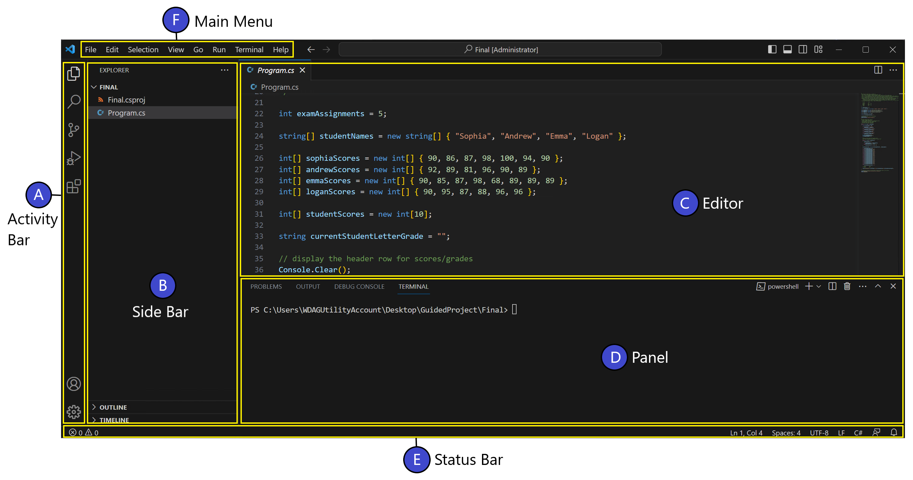
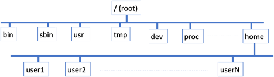

# Lab 01 - Configuration, Linux Overview and Basic Commands

This exercise provides hands-on experience with using Linux, basic
commands and its directory structure.


Accept the group assignment
- **Name your group using you first name and last name separated by hyphen**

Accept the assignment
- Which is the real assignment

Click the assignment repository link
- open the wk-01 folder and Follow Lab-01 instructions 

Click the class repo link 
- [link here]

## Learning Objectives

-   Understand basics of Linux Commands.

-   Become familiar with Linux Terminal in Docker Container

-   Understand program execution

## Learning Resources

1.  Downloading and installing Git

    a.  <https://git-scm.com/install/>

> N.B. Mac and Linux systems may already have git

2. Download and Install Docker

    a.  <https://www.docker.com/products/docker-desktop/>

        i.  Choose the one suitable for your machine

        ii. May ask you to register, please do

        iii. Must always run in the background

3.  Enabling Windows Sub System for Linux

    a.  <https://learn.microsoft.com/en-us/windows/wsl/install>

4.  Download and install VSCode

    a.  <https://code.visualstudio.com/download>

5.  Access your Github Account: **signin** or **signup**

    a.  <https://github.com/>

6. **For Mac users: download and install Microsoft Remote Desktop** 
   
   a. [Windows App](https://apps.apple.com/app/microsoft-remote-desktop/id1295203466).

## Environment 

- MacOS is based on Linux distribution and thus basic Linux commands work on Mac in similar way. 
- On Windows, a basic setup of Linux be installed using WSL (Windows Subsystem for Linux), but for uniformity, we will work with Docker based Ubuntu setup.

### VSCode Setup
VS Code is an IDE\tool to develop a SW. These days we use it for more than that. 

[Lean more](https://workshops.nuevofoundation.org/razor/learn-vscode/)

#### Sign In to GitHub from VS Code

-   Click the **account icon** 👤 in the **bottom-left corner** of VS Code.

-   Choose **Sign in with GitHub** and follow the prompts.

#### VS Code Extensions

Click the window like icon, ⊞,on the left, search and install the
following extensions:

-   **vscode-icons** -- File and folder icons

-   **Document Viewer** -- To view document files on VSCode

-   **vscode-pdf** -- To view PDF files on VSCode

**N.B. There will be other extensions we may install in the future**

### Creating Ubuntu image and container 

####  Open VSCode and Clone the Class Example Repository

1.  Open the **Command Palette** (Ctrl + Shift + P / Cmd + Shift + P)

2.  Type Git Clone and select **Remote Resources**.

3.  Search for your project and click it.
    1.  The project you accepted earlier

4.  Choose a folder where you want your projects stored.
    1.  I recommend `Documents` directory

5.  When prompted, click **Trust the Authors**.


####  Building and Running with Docker

##### Open VS Code Terminal

-  Open the **Command Palette** (Ctrl + Shift + P / Cmd + Shift + P)

    - Type: `Focus on Terminal View`
    - Hit the `Enter\Return` to view a terminal
    - On the terminal type `cd wk-01` and hit `Enter`

**Make sure the terminal indicated you current working folder**

##### ✅ Pull and run the image 

- This is the easiest to do. From the project directory:

> - `docker run -d --rm -p 33900:3389 -p 2222:22 --name ub22-host zizutg/multi-ub22-host:latest`

##### ‼️OR‼️ Build and run the Docker Image: might take time

Run the following commands:

> `docker build -t ub22-host .`

Run the Docker Container

>`docker run -d -p 33900:3389 --name ub22-host ub22-host`
 
## Accessing the host

Credentials for accessing this host are set:

- **Username**: `student`
- **Password**: `dps_repo`

### Remote Desktop macOS Users


1. Launch the **Windows App** and click **+ → Add PC**.
2. In the **PC name**, enter: `localhost:33900`
3. Under **Credential**, select **Add Credential** and enter the credntials
4. Save and double-click the new PC entry to connect.

### Windows Users

1. Open **Remote Desktop Connection** (`mstsc.exe`).
2. In **Computer**, type: `localhost:33900`
3. In the **xrdp** enter the credentials
4. Click Ok.

### Using SSH

If you'd rather use a terminal: `ssh student@localhost -p 2222`

> You’ll be prompted for the password: `dps_repo`.

***Identification warning***: `ssh-keygen -R "[localhost]:2222"` 


## Description

A basic set of commands and their usage is given below. 
- To exercise and use these commands, as much as possible please enter them by typing (and do not copy / paste from this document or elsewhere). 
- Entering the commands (and options) implicitly forces you to pay attention to details and as well assimilate your learning and retention. 
- At times when you make a typing mistake, you will understand the correct command usage and interpreting errors and recovering from them.

### Understand directory system

On successful login to a Linux, open the terminal:
- you are place in home directory,which typically ends with **`~$`**

- To practice all all commands ***unminimize*** the current image
  - `\$sudo unminimize`
- To know which directory you are in, enter
  - `\$ pwd`
  - **/home/student**
- Explore the directory structure using `ls` command. Explore more options with man ls
  
  
  
- List the contents of current directory
    - `\$ ls`
- List the contents of a different directory, e.g. /home directory, in detail
    - `\$ ls -l /home`
- List the contents of current directory including hidden files (file starting with .(Dot))
    - `\$ ls -la`
- List the contents of in reverse order of modification time. Oldest entries are shown first, and most recent are shown in last last
    - `\$ ls -ltr /var/log/`
- List the contents of in order of modification time.
    - `\$ ls -lt /etc`
- Study the man page of ls command and its options.
    - `\$ man ls`

### Changing Directory

The command `cd` changes the current directory to specified directory. 
- If no destination directory is specified, then it changes to home directory of user. 
- The command `pushd` stores the current directory information on stack and changes the current directory to specified destination. 
- The command `popd` returns the directory which on top of the stack.

- `\$ pwd`
    >*/home/student*
- `\$ pushd /home`
    >*/home ~*
- `\$ pushd /var/log`
    >*/var/log /home ~*
- `\$ pushd /tmp`
    >*/tmp /var/log /home ~*
- `\$ popd`
    >*/var/log /home ~*
- `\$ popd`
    >*/home ~*
- `\$ popd`
    >*~*
- `\$ popd`
  >*-bash: popd: directory stack empty*
- Change to parent directory (..)
  - `\$ cd ..`
- Explore other directory with relative paths

### Viewing File contents
When dealing with files

- To scroll down use SPACEBAR or Down arrow key. To scroll up, enter p or Up arrow key
- To quit, enter q.

Commands to deal with files in 
- To display content of a file
    - `\$ cat \<filename\>`
- e.g.display contents of password file contains list of all users on the system
    - `\$ cat /etc/passwd`
- To display contents of multiple files together, specify more than one filenames with cat, e.g.
    - `\$ cat /etc/hostname /etc/passwd`
- To display contents of larger files (more than current display screen size) i.e. navigate the file contents, use less or more commands
    - `\$ less /etc/passwd`
    - Might requite to install the command `sudo apt install less`
- Enter q to quit.
    - `\$ more /etc/passwd`
- To display top N (default = 10) lines of a file, use head command
    - `\$ head /etc/services`
    - `\$ head -5 /etc/services`
- To display bottom N (default = 10) lines of a file, use tail command
    - `\$ tail /etc/services`
    - `\$ tail -5 /etc/services`
- To display all lines starting from Nth line, use option +N
    - `\$ tail +15 /etc/services`

### Searching for Files

#### Searching for Files with file attributes

The find utility provides basic capabilities to search for files with
meta attributes such as filenames, creation or modification date, size,
permissions, ownership, file types etc.

The basic options are

- -name *pattern*
- -size *n*
- -maxdepth *levels*
- -perm *mode*
- -mtime *+/-n (time)*
- To understand full details use man command
  - `\$ man find`
- Examples
- Find files with filename matching some pattern
  - `\$ find /etc -name "services" -print`
  - `\$ find /etc -name "host\*" -print`
- Find files with size parameters i.e. greater than or less than specified size
  - `\$ find /etc -size +10000 -print`
  - `\$ find /var/log -size -10000 -print`

***Explore other options as well***

#### Searching for Files with matching contents

Use of grep command to search files for specific pattern. The general
usage is
- \$ grep \[*options*\] *pattern* *file(s)*

Examples
By default, search is case sensitive. To do case insensitive search,
i.e. match lower case, upper case and even mixed case, use option -i.

- `\$ grep http /etc/services`
- `\$ grep -i HTTP /etc/services`

When search for group of words, enclose them in quotes.

- `\$ grep "http protocol" /etc/services`

For negative (or inverse) search, find all lines which does not have the
pattern, use option -v.

- `\$ grep -vi tcp /etc/services`

### Managing Files and Directories

Creating directory
- `\$ mkdir dir1`
- `\$ mkdir dir2 dir3 \[...\]`
Creating nested subdirectory or directories
- `\$ mkdir -p dir1/dir2/dir3`

Creating empty files
- `\$ touch file1.txt`

Creating file with content. Use any text editor, e.g nano to create. It
is UI driven and basic editor commands are displayed the bottom. Enter
the text as needed and it will be displayed. Once entering/editing text
is done, enter \^-X (Ctrl-X) to exit, enter Y to save and exit

- `\$ nano file1.txt`
  - Type in: *Hello, World!*
  - Might need to install nano: `sudo apt install nano`
- Removing file
    - `\$ rm file1.txt`
- Removing multiple files
    - `\$ rm file1 file2 \[...\]`
- Removing directory
    - `\$ rmdir dir1 \[...\]`

- Removing directory having files and subdirectory in it. Use the -f to force the removal and -r to recursively traverse the subdirectories and remove these

  - `\$ rm -f dir1`
- Copying files. Copy one file to another file
    - `\$ cp file1 file2`
- Copying a directories and all of its file including subdirectories etc.
    - `\$ cp -r dir1 newdir1`
- Renaming files/directory
    - `\$ mv file1 file2`
    - `\$ mv dir1 dir2`

### Pipes and Redirection

#### Pipes 

Piping mechanism enables executing commands in a chain where output of
previous commands becomes input to the next command. General usage of
pipes (`|`)is given as

- `\$ cmd1 | cmd2 | cmd3 ...`

Examples

- `\$ ls -l /etc | less`
- `\$ grep tcp /etc/services | grep '\#' | less`

#### Redirection

This enables to save the output of current command into a file using
redirection symbol `>`

Example below saves all service that use tcp in one file and all
services using in another file,

- `\$ grep tcp /etc/services >services_tcp.txt`
- `\$ grep udp /etc/services >services_udp.txt`

Following examples shows a way of combining multiple files into a single
file

- `\$ cat file1.txt file2.txt file3.txt >all_files.txt`

### Viewing Processes

Using command ps, one can view the running processes. The command
without any options lists all running processes belonging to the user.
The option '-e' lists all the processes of system. Option '-f' provides
full format listing of processes. Make use of man command to explore all
the options of ps command.

- `\$ ps`
- `\$ ps -f`
- `\$ ps -e`
- `\$ ps -ef`
- `\$ man ps`

## Summary

This exercise provides a basic overview of Linux command usage in daily
life. Use of man command is helpful in understanding all the options
available to a give Linux command it is recommended to make use of man
so as to be able develop expertise in exploring full capabilities of a
given command.

## Working with GitHub in VS Code

Most Git tasks for this course will be done **using the Source Control icon in VS Code**
- We may switch to command based command based git in the future

### Setting Up Git Username and Email
     - Before committing code in Git, you need to configure your identity.
     - One-Time Global Setup
       - This applies to all repositories on your computer.
   - ***`THIS IS DONE ON THE SYSTEM TERMINAL NOT IN LINUX MACHINE`***

```bash
    git config --global user.name "Your Name"
    git config --global user.email "your_email@example.com"
```
#### Tip for Students:  
- Always **Commit + Push** your work before class ends.  
- Always **Pull instructor updates** before starting new work.  

### Committing and Pushing Your Work

1. Open your project folder in VS Code.
2. Click the **Source Control icon** (branch icon on the left sidebar).
3. You will see a list of changed files:
   - Hover over each file and click the **+** button to **Stage Changes**.
   - Or click the **Stage All Changes** button at the top.
4. Type a short message in the **message box** at the top (e.g., `Finish Lab 2 exercises`).
5. From the the **Commit** button, click the d**own arrow** ⬇️.
6. Then select **Commit & Sync** or **Commit & Push**
   1. The sync option will also get update from your repo, if there is any

### Pulling Updates from Instructor

When your instructor pushes updates, you need to bring them into your fork and local copy:

1. Click the **Source Control icon**.
2. At the top, click the **... menu** (three dots).
3. Select **Pull**: to simply get update from the origin
   1. You can also use **Pull from ...** 
   
4. VS Code will fetch changes and attempt to merge automatically.
5. If there are conflicts, VS Code will highlight them:
   - Buttons will appear above each conflict: 
     - **Accept Current**, 
     - **Accept Incoming**, or 
     - **Accept Both**.
   - After resolving, click **✔ Commit** to finish the merge.
