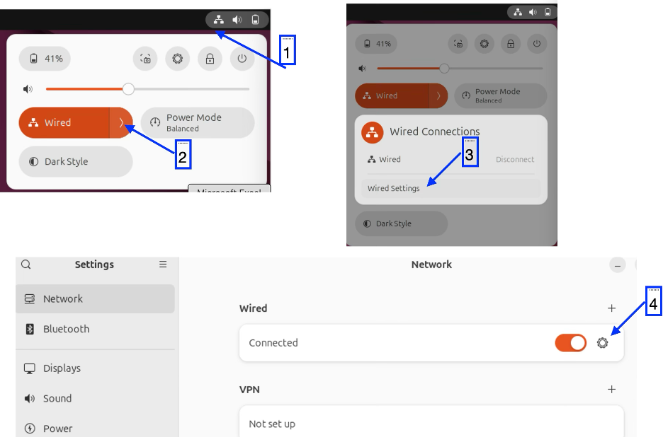
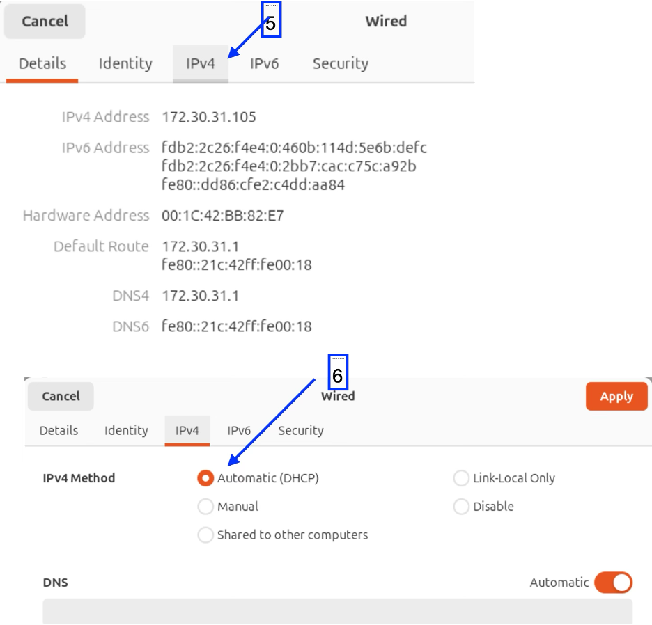
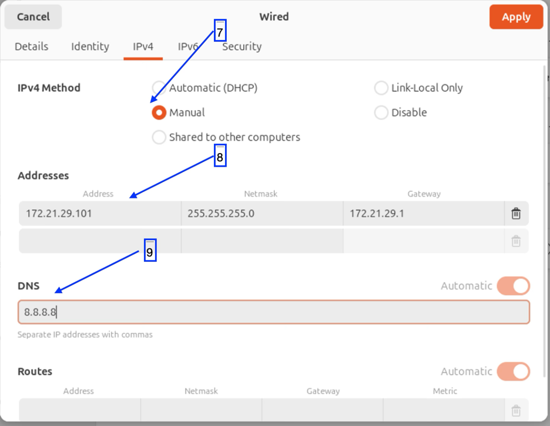
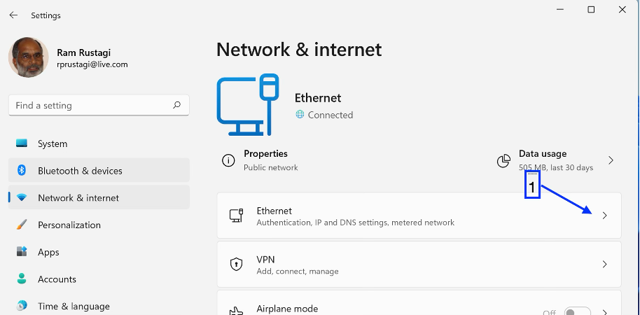
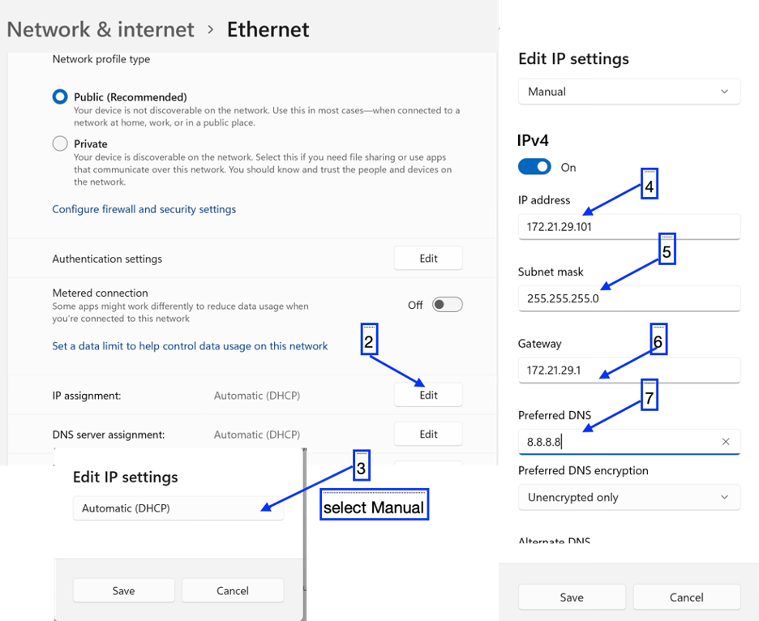
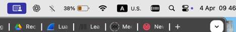
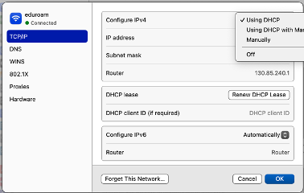

# Lab 03 - IP Addressing, Reachability, and Ncat

This exercise provides basic understanding of IP addressing.

## Learning Objectives

-   Understand IP address configuration on host (Linux, Mac, Windows)

-   Understand subnetting of IP addresses

-   Become familiar with basic network utilities: ping, traceroute

## Learning Resources

-   Understand IP Addressing: Everything you ever wanted to know

    -   https://ia800606.us.archive.org/21/items/B-001-002-066/501302.pdf

-   Computer Networks - A Top Down Approach, v8, Kurose, Ross; Pearson
    publishing

-   Interactive Exercises : Chap 04

    -   https://gaia.cs.umass.edu/kurose_ross/interactive/

## Environment 

Access to a Linux, Windows, or Mac system. 

## Description

### Configure IP address on a host.

IP address of a host in an office/workplace environment is generally configured using DHCP. There is a DHCP server that is installed and configured by IT admin which assigns address to the machine that connects to the network. In a server environment, that IP address is configured manually. For our manual configuration of IP address, we will use the IP network address 172.29.0.0/16 in our examples.

#### Configure IP address on a Linux Host

Follow the steps as marked by arrow with step numbers to configure IP
address of a host manually.

- Network configuration on Ubuntu
    > 
- Changing from DHCP to static IP
    > 
- Configuring IP address with subnet mask and DNZ
    > 

#### Configure IP address on a Windows Host

Follow the steps marked with numbers to configure the static IP address
in Windows 11.
- Configuring Network address
    > 
- Configuring Static IP address
    > 

#### Configure IP address on a Macbook Host

- Click on Wifi Icon in Menu Bar.
    > 

- Select WiFi Settings. This will show the following window. Select DHCP or Manual configuration. In manual configuration, enter the IP address, netmask, default router, and DNS server IP address as provided by Network administrator. Once assigned check reachability.
    > 

> <h1>REVERSE TO DHCP AFTER PRACTICE</h1>

### Internet Reachability and traceroute

1.  Connect to UMBC Public network e.g. "UMBC Visitor" and reset your network configuration to DHCP.
1.  Check reachability (ping) to google.com or any other website. This should be successful.
    1.  `ping -c6 www.google.com` 
2.  Identify each IP router connecting you to google. 
    1.  Use the following command to list all the routers between your device and google.com
        - On Macbook/Linux: `traceroute -n www.google.com`
        - On Windows: `tracert -n www.google.com`

### Exploring Ncat — A Versatile Networking Tool

Installation Instructions

- Windows
  1. Visit: https://nmap.org/download  
  2. Download and install **Nmap for Windows** (Ncat is included).
  3. Open **Command Prompt** or **PowerShell** and verify: `ncat --version`

- Linux (Debian / Ubuntu)
    1. Open a **Terminal** and install via CLI `sudo apt install nmap`
    2. Verify via: `ncat --version`

- macOS
    1. Open a **Terminal** and install via CLI `brew install nmap`
    2. Verify via: `ncat --version`

Note: macOS and Linux include a basic `nc`, but `ncat` provides additional features.

#### Basic TCP Communication Using Ncat
Open two terminals (Using VSCode terminal or Other terminals)
- Start the Server (Terminal 1): `ncat -l -p 12345`
- Start the Client (Terminal 2): `ncat <server_ip> 12345`
  - Your machines IP or 127.0.0.1 (loopback ip)

Text entered in one terminal will appear in the other.

> **Communicating with Your Neighbor**
- Instead of two terminals on one computer

1. Find your IP address:
   - Linux / macOS:`ip a` or `ifconfig`
   - Windows:`ipconfig`
2. Share your IP address with your neighbor.
3. Start a server:`ncat -l -p 12345`
4. Ask your neighbor to connect:`ncat <your_ip> 12345`
5. Exchange messages and then switch roles.

#### Using Ncat as a Web Browser

Type the following on a terminal: `ncat -C google.com 80`
- Then type the following and press **Enter twice**:`GET / HTTP/1.1`

Observe the HTML response from the server.

#### Creating a Simple Web Server Using Ncat

1. Observe the script inside `hello.html`:
2. From Terminal, run Ncat as a web server: `ncat -l localhost 8080 < hello.html`
1. Open a browser and visit:`http://localhost:8080`

#### Remote Shell Access (Demonstration Only)

Warning: This is for educational demonstration only. Do NOT expose this to public networks.

1. Start a shell server on one terminal : `ncat -e /bin/bash -l -p 12345`
2. Connect from a client on another termina:`ncat <server_ip> 12345`
   - Try commands such as:`ls, pwd, ps`

### Configuring Subnets

Connect to WiFi Network "UMBC-DPS-CN" SSID with password as given. Choose the network interface and identify your IP addressand default router. Your IP assigned IP address should be in the network range 192.168.99.0/25 or something similar as described at the time of exercise conduction. IP address of your device should be like 192.168.99.X and IP address of wifi router would be 192.168.99.1 (Ensure to verify it at the time of exercise conduction).

#### Checking connectivity

1.  Check reachability of each other by ping WiFi gateway e.g., 192.168.99.1 and it should be successful.
1.  Check reachability to other participants. 
    1.  Ping the IP address of other users. Ensure that personal firewall permits Ping (ICMP) packets.

#### Overlapping subnets

1.  Configure you IP address manually by keeping the same IP address as assigned by DHCP but increase the subnet range i.e. set the network mask as /24.
    1.  Check reachability (ping) to Wifi Router and it should work.
2.  Configure your IP address manually as 192.168.99.x+128, i.e. increase the value the of last byte in the IP address by 128. 
   - By increasing the subnet range, you are creating the subnet that overlaps the network of Wifi Router.
    1.  Check reachability of Wifi Router (192.168.99.1) and it should fail. 
     - This is because Wii router is in your range and but from router perspective, you are outside the network of router.
3.  Note down the IP Address of other participant e.g. 192.168.99.Y+128 and check its reachability. This should be reachable.

## Summary

> In this exercise, we have studied and learnt the following

a.  Assignment of IP Address upon connecting to internet.

b.  Checking reachability using ping

c.  Identifying all the routers from the device to chosen internet
    server e.g. google.com

