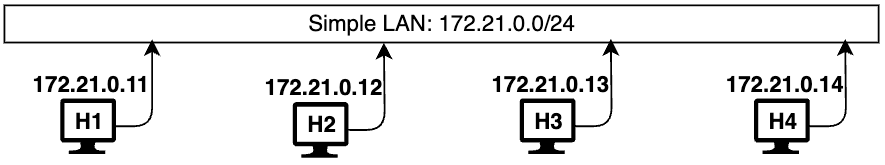
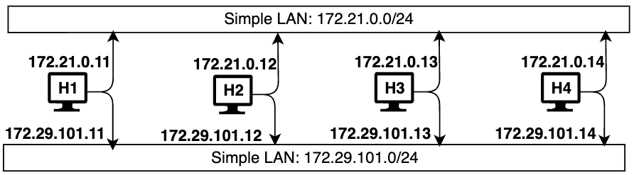
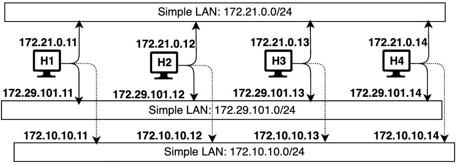
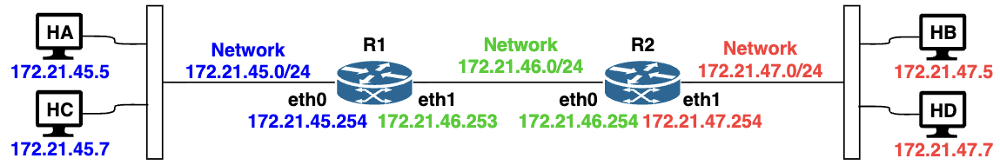

# Lab 04 - IP Addressing, and Subnets

This exercise provides overview of docker containers and their use in creating various network scenarios to study network behaviour. 

## Learning Objectives

- Understand IP address configuration on host 
- Become familiar with accessing multiple network on the same interface
- Understand use of docker containers
- Create network scenarios using docker containers

## Learning Resources

-   Understand IP Addressing: Everything you ever wanted to know
    -   https://ia800606.us.archive.org/21/items/B-001-002-066/501302.pdf
-  Understand docker containers
    - https://www.docker.com/
    - https://www.docker.com/products/docker-desktop
-   Computer Networks - A Top Down Approach, v8, Kurose, Ross; Pearson
    publishing

## Environment 

The majority of our networking exercises will be carried out in a docker based environment using Docker Desktop. Docker Desktop is an application environment for your laptop environment that enables to run containerized applications. The Docker Desktop integrates and provides access to a vast ecosystem of docker images via Docker Hub. Using this application, we will create majority of our networking scenarios and understand working of networking protocols.

We will use `docker compose` to create multiple containers in single step. All images for the containers are available on the hub. If the image from the hub does not work:
- We will build the images from docker files 
  - net-ub22-host.df
  - multi-router.df 
- To build an image from `.df` files, use the command below
  - `docker build -f <file-name>.df -t <image-name> .`
- Then update the `.yml` files to use local builds instead
  - E.g. `zizutg/net-ub22-host` will be replaced by `net-ub22-host`

## Description

After docker desktop and other utilities are setup, carry out the following basic exercises to understand and implement basic of network

### Configuring IP Address on a host

Consider a simple network with 4 hosts



To create this network:
- Open your terminal, and enter the following command. 
  - Make sure you are the directory containing YAML files
- `$ docker-compose -f multi-net4-LAN-4H.yml up -d`
```
    [+] Running 6/6
    ✔ Network wk-02_net-1  Created                  0.0s 
    ✔ Network wk-02_net-2  Created                  0.0s 
    ✔ Container H4         Started                  0.6s 
    ✔ Container H3         Started                  0.6s 
    ✔ Container H2         Started                  0.6s 
    ✔ Container H1         Started                  0.6s 
```
This will create 2 networks, and 4 hosts.
- At this point we only care about net 1
  - **Unfortunately Docker will assign IP addresses automatically**
  - You can verify this by accessing each host and checking ip
  
```
$ docker exec -it H1 bash
root@cd20737f7dab:/# ip addr show 
``` 
> **You can add interface after command, eth0 or eth1**

#### Assigning IP addresses

- We first flush old IP addresses
  - Access each H1 using the above command
  - Use the following command to flush both automatic IP addresses
    ```
    root@cd20737f7dab:/# ip addr flush dev eth0 && ip addr flush dev eth1
    ```
- Assign a new IP and check
    ```
    root@cd20737f7dab:/# ip addr add 172.21.0.11/24 dev eth0
    root@cd20737f7dab:/# ip addr show eth0
    11: eth0@if225: <BROADCAST,MULTICAST,UP,LOWER_UP> mtu 1500 qdisc noqueue state UP group default 
        link/ether 06:40:88:7b:26:f6 brd ff:ff:ff:ff:ff:ff link-netnsid 0
        inet 172.21.0.11/24 scope global eth0
        valid_lft forever preferred_lft forever
    ```
***Repeat this process for all the remaining hosts***
|Host |IP Address. |Interface |
|-----|------------|----------|
|H2   |172.21.0.12 |eth0      |
|H3   |172.21.0.13 |eth0      |
|H4   |172.21.0.14 |eth0      |

### Checking Reachability in a simple LAN

Check reachability of all Hosts from Host H4 using the `ping`. 
- Similarly, you can check reachability of other hosts from each other. 
    ```
    $ docker exec -it H4 bash
    root@c596c42cdb0a:/# ping -c2 172.21.0.11 
    PING 172.21.0.11 (172.21.0.11) 56(84) bytes of data.
    64 bytes from 172.21.0.11: icmp_seq=1 ttl=64 time=0.129 ms
    64 bytes from 172.21.0.11: icmp_seq=2 ttl=64 time=0.072 ms

    --- 172.21.0.11 ping statistics ---
    2 packets transmitted, 2 received, 0% packet loss, time 1039ms
    rtt min/avg/max/mdev = 0.072/0.100/0.129/0.028 ms

    root@c596c42cdb0a:/# ping -c2 172.21.0.12
    PING 172.21.0.12 (172.21.0.12) 56(84) bytes of data.
    64 bytes from 172.21.0.12: icmp_seq=1 ttl=64 time=0.906 ms
    64 bytes from 172.21.0.12: icmp_seq=2 ttl=64 time=0.074 ms

    --- 172.21.0.12 ping statistics ---
    2 packets transmitted, 2 received, 0% packet loss, time 1026ms
    rtt min/avg/max/mdev = 0.074/0.490/0.906/0.416 ms

    root@c596c42cdb0a:/# ping -c2 172.21.0.13
    PING 172.21.0.13 (172.21.0.13) 56(84) bytes of data.
    64 bytes from 172.21.0.13: icmp_seq=1 ttl=64 time=1.44 ms
    64 bytes from 172.21.0.13: icmp_seq=2 ttl=64 time=0.155 ms

    --- 172.21.0.13 ping statistics ---
    2 packets transmitted, 2 received, 0% packet loss, time 1004ms
    rtt min/avg/max/mdev = 0.155/0.798/1.441/0.643 ms
    ```

### Assign IP to the second interface and check reachability
- Assign the second interface a new IP according to the table and check reachability


|Host |IP Address.   |Interface |
|-----|--------------|----------|
|H1   |172.29.101.11 |eth1      |
|H2   |172.29.101.12 |eth1      |
|H3   |172.29.101.13 |eth1      |
|H4   |172.29.101.14 |eth1      |

- Assign the second interface a another IP according to the table and check reachability


|Host |IP Address.   |Interface |
|-----|--------------|----------|
|H1   |172.10.10.11  |eth1      |
|H2   |172.10.10.12  |eth1      |
|H3   |172.10.10.13  |eth1      |
|H4   |172.10.10.14  |eth1      |


### Determination of Source IP Address.

We have assignment multiple IP addresses to a host. When this hosts sends a packet to another host, it automatically chooses the correct source IP Address and network interface to send the packets to destination IP Address

To understand its working access H1 in one terminal windows and run the following command. 
- ***The message below the command is going to show after you ping this host***

    ```
    root@cd20737f7dab:/# sudo tcpdump -n -i any icmp
    bash: sudo: command not found
    root@cd20737f7dab:/# tcpdump -n -i any icmp
    tcpdump: data link type LINUX_SLL2
    tcpdump: verbose output suppressed, use -v[v]... for full protocol decode
    listening on any, link-type LINUX_SLL2 (Linux cooked v2), snapshot length 262144 bytes
    22:42:26.583986 eth0  In  IP 172.21.0.12 > 172.21.0.11: ICMP echo request, id 29, seq 1, length 64
    22:42:26.584130 eth0  Out IP 172.21.0.11 > 172.21.0.12: ICMP echo reply, id 29, seq 1, length 64
    22:42:27.595977 eth0  In  IP 172.21.0.12 > 172.21.0.11: ICMP echo request, id 29, seq 2, length 64
    22:42:27.596034 eth0  Out IP 172.21.0.11 > 172.21.0.12: ICMP echo reply, id 29, seq 2, length 64
    22:42:52.040325 eth1  In  IP 172.29.101.12 > 172.29.101.11: ICMP echo request, id 30, seq 1, length 64
    22:42:52.040789 eth1  Out IP 172.29.101.11 > 172.29.101.12: ICMP echo reply, id 30, seq 1, length 64
    22:42:53.044965 eth1  In  IP 172.29.101.12 > 172.29.101.11: ICMP echo request, id 30, seq 2, length 64
    22:42:53.045017 eth1  Out IP 172.29.101.11 > 172.29.101.12: ICMP echo reply, id 30, seq 2, length 64
    22:43:03.810341 eth1  In  IP 172.10.10.12 > 172.10.10.11: ICMP echo request, id 31, seq 1, length 64
    22:43:03.810381 eth1  Out IP 172.10.10.11 > 172.10.10.12: ICMP echo reply, id 31, seq 1, length 64
    22:43:04.841785 eth1  In  IP 172.10.10.12 > 172.10.10.11: ICMP echo request, id 31, seq 2, length 64
    22:43:04.841833 eth1  Out IP 172.10.10.11 > 172.10.10.12: ICMP echo reply, id 31, seq 2, length 64
    ^C
    12 packets captured
    12 packets received by filter
    0 packets dropped by kernel
    root@cd20737f7dab:/# 
    ```

- Now, in another terminal window, from H2 send `ping` packets to different IP Addresses (as assigned earlier) as follows.

    ```
    root@f0ac6e2caae3:/# ping -c2 172.21.0.11
    PING 172.21.0.11 (172.21.0.11) 56(84) bytes of data.
    64 bytes from 172.21.0.11: icmp_seq=1 ttl=64 time=0.514 ms
    64 bytes from 172.21.0.11: icmp_seq=2 ttl=64 time=0.228 ms

    --- 172.21.0.11 ping statistics ---
    2 packets transmitted, 2 received, 0% packet loss, time 1012ms
    rtt min/avg/max/mdev = 0.228/0.371/0.514/0.143 ms

    root@f0ac6e2caae3:/# ping -c2 172.29.101.11
    PING 172.29.101.11 (172.29.101.11) 56(84) bytes of data.
    64 bytes from 172.29.101.11: icmp_seq=1 ttl=64 time=1.09 ms
    64 bytes from 172.29.101.11: icmp_seq=2 ttl=64 time=0.194 ms

    --- 172.29.101.11 ping statistics ---
    2 packets transmitted, 2 received, 0% packet loss, time 1005ms
    rtt min/avg/max/mdev = 0.194/0.641/1.089/0.447 ms
    root@f0ac6e2caae3:/# ping -c2 172.10.10.11

    PING 172.10.10.11 (172.10.10.11) 56(84) bytes of data.
    64 bytes from 172.10.10.11: icmp_seq=1 ttl=64 time=0.145 ms
    64 bytes from 172.10.10.11: icmp_seq=2 ttl=64 time=0.184 ms

    --- 172.10.10.11 ping statistics ---
    2 packets transmitted, 2 received, 0% packet loss, time 1031ms
    rtt min/avg/max/mdev = 0.145/0.164/0.184/0.019 ms
    root@f0ac6e2caae3:/# 
    ```

The problem with this is everyone on the network can receive every ping. 
- To check this see the tcp dump of H3, while H2 is pinging H1 
#### Shut down the network

```
(base) zee@Mac wk-02 % docker compose -f multi-net4-LAN-4H.yml  down --remove-orphans
[+] Running 6/6
 ✔ Container H4         Removed                 10.4s 
 ✔ Container H3         Removed                 10.6s 
 ✔ Container H1         Removed                 10.5s 
 ✔ Container H2         Removed                 10.5s 
 ✔ Network wk-02_net-1  Removed                  0.5s 
 ✔ Network wk-02_net-2  Removed                  0.3s 
(base) zee@Mac wk-02 % docker network prune -f 
```

### A network with Router

Create a simple network of four hosts connected via two routers.


Open your terminal, go to the directory containing YAML files and enter the following command: `docker compose -f multi-net4-2R4H.yml up `
- In this case the wk-02 directory
    ```
    (base) zee@Mac wk-02 % docker compose -f multi-net4-2R4H.yml up -d                
    WARN[0000] /Users/zee/Library/CloudStorage/GoogleDrive-zyalew@umbc.edu/My Drive/Courses/CMSC481/class-repo/wk-02/multi-net4-2R4H.yml: the attribute `version` is obsolete, it will be ignored, please remove it to avoid potential confusion 
    [+] Running 9/9
    ✔ Network wk-02_net4-46  Created       0.0s 
    ✔ Network wk-02_net4-47  Created       0.0s 
    ✔ Network wk-02_net4-45  Created       0.0s 
    ✔ Container R2           Started       0.9s 
    ✔ Container HB           Started       0.8s 
    ✔ Container HD           Started       0.8s 
    ✔ Container R1           Started       0.9s 
    ✔ Container HA           Started       0.8s 
    ✔ Container HC           Started       0.9s 
    (base) zee@Mac wk-02 % 
    ```
- Check that all containers are up and running: `$ docker ps`

- You can check reachability between hosts i.e., and it verify. 
    ```
    (base) zee@Mac wk-02 % docker exec -it HA bash
    root@HA:/# -c2 172.21.47.5 and traceroute 172.21.47.5
    bash: -c2: command not found
    root@HA:/# ping -c2 172.21.47.5 && traceroute 172.21.47.5
    PING 172.21.47.5 (172.21.47.5) 56(84) bytes of data.
    64 bytes from 172.21.47.5: icmp_seq=1 ttl=62 time=1.51 ms
    64 bytes from 172.21.47.5: icmp_seq=2 ttl=62 time=0.310 ms

    --- 172.21.47.5 ping statistics ---
    2 packets transmitted, 2 received, 0% packet loss, time 1007ms
    rtt min/avg/max/mdev = 0.310/0.908/1.507/0.598 ms

    traceroute to 172.21.47.5 (172.21.47.5), 30 hops max, 60 byte packets
    1  R1.wk-02_net4-45 (172.21.45.254)  0.260 ms  0.054 ms  0.101 ms
    2  172.21.46.254 (172.21.46.254)  0.186 ms  0.118 ms  0.139 ms
    3  172.21.47.5 (172.21.47.5)  0.138 ms  0.126 ms  0.130 ms
    root@HA:/#     
    ```
- Repeat from between other hosts

### Analysing the router

- Access the router via terminal: `docker exec -it R1 bash`
- Show the route table
    ```
    root@R1:/# ip route show
    default via 172.21.46.254 dev eth1 
    172.21.45.0/24 dev eth0 proto kernel scope link src 172.21.45.254 
    172.21.46.0/24 dev eth1 proto kernel scope link src 172.21.46.253 
    ```
- Check IP forwarding is enabled R1.
    ```
    root@R1:/# cat /proc/sys/net/ipv4/ip_forward
    1 
    ```
  - ***1 means enabled, 0 means not***
- See available routing tables
   
    ```
    root@R1:/# cat /etc/iproute2/rt_tables
    #
    # reserved values
    #
    255     local
    254     main
    253     default
    0       unspec
    #
    # local
    #
    #1      inr.ruhep
    ```
- Create new table, add a rule to it, and check it table exits
    ```
    root@R1:/# echo "100 custom1" >> /etc/iproute2/rt_tables
    root@R1:/# ip route add 10.0.0.0/24 via 172.21.46.254 table custom1
    root@R1:/# cat /etc/iproute2/rt_tables
    #
    # reserved values
    #
    255     local
    254     main
    253     default
    0       unspec
    #
    # local
    #
    #1      inr.ruhep
    100 custom1
    ```
- Finally, see inside the routing tables
    ```
    root@R1:/# ip route show table custom1
    10.0.0.0/24 via 172.21.46.254 dev eth1 

    root@R1:/# ip route show table local
    local 127.0.0.0/8 dev lo proto kernel scope host src 127.0.0.1 
    local 127.0.0.1 dev lo proto kernel scope host src 127.0.0.1 
    broadcast 127.255.255.255 dev lo proto kernel scope link src 127.0.0.1 
    local 172.21.45.254 dev eth0 proto kernel scope host src 172.21.45.254 
    broadcast 172.21.45.255 dev eth0 proto kernel scope link src 172.21.45.254 
    local 172.21.46.253 dev eth1 proto kernel scope host src 172.21.46.253 
    broadcast 172.21.46.255 dev eth1 proto kernel scope link src 172.21.46.253 
   
    ```

Shut down the network
```
(base) zee@Mac wk-02 % docker compose -f multi-net4-2R4H.yml down --remove-orphans
WARN[0000] /Users/zee/Library/CloudStorage/GoogleDrive-zyalew@umbc.edu/My Drive/Courses/CMSC481/class-repo/wk-02/multi-net4-2R4H.yml: the attribute `version` is obsolete, it will be ignored, please remove it to avoid potential confusion 
[+] Running 9/9
 ✔ Container HC           Removed                   10.6s 
 ✔ Container R1           Removed                   10.6s 
 ✔ Container HD           Removed                   10.4s 
 ✔ Container HA           Removed                   10.5s 
 ✔ Container HB           Removed                   10.3s 
 ✔ Container R2           Removed                   10.6s 
 ✔ Network wk-02_net4-45  Removed                    0.2s 
 ✔ Network wk-02_net4-46  Removed                    0.3s 
 ✔ Network wk-02_net4-47  Removed                    0.5s 
(base) zee@Mac wk-02 % docker network prune -f  
```

## Summary

In this exercise, we have studied and learnt the following
- Assignment of an IP Address to a host
- Assignment of multiple IP Address to a host
- Assignment of multiple IP addresses to a single interface of a host.
- Creating LANs with and without routers
- Configuration of routing tables in a router and host
- Study of routing table structure in a network router.


