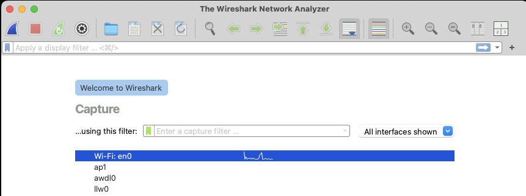
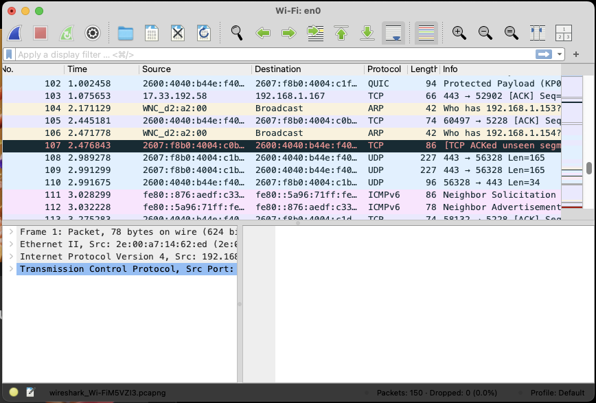
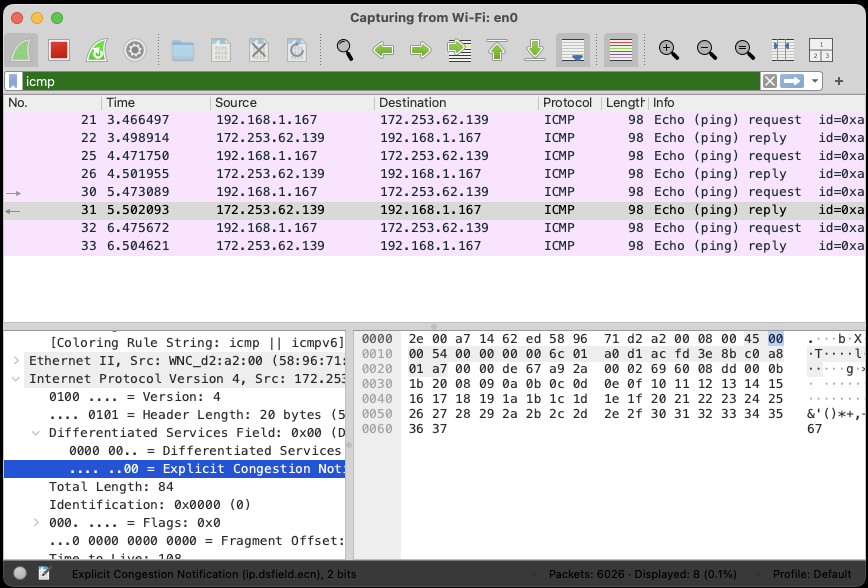
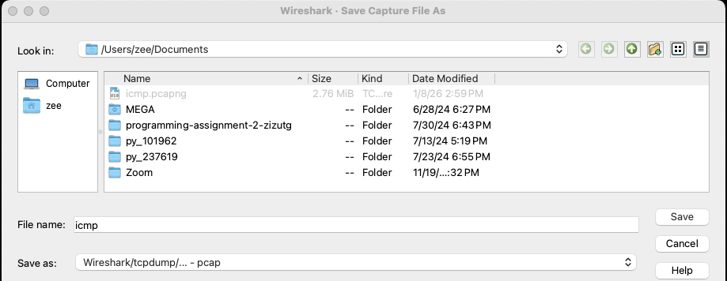

# Lab 04 - Wireshark

This exercise provides overview of Layer 2 networking

## Learning Objectives

-   Understand use of wireshark
-   Analyze network traffic using wireshark

## Environment 

A laptop running windows/MacOS/Linux with all tools and utilities installed. 

- Download and install Wireshark from <https://www.wireshark.org/download.html>. 
- Ensure to download the version applicable to your laptop (e.g. Windows, Macbook Intel, Macbook Mx chip). 
- Follow the instruction during installation. 
- Do install the related components such as tshark, and external capture interfaces such as sshdump, UDPdump etc. 
- For live capture of traffic, do select the latest version of Npcap to download and install.

## Description

After Wireshark is installed, carry out the following basic exercises to understand the basic packet capture mechanism. Start the wireshark application and it will show a welcome screen which will ask you to choose the network interface. The capture interface window may be different depending upon underlying OS being Windows or Macbook. 

### Capture Traffic

To capture any live traffic, you need to select the appropriate network interface. Choose the interface on which it shows some line graph indicating the live traffic. Choose Wi-Fi or Ethernet interface with which you are connected to internet. Enter (or Press RETURN) and the wireshark window will show the packets being transmitted and received on the network interface. Since the laptop continue to access internet in the background, it is likely that it will shows a continuous flow of live packets being captured. 

This live capture of entire traffic is likely to capture large number of network packets and likely to overwhelm and it will be challenging to interpret anything. This live traffic shows that wireshark at basic is working fine.

Click on the Red box (square button) in the menu to stop the live traffic. The wireshark window primarily shows 3 panes. The top pane shows all the traffic that is being captures and it is sequenced as per packet numbers. The second pane shows the protocol details of the packet being selected in the top pane. By default, it may be the first packet. The 3^rd^ pane shows that bytes (octets) in hex value of the packet selected in top pane. Select another packet in top pane and you will see the content changing in pane 2 and pane 3 accordingly.

Quit wireshark application. Choose the option "Quite Without Saving" and wireshark application will quit.

### Capturing Ping Packets

1.  Start the wireshark application, and select the interface connected to internet. Specify the capture filter as "icmp". If the capture filter syntax is proper, it will show with a Green color indicator. If it is incorrect or improper, this will be indicated by a red or yellow color. After entering the correct capture filter, press Enter/Return key.

2. This will start the capture but will not show any packets in the window panes.

3. Open the command terminal window, and ping google.com by sending few packets.( If using Macbook, then specify the option "-c 4" otherwise it will continuously keeping sending Ping packets). For example, use the following command

   - `$ ping -c4 www.google.com`

4. This will show 4 Echo (Ping) request packets and corresponding 4 Echo (Ping) Reply as shown in Figure 3. After ping command completes, stop the capture by clicking the Red button.

5.  Select any of the 8 packets and in the two panes below it will show the protocols details of ping packet, e.g., Ethernet, Internet, and ICMP (Internet control Message Protocol). Analyze the protocol in "Packet Details" pane. Look at the source and destination IP address of any packet. For Echo Request packet, source IP will be your laptop IP address and destination IP will correspond to Google's IP address. Similarly, for Echo Reply packet, source IP will correspond to google.com and destination IP will correspond to your laptop's IP address.

Analyze the packet length field in the Packet List pane and packet detail pane. Scroll down the Packet Detail pane to know the Data size of ICMP Echo Request. By default, it will be 48 bytes.

### Saving the Packets Capture

Saving all the packets
- Stop the capture first
- For a subsequent analysis, save the captured packet in a file. 
- The saved file has an extension `.pcap` indicating packet capture. Use the Wireshark options as follows
  - `Wireshark - File - Save As.`
- Enter any file name of your choice and click "Save". All the packets will be saved in the specified file.

Saving selected packets

- Wireshark also provides option to save few selected packets. 
- To save specific packets, use the option FileExport Specified Packets. It will display many options on which packets need to be specified. Select the option you would like. 
- For example, figure shows the options for saving packets numbered from 3 to 6 i.e., 4 packets in the fie icmp.pcap.

#### Capturing HTTP packets.

Use the capture option, select the appropriate live network interface, and specify the capture filter as HTTP (or port 80) and start the capture. Open a web browser and enter any URL e.g. <http://umbc.edu> or <http://google.com>. When browser shows the content of webpage, respective packets capture will be shown in wireshark window.

Save the packets e.g. in a file http.pcap for later analysis

### Analyze Packets Capture from a saved file.

Start wireshark, and instead of live capture, open the save file e.g. icmp.pcap to analyze the packets. File Open

Select the filename and it will show the 4 packets save earlier. Explore various options of wireshark e.g. time in different format. Explore the various menu options of wireshark to understand basic working of wireshark.

#### Analyze Packets Capture from other saved files.

Share your saved file with another course participant and similarly, receive the packet capture file from another participant and analyze the captured file. Share your findings with each other of you packet capture analysis.

## Summary

In this exercise, we have studied and learnt the following
-  Starting wireshark to capture live traffic and analyze1
-  Use wireshark to analyze already captured traffic.

## Learning Resources

Wireshark and tcpdump
-   <https://www.wireshark.org/>
-   tshark for windows
-   <https://www.tcpdump.org/>
-   <https://www.winpcap.org/windump/>
-   <https://npcap.com/#download>
-   <https://techcommunity.microsoft.com/blog/coreinfrastructureandsecurityblog/introduction-to-network-trace-analysis-part-1-asking-questions-and-collecting-da/3575496>
