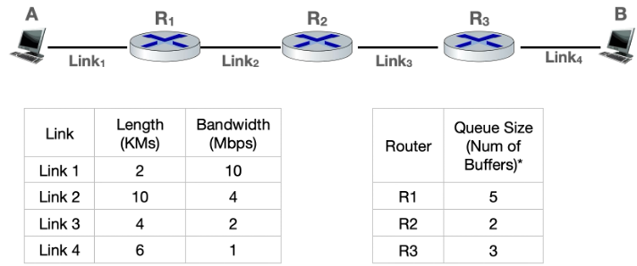
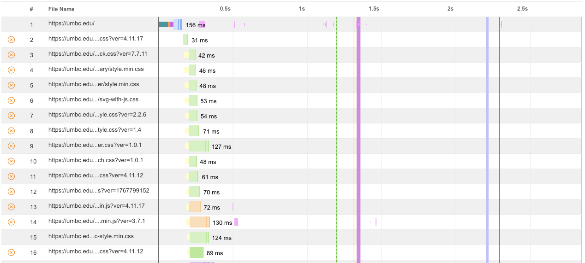
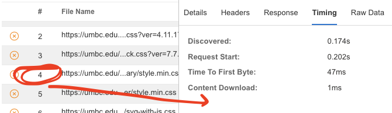
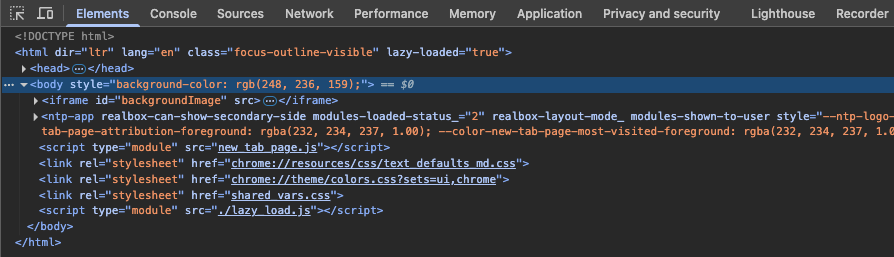

## Lab 06 - Delays in computer networks

This exercise provides hands-on experience with understanding networking
delays their various components, and real life delays (with delays when accessing web page),

## Learning Objectives

-   Understand basics of networking delay
-   Understand components of delay, such as Transmission, Propagation and Queuing delay

## Environment 

Access to laptop running with access spreadsheet (MS excel or Google worksheet) and a browser (Firefox or Chrome).

## Description

This lab introduces students to the end-to-end behavior of Internet communication, starting from low-level transmission delays across network elements, and progressing to high-level web performance analysis as experienced by end users.

In the first part of the lab, students will calculate the end-to-end delay for sending a sequence of packets from one host to another through a series of network elements (e.g., routers or switches). 
- Using a simplified network topology where Host A is connected to Host B via three intermediate devices, students will break down the total delay into transmission, propagation, and processing components. 
- This exercise builds intuition about how physical and logical infrastructure contributes to overall communication delay.

In the second part, students shift focus to the application layer. 
- They will investigate what happens when a user enters a URL into a browser—examining how the browser fetches content from a web server and renders it. 
- The focus here is on understanding the time spent downloading the content and the time needed to render or process the content (e.g., displaying a webpage, playing media, or opening a file). 
- Students will connect these delays with their earlier analysis of network-level delay, providing a holistic view of web performance.

By the end of this lab, students will be able to relate under-the-hood delays in the network infrastructure with user-visible performance when accessing online content.

## Network End-to-End delay

Host A sends 10 packets, each of size 4000 bits without any inter packet gap i.e., transmission of $N^{th}$ packets starts immediately after transmission of $(N-1)^{th}$ packet is completed. 
- Your task is to compute end to end delay in ***milli seconds***. 
- The end-to-end delay should take into consideration ***Propagation Delay***, ***Transmission Delay*** and ***Queuing Delay***. 
  - You can assume that ***Processing delay*** is zero. 
- For computing propagation delay, consider that speed of electromagnetic communication is $2*10^5KM/s$ (the approximate speed of EM wave in copper medium).
  -  Thus, assuming that the first bit of packet starts at time `t=0ms`, you need to compute the time at which last bit of last packet will be received by Host B. 
- Note that it is not necessary that last packet would be $10^{th}$ packet. 
  - It could be $9^{th}$ pkt (if $10^{th}$ packet is discarded by a router when no buffer available) or - it could even be $8^{th}$ packet as well (if both $9^{th}$ and $10^{th}$ packets are dropped by routers).

  

Each router has fixed number of queue buffers (each of size 4000 bits) which excludes the buffer for currently receiving and transmitting packet. 
- When a router receives the packet, it is received in receive buffer. 
- Similarly, when a router transmits the packet, it moves the packet to transmit buffer and then starts transmission. 
- Thus, even if a router has no queue buffer, it can still receive the packet in receive buffer, moves it to transmit buffer and starts transmitting this packet. 
- A router can receive and transmit simultaneously i.e., while transmitting a packet, it can also receive the next incoming packet. 
- Each router uses *Store and Forward* mechanism i.e., it can start transmission only after it has received the complete packet. 
- In case router has no buffer to store the incoming packet(s), it will discard the packet. 
- When a router receives a packet, and transmit buffer is occupied because of previous packet still being transmitted, it will move the packet from receive buffer to queue buffer.

### Delay Computation Basics

Considering the example  network, which also show the bandwidth of each link as well as its length. For our computation, consider that at host A:

The $1^{st}$  packet transmission starts at $t=0ms$, and your task is to compute its transmission delay and the propagation delay to calculate the time at which it will arrive at router $R1$. 
- The propagation delay of Link-1 is $2/(2*10^5)=0.01ms$. 
- Transmission delay of packet 1 is $4000/(10*10^6)=0.4ms$. 
  - Thus, first bit of first packet will arrive at $R1$ at $t=0.01ms$ and its last bit will arrive at $t=0.4+0.01=0.41ms$. 
  - Thus, router $R1$starts its transmission of first packet at time $t=0.41ms$. 
  - Since this packet is transmitted immediately upon arrival, there is no queuing delay for this $1^{st}$ packet in router $R1$. 

The $2^{nd}$ packet transmission at host A will start time $t=0.40ms$.
- It will be received by router $R1$ at $t=0.81ms$ (the first bit of $2^{nd}$ bit arrives as time $t=0.41ms$, and last bit at time $t=0.81ms$). 
- However, the transmission delay of $1^{st}$ packet by $R1$ is computed as $4000/(4*10^6)=1.0ms$. 
- Thus, first packet transmission at $R1$ will complete at time $t=0.41+1.0=1.41ms$. 
- Since the $2^{nd}$ packet arrives at $R1$ at time $t=0.81ms$, it will be in the first queue buffer from time $t=0.81ms$ to time $t=1.41ms$ i.e., its queuing delay will be $0.60ms$. 
  
Similarly, $3^{rd}$ pkt will arrive at $R1$ at time t=1.21ms will occupy $2^{nd}$ queue buffer. 
- At this time, queue size at $R1$ is 2 (pkt \#2, \#3). The transmission of $2^{nd}$ pkt at $R1$ can start at time $t=1.41ms$ and complete at time t=2.41ms. 
- Thus, queuing delay for $3^{rd}$ pkt at $R1$ will be $2.41-1.21=1.20ms$. 
- At time just before $t=1.41ms$, $R1$ has queue size of 2 (pkt \#2 and \#3). 
- However, if router $R1$ has only one queue buffer, then it already has $2^{nd}$ packet in its buffer and so can't store this $3^{rd}$ packet and hence it will discard this $3^{rd}$ packet.

### Computation of Delay and Packet Loss

Your computation should show the entries in the table at each router and host B. Some entries have been filled for explanation. All times are in milli seconds. You need to fill remaining entries.
- **R<#>**: Router number
- **AT**: Arrival time
  - time corresponds to arrival time of last bit of the packet
- **QT**: Queue time
  - how long it remained in the queue, i.e., time between when its last bit arrived and its first bit transmitted. If
    router has no buffer when packet arrives, it discards this last packet. When the packet is discarded upon arrival, then write "Dropped" in Q time column and N.A. in Dep. Time column.
- **DT**: Departure time
  - corresponds to transmission start time of first bit of the packet
- **Queue Size**: R1 = 5, R2 = 2, and R3 = 3
  - Note: Queue time and transmission start time is not applicable to hostB.

|pkt # | R1 - AT   | R1-QT   | R1-DT    | R2 - AT   | R2-QT   | R2-DT    | R3 - AT   | R3-QT   | R3-DT    | B - AT |
|------|-----------|---------|----------|-----------|---------|----------|-----------|---------|----------|-----------|
| 1    | 0.41      | 0       | 0.41     | 1.46      | 0       | 1.46     |           |         |          |           |
| 2    | 0.81      | 0.60    | 1.41     | 2.46      |         |          |           |         |          |           |
| 3    | 1.21      |         |          |           |         |          |           |         |          |           |
| 4    |           |         |          |           |         |          |           |         |          |           |
| 5    |           |         |          |           |         |          |           |         |          |           |
| 6    |           |         |          |           |         |          |           |         |          |           |
| 7    |           |         |          |           |         |          |           |         |          |           |
| 8    |           |         |          |           |         |          |           |         |          |           |
| 9    |           |         |          |           |         |          |           |         |          |           |
| 10   |           |         |          |           |         |          |           |         |          |           |

## Web Delay: Measuring Internet Access Speed

A typical internet access at home or office is currently available at 100Mbps or higher rates. 
- Even the cellular 5G connectivity provides the internet bandwidth at these rates. 
- Typically, download (from the internet) speed is much higher than the upload (to internet) speed.

As a first exercise, measure your download and upload speed. 
- In the browser, enter the URL <http://speedtest.net> and start the measurement. 
- This typically would take about few tens of seconds and provide the details of both download and upload speed.

- Use the URL <http://speedtest.net> (or any other similar URL provided by ISP) , Choose the server from which to run the speed test and start the test.

- Analyze the result of speed test and ping performance. 
  - The ping response would be in tens of milliseconds.
  - Do a ping to the IP of the server on the speed test and compare the ping performance with speed test.

### Measuring Web Components

Though high internet connection speed is a must for better user experience, there are other factors that also play significant role in determining the user experience. 
- A typical main URL for any organization consists of number of components such as images, javascripts, stylesheets etc., each having its own URL. 
- Each of these URL are fetched by the browser before the web page is rendered. 

- A website like <http://webpagetest.org> provides a detailed breakdown for each component. 
- This exercise involves analyzing the web performance of the main web page of your organization. 
- Carry out the following steps.

-   Access the website <https://www.webpagetest.org/> and enter the URL your chosen website (e.g. umbc.edu) to analyze its performance.

-   Analyze the Waterfall view of the website. For example, for umbc.edu, it will look as shown below.
    

-   Double clicking on this waterfall view to study more details about the performance. 
- For this test, it shows website umbc.edu consists of 82 components and required 28 TCP Connections. 
- For each of the URL, it provides request start time, DNS lookup time, download time, bytes downloaded and HTTP Status code.

-   A deeper analysis shows that URL Request `#4` <https://umbc.edu/wp-includes/blocks/cover/style.min.css>, took 1 millisecond to download are 2KB.
  

-   Identify all such URLs in your chosen website which takes longer than 1s. 
- This provides you some insight into overall performance of your website and provides pointers to areas which can be improved for better user experience.

#### Using Web Developer Tools

Most web browsers today provide support for analyzing web performance. 

For example, in Firefox browser, before accessing a web page, setup the web Developer toosl as follows.

- FirefoxTriple bar application menu (**≡**) > More Tools > Web Developer tools.

For Chrome browser Web Developer Tools can be accessed as 
- Chrome Hamburger Menu (3 vertical dots) **⋮** > More Tools > Developer Tools
  

-   Enter the desired URL (e.g. umbc.edu) and while web page will be rendered in the main window, the sub window will show all the components URLs being fetched under the Network tab. 
- The last line (Status) line will show summary performance.

-   Analyze the component URLs and identify the URLs that take maximum time. 
- Clicking on a particular URL will provide more details for that URL, such as Request Timing for Waiting and Receiving. 
- This will help you identify the bottleneck components that may need to be looked into to improve overall performance.

## Summary
In this exercise, we have studied and learnt the following

- Components that constitute end to end delay.
- Computation of Transmission, Propagation and Queuing delay.
- Computation of end to end delay
- Measuring the raw bandwidth of internet connection.
- Analyzing a website performance though Web developer tools in a browser or through web performance measurement sites e.g. <https://webpagetest.org>.

## Learning Resources

-   <https://media.pearsoncmg.com/ph/esm/ecs_kurose_compnetwork_8/cw/content/interactiveanimations/transmission-vs-propogation-delay/transmission-propagation-delay-ch1/index.html>
-   <https://media.pearsoncmg.com/ph/esm/ecs_kurose_compnetwork_8/cw/content/interactiveanimations/queuing-loss-applet/index.html>
-   <https://gaia.cs.umass.edu/kurose_ross/interactive/caravan.php>
-   <https://gaia.cs.umass.edu/kurose_ross/interactive/one-hop-delay.php>
-   <https://gaia.cs.umass.edu/kurose_ross/interactive/end-end-delay.php>
-   <https://www.speedtest.net/>
- <https://www.webpagetest.org/>

## Answer for E2E Delay

|pkt #|R1 - AT|R1-QT|R1-DT|R2 - AT|R2-QT|R2-DT|R3 - AT|R3-QT|R3-DT|B - AT|
|---|---|---|---|---|---|---|---|---|---|---|
|1|0.41|0.00|0.41|1.46|0.00|1.46|3.48|0.00|3.48|7.51|
|2|0.81|0.60|1.41|2.46|1.00|3.46|5.48|2.00|7.48|11.51|
|3|1.21|1.20|2.41|3.46|2.00|5.46|7.48|4.00|11.48|15.51|
|4|1.61|1.80|3.41|4.46|3.00|7.46|9.48|6.00|15.48|19.51|
|5|2.01|2.40|4.41|5.46|4.00|9.46|11.48|8.00|19.48|23.51|
|6|2.41|3.00|5.41|6.46|Dropped|N.A.|N.A.|N.A.|N.A.|N.A.|
|7|2.81|3.60|6.41|7.46|4.00|11.46|13.48|10.00|23.48|27.51|
|8|3.21|4.20|7.41|8.46|Dropped|N.A.|N.A.|N.A.|N.A.|N.A.|
|9|3.61|4.80|8.41|9.46|4.00|13.46|15.48|12.00|27.48|31.51|
|10|4.01|Dropped|N.A.|N.A.|N.A.|N.A.|N.A.|N.A.|N.A.|N.A.|