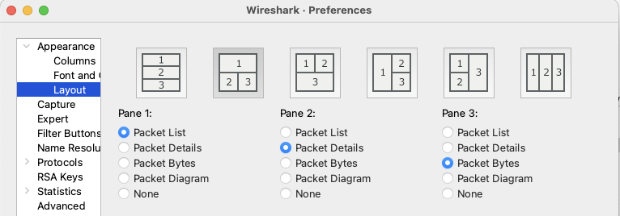
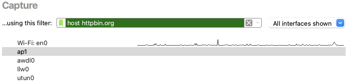
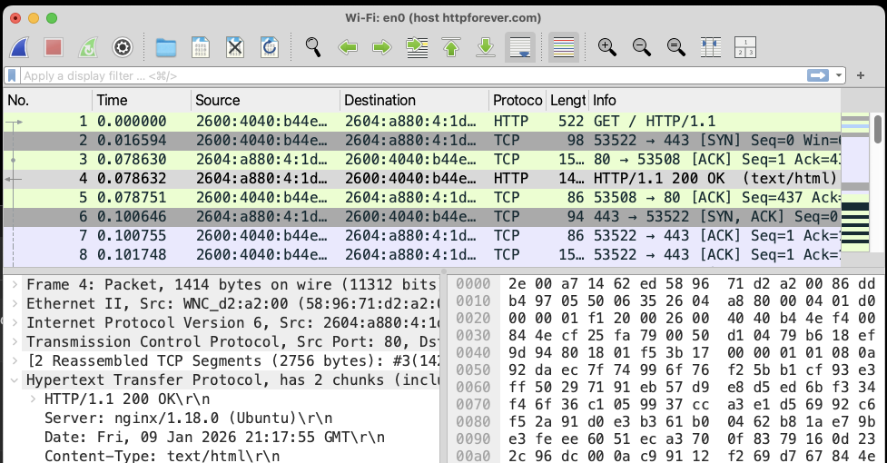
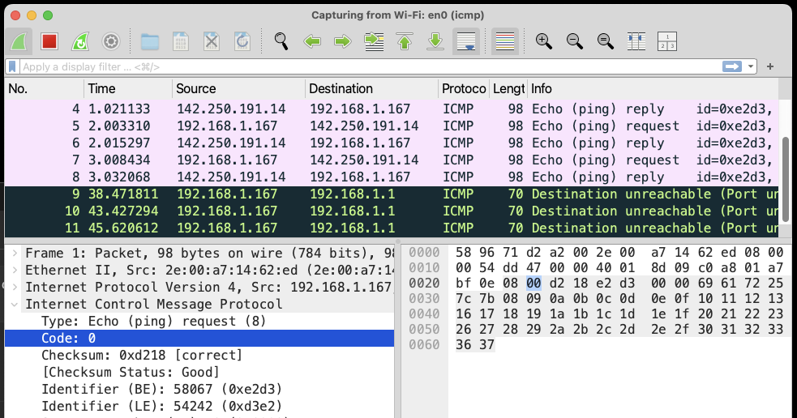
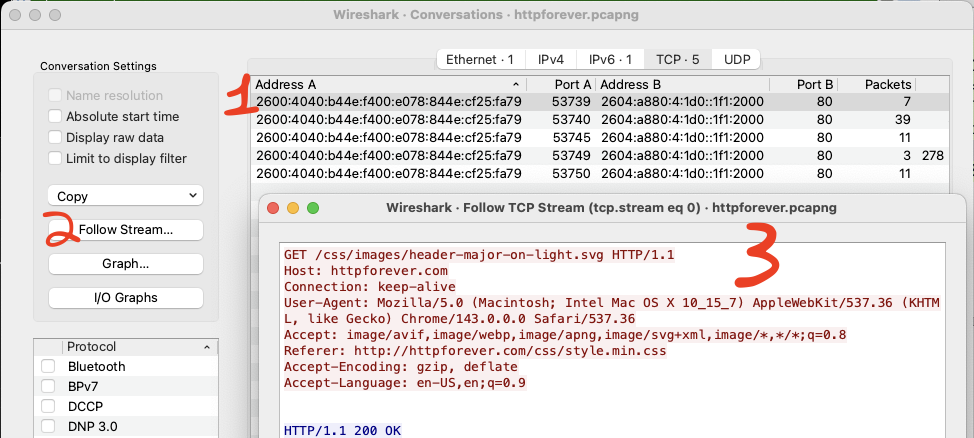
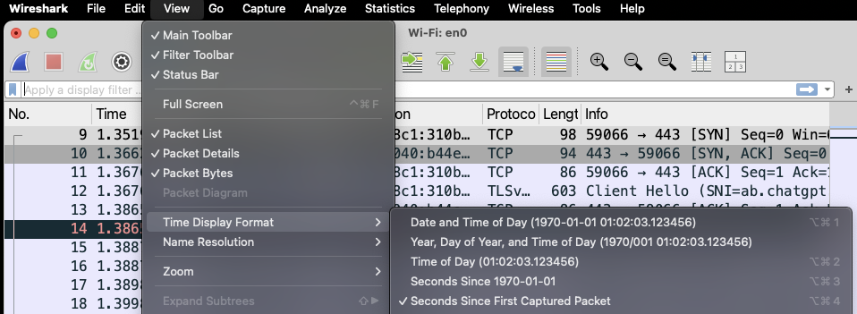
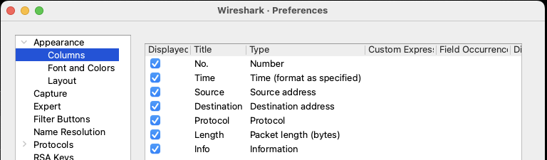
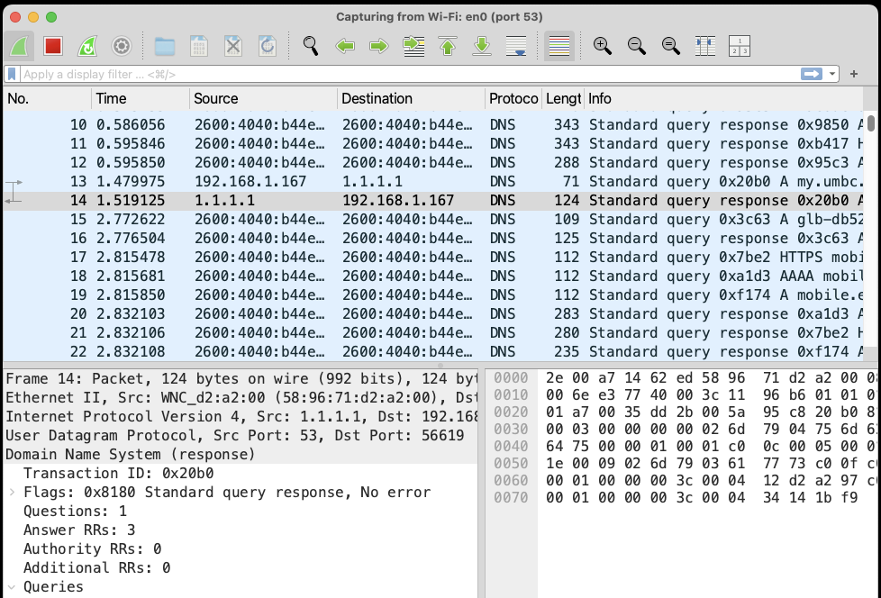
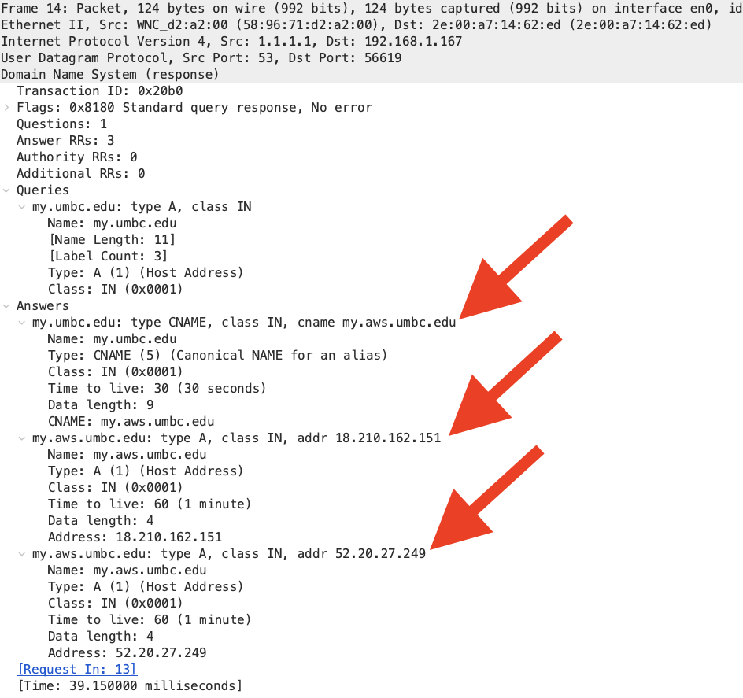

# Lab 07 - Analyzing Network Layers with Wireshark

This exercise provides insights into using Wireshark to analyze packets at each layer protocol stack such as HTTP, DNS, TCP, UDP, ICMP, IP, Ethernet etc.

## Learning Objectives

- Understand packet analysis at field level for a given protocol

- Understand packet encapsulation and decapsulation during packet
    transmission when using the network protocols stack.

## Learning Resources

- https://www.wireshark.org/docs/wsug_html_chunked/ChapterIntroduction.html

## Environment 

This exercise involves using your laptop and Wireshark to dissect packet at each layer of network stack in both the cases of live capture as well as reading from .pcap file. In addition, we explore the built-in utilities, such as nslookup to study DNS resolution process.

## Description

In this exercise, we will dissect packets for commonly used protocols in wireshark. Once you master

### Wireshark Layout

Open the wireshark packet capturing application. Find the setting or preference menu. Set the layout as per your preference. In this exercise we will look at the layout where all 3 panes namely, packet list, packet details and packet bytes pane stacked on each other. It provides many layout options as shown below:



Choose your layout seup as per your preference as follows

Wireshark Preference Appearance Layout(select layout)

### Network layer Analysis of Live Capture of web traffic

- In wireshark, select your primary interface, specify the capture filter as `host httpforever.com`.
  - Or, any other website that serves HTTP traffic and does not redirect to HTTPS, the current default behaviour in Internet wbsites. 
  - For example, <http://httpbin.org>, <http://rprustagi.com> etc.) and start the wireshark capture. Ensure to select the correct network interface corresponding to internet connecting one.
    

  - Open any browser and enter the URL <http://httpforever.com>. Once the browser displays the contents, stop the capture. In the Packet List pane, select the packet which shows HTTP Protocol. The wireshark capture will be something like as shown in the figure.
    

- The packet detail pane shows the full TCP/IP protocol stack i.e. Ethernet, Internet Protocol, TCP protocol and HTTP protocol. Expand HTTP protocol and it will show all of HTTP headers for this HTTP Request. Identify the website being accessed from the request header "Host: httpforever.com".

- Analyze contents of each header. Note that each header is terminated by "\\r\\n" i.e., Carriage Return Line Feed as per the protocol specifications of HTTP. When the header is terminated by single "\\r" or "\\n", it is not consistent with HTTP protocol specifications and some web servers may respond with Error response "400 Bad Request".

- Analyze header details of other protocols, such as, TCP, IP or Ethernet.

- Save the entire capture in a file `httpforever.pcap` (choose your filename)

### Network layer Analysis of Live capture of Ping traffic

- Restart wireshark capture with capture filter as `icmp`.

- Open a terminal window and enter `ping -c4 google.com`

- Stop the wireshark capture after it shows few packets. A sample capture is shown in ??



- Select first packet or any packet and analyze the protocols displayed in the Packet Details pane. It will show 3 protocol, namely, Ethernet, IIP and ICMP. There is no TCP or HTTP protocol in these capture

- Expand the ICMP packet details and analyze all the headers.

### Network layer Analysis of stored capture in a file

- Open the earlier saved file `httpforever.pcap` in wireshark. We will explore few options in wireshark on this capture.

- Explore protocol conversations. From the menu, select Statistics Conversations. An example is shown below: 



- In this capture, it shows 4 conversations for TCP, 1 for IPv4, 1 for Ethernet and none for UDP. It also shows other details i.e. number of packets, bytes in both directions. Scroll to right to see more details. Click on IPv4 or Ethernet protocol to see the details. Close this conversation

- Analyse one of the 4 TCP conversations to see all the data in this connection. Select the first packet. Right click and select "Follow TCP Stream". As this connection has HTTP as higher layer protocol, it will pop up a window showing all the HTTP Data. Identify the TCP Connection details by studying source port number of the client. The display filter in Wireshark window will show 'tcp.stream eq 0'.

- Clear the display filter by clicking cross mark ('X') on the right side of display filter to see the entire traffic.

- Identify another packet with a different source port number and follow this TCP connection to see the HTTP data transferred on this TCP connection.

### Customizing Display Format and Columns

- By default, time stamp of first packet is shown as 0.0s and all subsequent packets shown w.r.t. delay from the first packet. Change the time format e.g. Date/time to see actual time of packet capture. Use the options ViewTime Display Format Date and Time of Day to see the actual time. An example is shown in here:
- 


- Customizing the display columns. By default The Packet List pane shows all the columns. To customize the columns of interest, use the following option,

Wireshark Preferences (or settings) Appearance Columns and select only those columns of interest. This is shown in the figure:


- Similarly, explore other options of wireshark to become familiar with so as to be able to use it effectively during any packet capture analysis.

### Setting up wireshark for DNS

Start wireshark on your laptop , select the appropriate active network interface (e.g., WiFi), specify the capture filter as `port 53` and start the capture. A DNS traffic originated from the laptop and corresponding response will be captured and displayed in the wireshark panels.

#### Simple name resolution

Open the terminal, and choose any domain name of your interest, e.g., my.umbc.edu and use the built in utility nslookup to find the IP address of the domain name. 
- An example usage of the command is provided on both Windows and Macbook. As shown, this provides two IP addresses `52.20.27.249` and `18.210.162.151` corresponding to the domain name `my.umbc.edu` which is an alias of name `my.aws.umbc.edu`. The command output also shows the default DNS IPv6 address of Server used by the host system. 
- This may have a little difference depending on your OS and the network you are connected with

```
(base) zee@Mac class-repo % nslookup my.umbc.edu
Server:         2600:4040:b44e:f400::1
Address:        2600:4040:b44e:f400::1#53

Non-authoritative answer:
my.umbc.edu     canonical name = my.aws.umbc.edu.
Name:   my.aws.umbc.edu
Address: 18.210.162.151
Name:   my.aws.umbc.edu
Address: 52.20.27.249
```


Repeat the exercise to resolve more domain names of your choice and analyze the responses w.r.t. their canonical name, aliases etc.

#### Using Specific DNS Server

Repeat the above exercises using any of your preferred DNS server, e.g., 8.8.8.8 which is publicly available DNS server.

Name resolutions using specific DNS Server
- The general syntax of nslookup command is: `$ nslookup [options] [hostname] [server]`

If the hostname is not given, nslookup will enter the interactive mode where you can its various options to explore all the services offered byDNS.

Some of the public DNS servers that can be used are shown here:
| DNS Server Provider  | Primary DNS Server  | Secondary DNS Server|
| ---------------------| --------------------| --------------------|
| Google               | 8.8.8.8             | 8.8.4.4|
| Cloudfare            | 1.1.1.1             | 1.0.0.1|
| Quad9                | 9.9.9.9             | 149.112.112.112|
| OpenDNS (Cisco)      | 208.67.222.222      | 208.67.220.220|

Find the IP address of any website/domain name using the specific DNS server. An example usage of DNS Resolution using CloudRare (1.1.1.1 and 1.0.0.1) is shown  the  below. Use your preferred domain names and preferred public DNS servers to resolve names and find corresponding IP addresses.

```
(base) zee@Mac class-repo % nslookup my.umbc.edu 1.1.1.1
Server:         1.1.1.1
Address:        1.1.1.1#53

Non-authoritative answer:
my.umbc.edu     canonical name = my.aws.umbc.edu.
Name:   my.aws.umbc.edu
Address: 52.20.27.249
Name:   my.aws.umbc.edu
Address: 18.210.162.151
```

#### Analyze the DNS response in Wireshark.

The simple query may result in many DNS Requests. The wireshark capture will show all such queries and response. A sample of such queries and responses are shown here.



Even for a single query, the system makes multiple requests. Expanding the highlighted response shows the full response as per DNS record format as shown is the figure below. The first Resource Record show the canonical name, $2^{nd}$ Resource Record shows the first IP address and $3^{rd}$ Resource Record shows the $2^{nd}$ IP address for the domain name my.umbc.edu



Examine the other records and study the response. For example, the  query/response (pkt \#13, \#14 in) corresponds to reverse name look up for the IP Address 1.1.1.1. 

#### Resolving all response types.

Record types
- DNS server provides many services i.e. various types of resource records. The request type is specified in request type. Currently supported DNS request types are

A - IPv4 Address
AAAA - IPv6 Address
MX - Mail Exchange Server
NS - Name Server
CNAME- Canonical Name
TXT - Text Record
PTR - Reverse DNS
SOA - Start of Authority
ANY - All available records.

To find all the response types, provide the request type as "ANY" and DNS server will provide all possible record types associated. An example is shown below as to how request all record types for the domain `umbc.edu`. 
```
(base) Mac:class-repo zee$ nslookup -type=ANY umbc.edu 8.8.8.8
;; Truncated, retrying in TCP mode.
Server:         8.8.8.8
Address:        8.8.8.8#53

Non-authoritative answer:
umbc.edu        rdata_46 = SOA 5 2 86400 20260209004922 20260109234922 645 umbc.edu. GjriWnCR9/prQYIZcdQ1YjFLtiGuVQsYoo/ONcfSUHLeXyPSO//U7OSW vJ89WuVPcYW6LEqM991U3I17+zt1U+bmTIjEJtKeA8x3knqdaKAvmrRU encg/0iZ7YjomTC+ULFbV3XYus/5z8HWTpCGTSz3Hc/gbNwfvvTQpvT0 TXE=
umbc.edu        nameserver = dnsexternal1.umbc.edu.
umbc.edu        nameserver = dnsexternal2.umbc.edu.
umbc.edu        nameserver = dnsexternal.umbc.edu.
umbc.edu        nameserver = dnsexternal4.umbc.edu.
umbc.edu        nameserver = dnsexternal3.umbc.edu.
umbc.edu        rdata_46 = NS 5 2 86400 20260206053855 20260107050155 645 umbc.edu. i+0GSZHKZs7ZGA54wwdVMI7OAOtw99WOeh7PorjSjWzqvdmGSZRBik2e AXB+rBkP8DdsM6CEw+teTKwKFKnhAB2uQ1Im2OJGLa3rfoGHDPtEIy6f /yzt7Q5j3vGTvElrNjb3PhXn69fI+GC4P5zY1xyWFzwxyoKgnwAj+AKh 0pQ=
Name:   umbc.edu
Address: 23.185.0.4
umbc.edu        rdata_46 = A 5 2 60 20260121210839 20251222203630 645 umbc.edu. A5IbpTGcn0dWAbjIyqQL81q9Q/fSMeoTgP68P3hHM60proRrrUSd2aR1 UHOwLyFnwjC5dPjMrSYy87z4T+aVCNHmWwDeG1f1QcPLOycXKLBWRLPG pC0AjkSRjH0lCks/FtoCoqW3wpLIG/MwB7H/ewLDKpdYxftWXeU66u0R VTM=
```

This response contains following record types: SOA, NS, A, MX, TXT, AAAA, NSEC, DNSKEY etc. The last two record types corresponds to secure DNS response.

#### Resolving all record types

Find out all the resource record types for your own preferred domain
names. Analyse these responses in wireshark capture, look at each record
types and their respective attributes. Explore the TTL (Time To Live)
attribute i.e. validity period for caching such responses.

#### Using other tools

- Macbook and Linux: comes with two other tools, namely host and dig to resolve the DNS queries. These tools are `host` and `dig`. Explore on your own

- Windows: explore the use of `Resolve-DnsName` to explore working of DNS protocol. Open powershell terminal and user the command


## Summary

In this exercise, we have studied and learnt the following

1. Analyzing packets at each layer of network stack
2. Customizing display layout of wireshark.
3. Analyzing packet capture from a stored .pcap file
4. Use of DNS resolution for simple name to IP Address mapping
5. Use of DNS resolution to explore all record types in DNS resolution.
6. Analyze DNS packet format and fields using wireshark.


