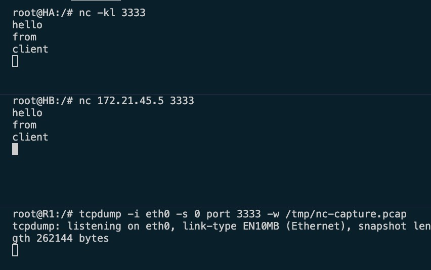
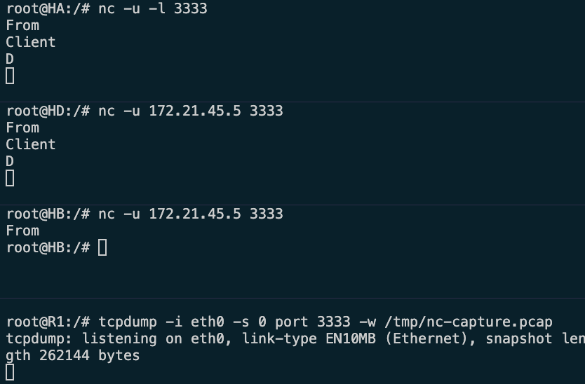
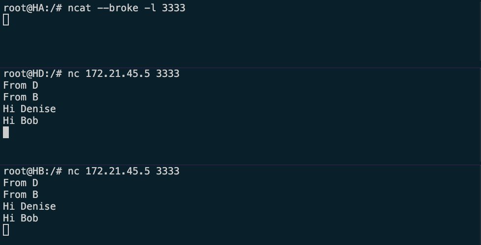
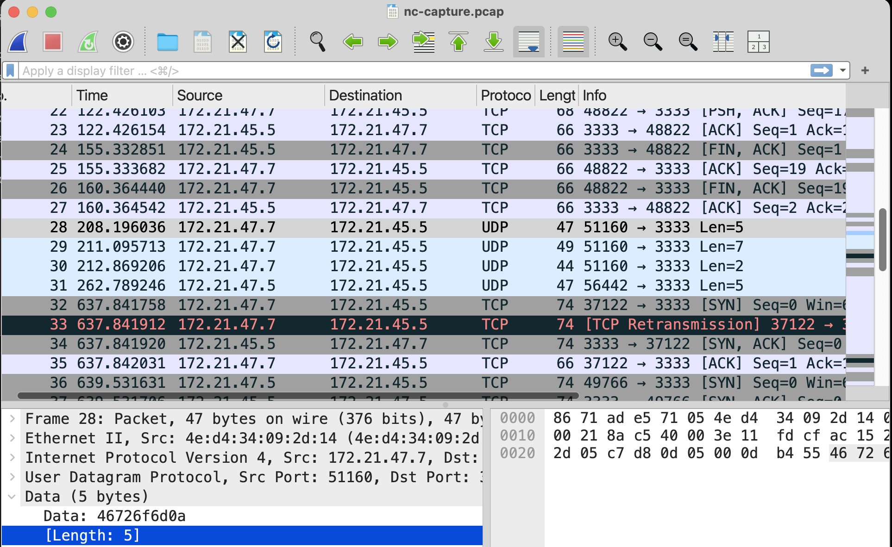

# Lab 08- Network Communication

This exercise provides basic overview of TCP and UDP as well as single and multiple client connection via nc and ncat.

## Learning Objectives

-   Overview TCP and UDP
-   Understand single and multi-client servers

## Environment 

This exercise involves using netcat to communicate between two or more applications on different hosts. The majority of our networking exercises will be carried out in a docker based environment using Docker Desktop. 

## Description

### Using Netcat/nc in VM Environment

Creating the hosts and the routers

- run the netowk created during lab 4 
    - ` docker compose -f ./util/yml/multi-net4-2R4H.yml up -d`

- Capture the tcp communication at R1
  - `tcpdump -i eth0 -s 0 port 3333 -w /tmp/nc-capture.pcap`

#### Netcat(nc) communication

Netcat (nc) is a utility that is available on Linux by default, which can be used for testing, and sending data across network connections between two end systems. The general syntax of using this utility is

`$ nc \[options\] host port`

The options provide different choices and configuration on using this utility. At the simplest level, for sending data across a network connection, we need to first setup up the connection. A connection setup requires to start a network server and then use a client to connect to this server and establish communication.

#### Starting Network Server
Access HA, open a terminal window and start a network server accepting connections on a port of your choice e.g. port number 3333. Run the following command in the terminal window.

- $ nc -kl 3333

The option -k specifies that network server will continue to run when an earlier client terminates i.e., closes the connection. The netcat server accepts only one connection at a time and does not handle multiple concurrent connections from many clients.

#### Setting up connection from Network client.

Access HB, open a terminal window and connect to this netcat server, which is HA. 

- The client needs to specify the IP address and port number of the server. Assuming that IP address of HA is `172.21.45.5`, run the following command in the terminal window.
- nc 172.21.45.5 3333

This will establish the connection with netcat server. Now enter any text in client terminal and this will appear in server terminal window. Similarly, whatever you enter(type) in the server window will appear in client terminal window.



#### Terminate the current connection and start a new connection

In the client terminal window, HB, press Ctrl-C to terminate the netcat communication. 
- Exit out of HB, and access another host, HD


**Since netcat server is running in perpetual mode, it will accept next client after previous client terminates.**

Repeat this process for other hosts such as, HC, or R2. 

### Network Communication using UDP

The network communication exercise in above section shows the data transmission using TCP. The netcat utility also provides data transmission using UDP as well. When using netcat with UDP, it won't work well in perpetual mode (i.e. option -k). 

Starting UDP Server
- First kill the server on HA, Ctrl + C
- Then run net cat on udp  
  - $ nc -u -l 3333

#### Communication using UDP Client

On HD, connect to UDP server by using
the following command.

- `$ nc -u 172.21.45.5 3333`

Now whatever text is entered on client window, it will appear on server window and vice versa.

Try to access the server from HB, without terminating HD connection
- It should exit automatically




- Terminate nc on all hosts using `Ctrl + c`


### Multiple Client chat


Run Ncat server

- In the terminal window of HA, run the ncat server with `--broker` option. 
- This enables server to connect to multiple client together as a group and whenever any client enters any text after connecting to server, it will communicate the text to all other connected clients.
- `$ ncat --broker -l 3333`

Run Ncat clients

- Open multiple hosts such as HB and HDconnect to ncat server as before. Run the following command in each of the terminal window.

- `$ nc 172.21.45.5 3333`

Enter any text on one of the hosts and ncat server will broadcast this text to all other clients like a group chat. The server will not display any chat text on its terminal window. This is because ncat server with `--broker` option runs in relay mode and does not show client
 ommunication.

 


### Wireshark analysis of netcat communication.

Since these are docker instances without any GUI support, you may not be able to use wireshark directly, and hence instead copy the tcpdump from R1 to week 4 directory and open it via wireshark. 

- Terminate the router terminal and all other ncat instances on hosts
- Exit to local machine
- Docker copy from R1 to week 4 directory

```
root@R1:/# tcpdump -i eth0 -s 0 port 3333 -w /tmp/nc-capture.pcap
tcpdump: listening on eth0, link-type EN10MB (Ethernet), snapshot length 262144 bytes
^C61 packets captured
61 packets received by filter
0 packets dropped by kernel

root@R1:/# ls /tmp/
nc-capture.pcap

root@R1:/# exit
exit

(base) zee@zees-MacBook-Pro-4 class-repo % docker cp R1:/tmp/nc-capture.pcap ./w
k-04 
Successfully copied 6.66kB to /Users/zee/Library/CloudStorage/GoogleDrive-zyalew@umbc.edu/My Drive/Courses/CMSC481/class-repo/wk-04
```

- Analyze via wireshark

 


Shut down the network
```
(base) zee@zees-MacBook-Pro-4 class-repo % docker compose -f ./util/yml/multi-net4-2R4H.yml down --remove-orphans
WARN[0000] /Users/zee/Library/CloudStorage/GoogleDrive-zyalew@umbc.edu/My Drive/Courses/CMSC481/class-repo/util/yml/multi-net4-2R4H.yml: the attribute `version` is obsolete, it will be ignored, please remove it to avoid potential confusion 
[+] Running 9/9
 ✔ Container R1         Removed          10.6s 
 ✔ Container R2         Removed          10.6s 
 ✔ Container HC         Removed          10.5s 
 ✔ Container HA         Removed          10.4s 
 ✔ Container HD         Removed          10.4s 
 ✔ Container HB         Removed          10.3s 
 ✔ Network yml_net4-46  Removed           0.2s 
 ✔ Network yml_net4-47  Removed           0.3s 
 ✔ Network yml_net4-45  Removed           0.5s 
(base) zee@zees-MacBook-Pro-4 class-repo % docker network prune -f
```

## Summary

In this exercise, we have studied and learnt the following

- Simple network communication using netcat (nc) utility
- Simple network communication using UDP with netcat (nc) utility.
- Group chat communication using ncat (from nmap family) as a broker to relay communications among all members of group.

## Learning Resources

### Netcat and Ncat (Nmap) 

- <https://linux.die.net/man/1/ncat>
- <https://linux.die.net/man/1/ncat>
- <https://www.docker.com/>
- Lab-04 for docker instances