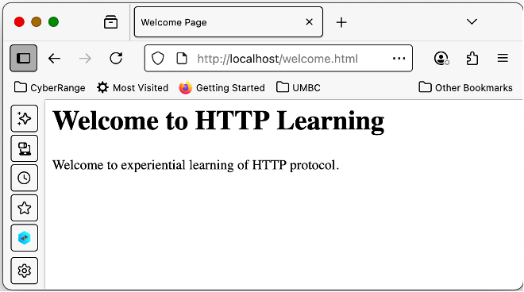
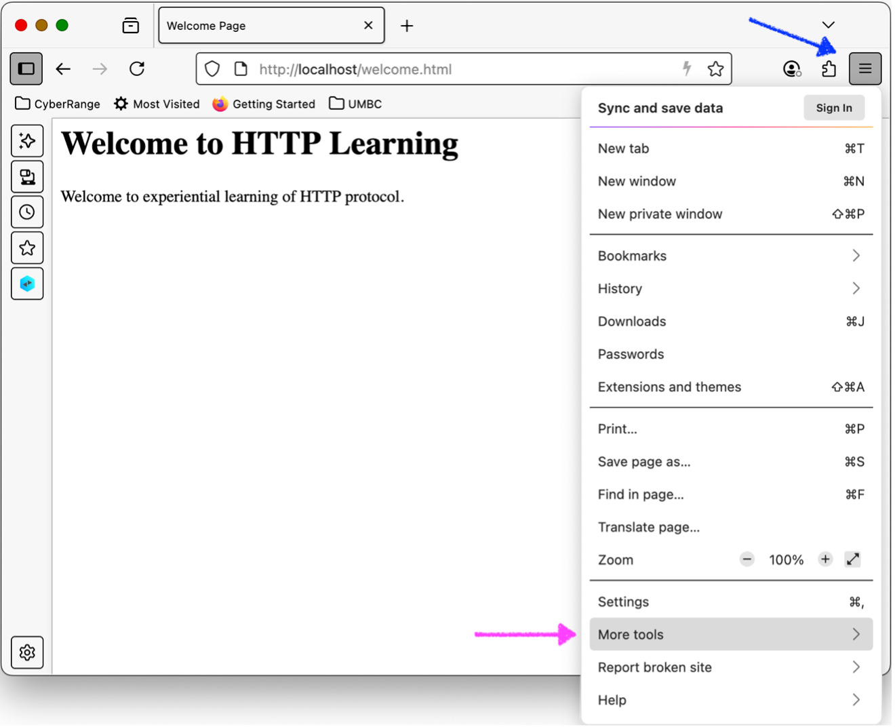
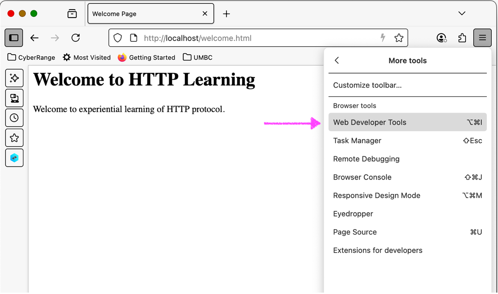
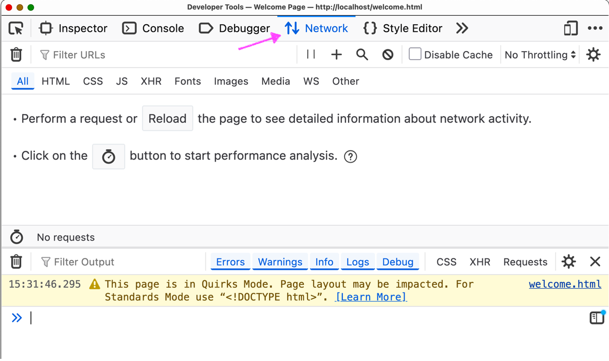
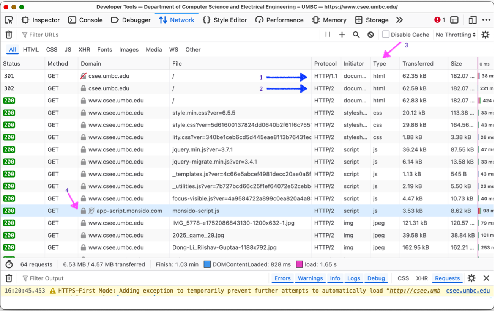
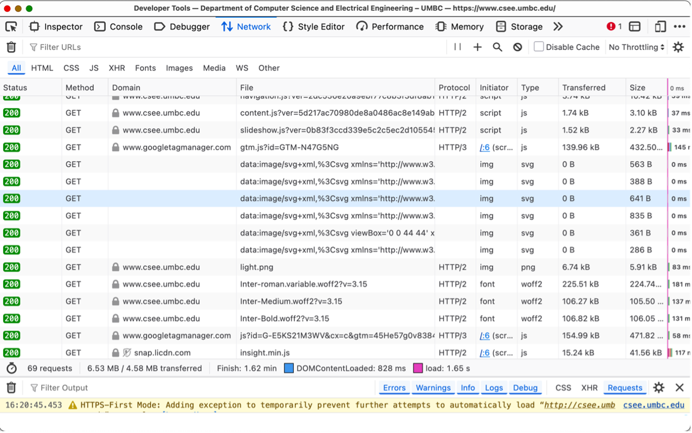
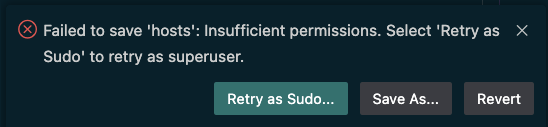
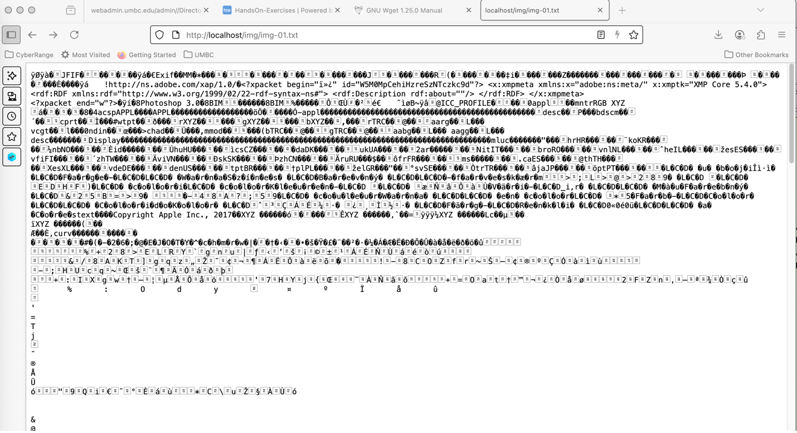

## Lab 09- Web Overview

This exercise provides basic overview of using Web Developer Tools in a browser to understand HTTP protocol behaviour.

## Learning Objectives
- Understand HTTP Protocol evolution e.g., from v0.9, 1.0, 1.1, 2and 3.
- Understand use of web Developer Tools in a browser (Firefox, Chrome)
- Understand protocol evolution of HTTP.
- Understand HTTP Headers.
- Understand use of HTTP headers in fetching web content.

## Environment 

Docker Desktop, which is an application environment for your laptop environment that enables running of containerized applications. The Docker Desktop integrates and provides access to a vast ecosystem of docker images via Docker Hub. To access web content, use of Firefox browser is recommended as it provides easier support to dissect and analyse web request and response

Currently, most computers use either ARM based CPU (such as Apple Macbook using Sillicon chip M1/M2/M3/M4) or Windows based laptop using Intel x86 based CPU. An image created for arm architecture is unlikely to run on x86 based systems and vice versa. Nevertheless, the image for this exercise is designed to work in both. 

***For all of the exercise we will do based on a docker environment we will use pre-built images. When the image does not work. Build the image using the docker file in util folder. as follows:***

- docker build -f `<file-path>/<file-name>.df` -t `<image name>` .
  - E.g. `docker build -f ./util/df/net-ub22-host.df -t net-ub22-host .
`

## Description

### Creating, running and verifying the web server
- Creating a Local Web server Instance
- We will customized docker images to create a web server instance.
  - `$ docker run -it -d --name web -p 80:80 --rm zizutg/net-ub22-host`
- Note: if this doesn't work we build the image 


- Start the web server in the docker instance of web server.
  - In the terminal window of your laptop, enter the following command
  - `$ docker exec -it web apache2ctl start`

Verify that web server is up and running and serving web pages. 
- Run the following command on host (laptop) terminal.
  - `$ curl http://localhost/welcome.html`

```html
<html>
    <head>
        <title>Welcome Page<title>
    <head>
    <body>
        <h1>Welcome to HTTP Learning<h1>
        Welcome to experiential learning of HTTP protocol.
    <body>
<html>
```

#### Accessing Web Server in the browser

Open your chrome or firefox browser and access this local web server as follows. In the URL bar, enter the URL <http://localhost/welcome.html>

This should display a web page as shown below.

This verifies that your local web server is working well. This simple web server will be used as a basis of studying HTTP protocol behaviour.



## HTTP Evolution

HTTP 0.9 version

- When HTTP protocol was defined in 1990s, there was no versioning associated with HTTP protocol and no standard RFC were assigned to this very first HTTP draft protocol. Thus, this original version is unofficially referred to as version 0.9 since first formal version HTTP/1.0 was defined later. In the HTTP Version 0.9, the web server just expects the web URL without any protocol version and it responds with the web page. In this version there are no HTTP Headers and any other details. Most publicly deployed webservers today expects the version number to be specified in a web request and thus may not even respond.

- To access a web server using this unofficial HTTP 0.9, version, we need to work at the basic protocol and thus we will use the netcat tool.

- Open a terminal and enter the lines as shown in Table 1and press enter and you will see a simple web page response.

Using HTTP 0.9 version

- On Macbook
  - ` $nc -c localhost 80`
  - `GET /welcome.html`
    ```html
    <html>
        <head>
            <title>Welcome Page<title>
        <head>
        <body>
            <h1>Welcome to HTTP Learning<h1>
            Welcome to experiential learning of HTTP protocol.
        <body>
    <html>
    ```

- On Windows laptop, open the terminal and use the ncat (from nmap family) to access the local web server. With ncat, use the option `-C `(uppercase C) and it should show the similar response. The command on windows terminal should be as follows

  - `C> ncat -C localhost 80`
  - `GET /welcome.html`
  
This indicates the working of Apache Web server with HTTP 0.9 protocol.

### Using Web Developer Tools 

Any webpage today consists of many objects, typically exceeding 100 or more such objects. These objects includes images, videos, javascripts, stylesheets etc. To analyze an actual web pages response, and identify all its objects and what HTTP protocol versions are used, user of web developer tools provided by browsers comes in a handy way.


Web Developer Tools: Firefox

- To access web developer tools in Firefox, click on Hamburger Menu icon, and then select `"More Tools` as shown by the arrows here:
    

- After clicking on More Tools, it will pop up another menu and select 
`Web Developer Tools` as indicated below:
    

- Clicking on this will open a window corresponding to Web Developer Tools as shown in the image below. This should by default show the "Network" tab as shows by Red Arrow. In case, the "Network" tab is not selected, select the same manually.
  


Web Developer Tools: Chrome

- Open the Chrome browser, select Triple Vertical Dot (`⋮` or Chrome Menu) which appears at the **top-right corner** (next to the profile icon and sometimes to the right of the URL bar), then select `More Tools `followed by `Developer Tools` and this will pop Developer tools window of the Chrome browser.

### Exploring Web page.

Now in the browser window/tab where you opened the web developer tools, enter any of your preferred URL. This will show all the HTTP objects fetched to server this web page.

- Example of simple web page access <http://csee.umbc.edu> view via developer tool is shown below. 
- This provides a good information about the all the objects, the protocol versions, request methods, the actual URL, type of the object (e.g., HTML, image, javascript, stylesheet etc.).
- For example, the first object as shown by arrow-1 shows the protocol version as HTTP/1.1 whereas all others objects are accessed using protocol version HTTP/2. The arrow-3 shows the type of documents and next columns shows the size and transferred data etc. The second column shows the request method as GET. 
     
- While most objects are accessed using HTTP/2 protocol, scrolling down further in this window shows that some objects are accessed using HTTP/3 protocol as as indicated here:.
    

- Click on any of the object and explore all other details about this objects. Also, it should be noted that not all objects are fetched from the csee.umbc.edu domain. Some objects are fetched from other domains. An example is shown by arrow-4 in the figure above.

- Explore other features of web developer tools as per links given in section 3 2 and become familiar with other features. For example, how much time is taken by a particular object. As an exercise, identify the web objects that took much longer than other objects. Similarly, identify the total number of web objects fetched for a single URL entered by the user. In this example, browser fetched a total of 69 objects.

### HTTP Headers

Access webpage of your choice in the Firefox/Chrome browser and study/explore both HTTP request and response headers for the request made and web content received using the **Web Developer Tools** of the web browser.

In any web access, both HTTP Status codes and Headers kind of work together. In this exercise, we will focus mostly on those HTTP headers that pertain to successful response. We will study the role of HTTP Status codes in the next exercise.

- Date: 
- Server: 
- User-Agent: 
- Accept: / Content-Type: 
- Referrer: 
- Host: 
- Server: 
- Accept-Encoding: / Content-Encoding: 
- Accept-Language: 
- Range:

#### Common Headers

Open the web developer tools in your browser and access the webpage welcome.html from your locally created docker based web server. For example, access the URL http://localhost/welcome.html

Select/click on the file welcome.html in web developer tools panes and it should show both the request and response header.

***`Common Response Headers`***: Under the Headers tab, study all HTTP Response headers sent by web
server. Examine the values for the following headers

1. **Date**: It should show the current date and time
2. **Content-Length**: This shows the size of the web page (number of bytes) excluding the headers.
3. **Server**: This should identify webserver software, e.g. Apache/2.4.58
4. **Connection**: this indicates that server will maintain the TCP connection with web browser for the next web request.
5. **Keep-Alive**: this header indicates the timeout value for current TCP Connection and number of remaining requests that can be served on this TCP Connection

***`Common Request Headers`***: Under the Headers tab, study all HTTP Request headers sent by web server. Examine the values for the following headers.

1. **Accept**: this header indicates all types of web content that this
    browser can understand and render accordingly. For example, some of
    the most common values are

   1. **Text/html**
   2. **Application/xhtml+xml**
   3. **Connection**: indicates that browser would like to use a persistent HTTP connection i.e., use underlying TCP connection for next requests with the web server.
   4. **User-agent**: Provides information about browser and laptop. This values helps the web server determine client device specific content for the best user experience. For example, when using Firefox on Macbook, this value would be something like
      - `Mozilla/5.0 (Macintosh; Intel Mac OS X 10.15; rv:140.0) Gecko/20100101 Firefox/140.0`

### Request Header Host:

When a web server is configured to serve multiple websites, which is the case on shared cloud services hosting a web server, `the header Host`: is used by the web server to identify the website and serve content for that web site.

To study this header, we will create two different websites in our local web server and explore the usefulness of this request header.

- Creating contents for two different websites
  - A single web server serving multiple websites. Explore the role of header "Host: ".
  - Login into the docker instance, configure Apache web server to server multiple websites. A simple set of commands to configure it are as follows
  - Create the contents for two websites: you must access `net-ub22-host`
    - $ cd /var/www
    - $ mkdir websitea
    - $ mkdir websiteb
    - $ cp html/welcome.html websitea
    - $ cp html/welcome.html websiteb

  - Edit (e.g. using nano) the contents of /var/www/websitea/welcome.html
    - And add some content stating that it is websitea. For example, change the header `<h1>` content to following.
      - `<h1>Welcome to Website A</h1>`
      - `<h1>Welcome to HTTP Learning A<h1>`

  - Edit the contents of /var/www/websiteb/welcome.html
    - And add some content stating that it is websiteb. For example, change the header `<h1>` content to following.
      - `<h1>Welcome to Website B</h1>`
      - `<h1>Welcome to HTTP Learning B<h1>`

#### Configuring Two Websites on a Single Web Server

Run the following set of commands inside the docker instance.
  - `$ cd /etc/apache2/sites-available/`
  - `$ cp 000-default.conf websitea.conf`
  - `$ cp 000-default.conf websiteb.conf`

Configure these two virtual host config files (websitea.conf and websiteb.conf) with proper directive of website name and document root, 
- Update the file /etc/apache2/sites-available/websitea.conf
  - `ServerName websitea.local`
  - `DocumentRoot /var/www/websitea`

- Similarly, update the file /etc/apache2/sites-available/websiteb.conf
  - `ServerName websiteb.local`
  - `DocumentRoot /var/www/websiteb`

- Enable the two virtual hosts
  - `$ a2ensite websitea`
  - `$ a2ensite websiteb`

- Restart apache webserver
  - `$ apache2ctl restart`

Ignore the output:
- `AH00558: apache2: Could not reliably determine the server's fully qualified domain name, using 172.17.0.3. Set the 'ServerName' directive globally to suppress this message`
- 
#### Resolving DNS names for two websites

Make entry in `hosts` file, **which you can open with vscode**, to resolve hostname to IP address. On the local machine terminal 
- On `Macbook`, type `code /etc/hosts`
- On `Windows`, type `code C:\Windows\System32\drivers\etc\hosts`

Make/update the following entry using any text editor

- `127.0.0.1 myweb.local websitea.local websiteb.local`

You may have difficulties saving it, `Retry as Admin/Sudo`, as shown below, 
- Type in the necessary credintials and contine
  

Ensure that these names are resolved correctly. 
- To verify, use ping command to verify the resolution to loopback IP address 127.0.0.1 and it should be successful. 
- If you are using Macbook, use the option "-c4" so that ping stops after sending 4 request packets.

  - `$ ping -c4 myweb.local`
  - `$ ping -c4 websitea.local`
  - `$ ping -c4 websiteb.local`

#### Accessing Multiple Websites hosted under a Single Webserver.

The firefox browser, clear all the cache pages.
- `Firefox History >> Clear Recent History >> Clear`

After the browser cache is cleared, access the following URLs to see the changed web page as per website name though coming from same web server. Analyze the headers in Developers Tool, specifically the role of request header "Host: "
- <http://websitea.local/welcome.html>
- <http://websiteb.local/welcome.html>

***You can similarly clean recent history on chrome***

#### Header Language:

Configure Firefox browser with any language other than English of your choice, e.g., Kannada, Hindi etc. Access google.com in browser and analyze the web page.

To set your preferred language in Firefox, select
- *Hamburger Menu Settings*
- Under the section *Languages and Appearances Language*
- Select Choose..., and manage the preference order of the language as shown in below.

<image src="images/web-8.png">

Now access any website e.g., `google.com` that supports language preferences and study the web page served by the web server. Change the language preferences to some other language and refresh the webpage to see the content in the chosen language.

#### Headers Content-Type:

In the firefox browser, access the webpage welcome.txt instead of welcome.html 
- Enter the URL <http://localhost/welcome.txt> and analyze the web page displayed compared to webpage displayed when accessing <http://localhost/welcome.html>. 
- Both webpages are identical but browser displays it differently. 
- Analyze the HTTP Response header Content-Type: to understand the browser behavior

At times, browser displays the gibberish content when accessing a web page. To study such a behavior, create a copy of an existing image e.g. img-01.jpg as a text file. For example, Carry out the following steps.

Access the docker instance of web server and make a copy of the image file img-01.jpg.

- `$ docker exec -it web bash`
- `$ cd /var/www/html/img`
- `$ cp img-01.jpg img-01.txt`
- `$ exit`

Now access the URL <http://localhost/img/img-01.txt> and analyze the web
page and the role of header Content-Type:. It should show gibberish
- ***You may see different image on chrome***
  

### Analyze more HTTP 

Analyze your preferred webpage that you access in daily use and analyze them and become familiar with HTTP protocols being used, the size of web pages, number of images, video etc and their timeline deliveries.

Using the web developer tools, analyze the other headers when accessing
a web page, e.g.

- Referrer:
- Accept-Encoding:
- Content-Encoding:
- Vary:
- Upgrade-Insecure-Requests:


## Summary

In this exercise, we have learnt the following

- Use of Web Developer Tools
- HTTP Protocol Evolution
- Use of HTTP headers in fetching of web page and their rendering the browser.
- Serving of multiple websites by a single web server in shared hosting mode.
- Use of Language and other specific headers used in day to day life of web access.

## Learning Resources

### HTTP RFCs

-   RFC 7231 (obsoletes 2616) : HTTP 1/1
-   RFC 9110: HTTP Semantics
-   RFC 9112: HTTP/2
-   RFC 9113: HTTP/3

### Web Developer Tools in Briowser

-   Firefox: <https://firefox-source-docs.mozilla.org/devtools-user/>
-   Chrome: <https://developer.chrome.com/docs/devtools/open/>

### Command Line Utilities:
-   curl: <https://curl.se/
-   wget: <https://www.gnu.org/software/wget/manual/wget.html>

