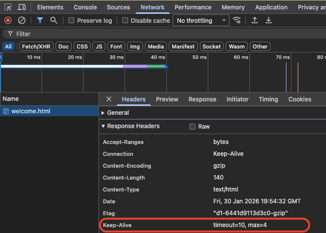
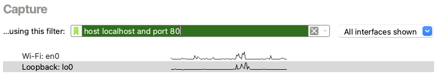
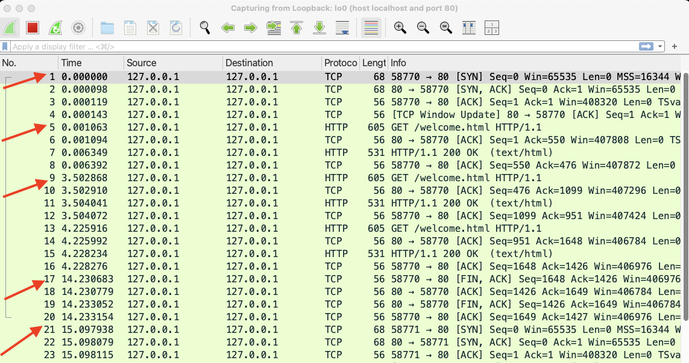
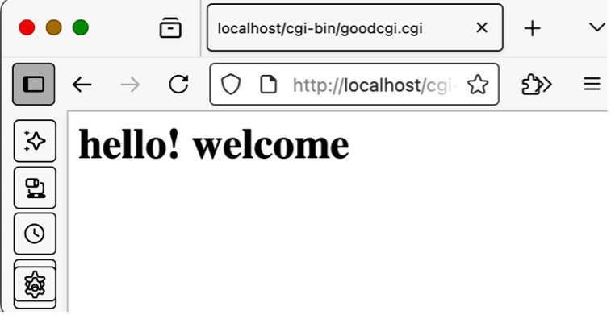
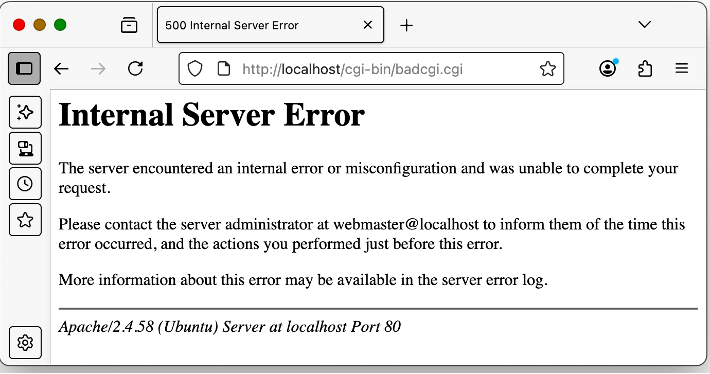
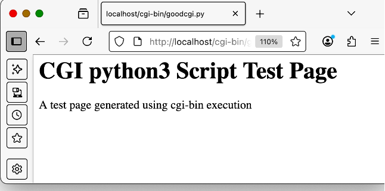
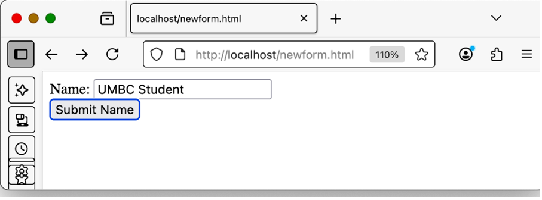
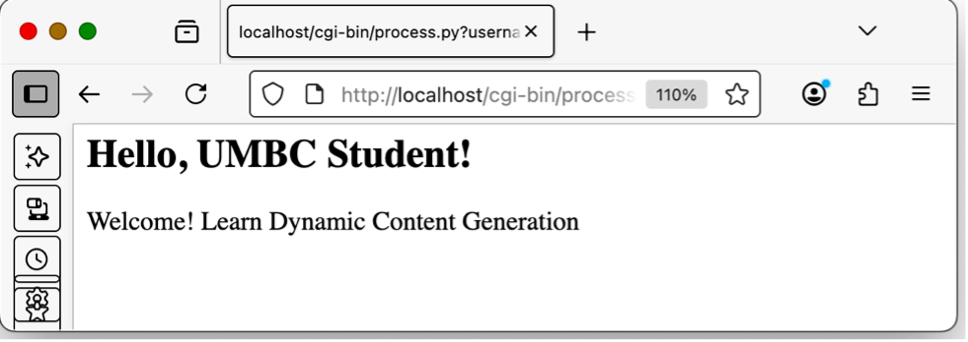

# Lab 11: HTTPS Communication

This exercise provides basic overview of using HTTPS in a secure web
access.

## Learning Objectives

- Understand HTTPS Communication
- Understand basics of Self Signed Certificate creation and installation
- Understand use website certificates in secure web communication.
- Understand use of Persistent HTTP connections
- Understand use of HTTP Headers “Connection:” and “Keep-Alive:”.
- Understand cgi-bin process
- Understand serving of dynamic web contents by a web server

## Environment

Docker Desktop, which is an application environment for your laptop
environment that enables

running of containerized applications. The Docker Desktop integrates and
provides access to a

vast ecosystem of docker images via Docker Hub.

To access web content, use of Firefox browser is recommended as it
provides easier support to

dissect and analyse web request and response.

## Description


### Creating, running and verifying the web server
- Creating a Local Web server Instance
- We will customized docker images to create a web server instance.
  - `docker run -d -it --name web -p 80:80 -p 443:443 --rm zizutg/net-ub22-host`
- Note: if this doesn't work we build the image 


- Start the web server in the docker instance of web server.
  - In the terminal window of your laptop, enter the following command
  - `$ docker exec -it web apache2ctl start`

Verify that web server is up and running and serving web pages. 
- Run the following command on host (laptop) terminal.
  - `$ curl http://localhost/welcome.html`

```html
<html>
    <head>
        <title>Welcome Page<title>
    <head>
    <body>
        <h1>Welcome to HTTP Learning<h1>
        Welcome to experiential learning of HTTP protocol.
    <body>
<html>
```

### Setting up SSL on Apache Webserver

In this exercise, we will consider setting up the website myweb.internal to be accessed with HTTPS and all the commands below will use this as an example case. You should choose your own website name, and when configuring it, replace the name website.internal with your chosen name.

#### Enabling SSL

Login to docker container and run following commands to enable SSL.

```
$ docker exec -it web bash
root@e24813c78c83:/# a2enmod ssl
root@e24813c78c83:/# a2ensite default-ssl
root@e24813c78c83:/# service apache2 restart or apache2ctl restart
```


#### Setting up the Website Content

Set up the DocumentRoot directory from where web contents will be served using HTTPS. This requires creating a directory for the website and creating a simple web content page (index.html)

Login to the docker instance, create the directory and create the simple content index.html in that directory.

`root@e24813c78c83:/# mkdir /var/www/myweb.internal`

Now create a simple web page, e.g. index.html in this directory using
text editor e.g. nano.

`root@e24813c78c83:/# nano /var/www/myweb.internal/index.html`

```html
<html>
     <head>
          <title>Welcome Secure Web</title>
     </head>
     <body>
          <h1>Learning HTTPS Usage</h1>
          Welcome to experiential learning of HTTPS.
     </body>
</html>
```
#### Configure Apache to use TLS

Create a configuration file myweb.conf corresponding to this website in
the directory /etc/apache2/sites-available and make entry for Apache
Directives such as ServerName, DocumentRoot and SSL Certificates.

`root@e24813c78c83:/# nano /etc/apache2/sites-available/myweb.conf`
```html
<VirtualHost *:443>
    ServerName myweb.internal

    DocumentRoot /var/www/myweb.internal

    SSLEngine on
    SSLCertificateFile /etc/ssl/certs/myweb-selfsigned.crt
    SSLCertificateKeyFile /etc/ssl/private/myweb-selfsigned.key

    ErrorLog ${APACHE_LOG_DIR}/myweb-error.log
    CustomLog ${APACHE_LOG_DIR}/myweb-access.log combined
</VirtualHost>
```

#### Creating TLS certificate

Generate a TLS Key and Certificate with some basic configuration. Key is the private key that should be kept with web server where and certificate is used by web client or browser to verify website details.

Login to the docker container and issue the following command to create the certificate. This certificate is created for a validity period of 1 year (365 days). You can choose your own validity period and certificate filename. This will ask some information such as country, state, city, organization etc and provide the required details. Important point to keep in mind is the provide the website name (e.g. myweb.internal) when entering common name. This is the name that will be used in the website certificate
```
openssl req -x509 -nodes -days 365 \
  -newkey rsa:2048 \
  -keyout /etc/ssl/private/myweb-selfsigned.key \
  -out /etc/ssl/certs/myweb-selfsigned.crt \
  -subj "/CN=myweb.internal"
```


Now enable/configure Apache to 2 use this certificate

```
root@e24813c78c83:/# a2ensite myweb.conf
root@e24813c78c83:/# a2dissite 000-default.conf
root@e24813c78c83:/# apache2ctl configtest
...
"Syntax OK" 
root@e24813c78c83:/# service apache2 reload # or apache2ctl restart
```

#### Accessing the Website using HTTPS

This requires that website name myweb.internal is resolved to proper IP
address. 
- In your laptop, access the file:  
  - `/etc/hosts` (on Macbook) Or
  - `\Windows\System32\Drivers\Etc\hosts` 
    - Admin privileges might be necessary (e.g. Mac `sudo code /etc/hosts`)
- Make the entry on the file to map IP address 127.0.0.1 to myweb.internal. 
- Essentially, modify the entry corresponding to localhost in your end and add the website name myweb.internal after the localhost itself like below.

`127.0.0.1 localhost myweb.internal`


Open the browser (Firefox) and enter URL <https://myweb.internal>. 
- It should display a warning page as shown in figure . 
- Click on **Advanced**, and then "**Accept Risk and Continue**" and then it will display the web page content.

In the browser URL field, it will show a lock icon. 
- Click on the lock icon to see the certificate details.

You can access the same by using curl (with option -k) so that it can
ignore the self signed certificate warning and display the webpage.
- `$ curl -k <https://myweb.internal>`

#### Redirect HTTP Traffic to HTTPS

We would like to serve this website using HTTPS traffic only even if use
enters HTTP. This requires configuring Apache to redirect all HTTP
traffic to HTTPS using status code 301/302. For that update the
configuration file myweb.conf with following additional details and
restart Apache.


`root@e24813c78c83:/# nano /etc/apache2/sites-available/myweb.conf`

Add the following lines

```html
<VirtualHost *:80>
    ServerName myweb.internal

    RewriteEngine On
    RewriteCond %{HTTPS} off
    RewriteRule ^ https://%{HTTP_HOST}%{REQUEST_URI} [L,R=301]
</VirtualHost>
```
Enable rewrite and restart

```
root@e24813c78c83:/# a2enmod rewrite
root@e24813c78c83:/# apache2ctl restart
root@e24813c78c83:/# service apache2 reload # or apache2ctl restart
```

Now access the URL <http://myweb.internal>.
-  It will automatically redirect to HTTPS.
- You can also use the curl command to follow the redirection e.g.
  - `$ curl - k -L http://myweb.internal`

### Accessing Google with mismatch in Certificate.

Find out the IP address of google.com. On Macbook use the option -c4,
```
$> ping -c4 google.com
PING google.com (142.251.111.138): 56 data bytes
64 bytes from 142.251.111.138: icmp_seq=0 ttl=107 time=10.116 ms
64 bytes from 142.251.111.138: icmp_seq=1 ttl=107 time=26.648 ms
64 bytes from 142.251.111.138: icmp_seq=2 ttl=107 time=68.403 ms
64 bytes from 142.251.111.138: icmp_seq=3 ttl=107 time=12.201 ms
\-\-- google.com ping statistics \-\--
4 packets transmitted, 4 packets received, 0.0% packet loss
round-trip min/avg/max/stddev = 10.116/29.342/68.403/23.433 ms

```
In the browser (Firefox/Chrome), enter the URL using HTTPS with IP address from the ping e.g.

`<https://142.251.111.138>`

This should also show a warning page in the browser. 
- This because the website certificate shows the site name as google.com whereas browser has accessed it using 142.251.111.138 and thus a mismatch and hence the warning page.

### Apache Configuration for Persistent Connections

This part of the lab is not going to need port 443. Hence, you can restart the host from new.

```
$ docker stop web
$ docker run -d -it --name web -p 80:80 --rm zizutg/net-ub22-host
$ docker exec -it web apache2ctl start
$ docker exec -it web bash
```

#### Default KeepAlive Configuration

Login to the docker instance and analyze the values of following Apache
Directives in the Apache web server configuration file
/etc/apache2/apache2.conf

- KeepAlive
- MaxKeepAliveRequests
- KeepAliveTimeout

```
root@76d36fea9894:/# grep KeepAlive /etc/apache2/apache2.conf 
# KeepAlive: Whether or not to allow persistent connections (more than
KeepAlive On
# MaxKeepAliveRequests: The maximum number of requests to allow
MaxKeepAliveRequests 100
# KeepAliveTimeout: Number of seconds to wait for the next request from the
KeepAliveTimeout 5
```

The directive KeepAlive On implies that web server supports persistent connection. 
- The directive MaxKeepAliveRequests 100 indicate that one TCP connection can be used to server up to 100 HTTP Requests. 
- The directive KeepAlivetimeout 5 indicates that if the web server does not receive next request in 5 seconds, it will close the TCP Connection and browser need to setup new TCP Connection.

#### Experimental Configuration 01 

For experiential understanding of how these works, change the values of
last two directives as follows and restart Apache

`root@76d36fea9894:/# nano /etc/apache2/apache2.conf`

Update the two items, then save and exit
- MaxKeepAliveRequest 4
- KeepAliveTimeout 10

Check and restart

```
root@76d36fea9894:/# grep KeepAlive /etc/apache2/apache2.conf | grep -v '#'
KeepAlive On
MaxKeepAliveRequests 4
KeepAliveTimeout 10
root@76d36fea9894:/# apache2ctl restart
AH00558: apache2: Could not reliably determine the server's fully qualified domain name, using 172.17.0.3. Set the 'ServerName' directive globally to suppress this message
```

#### Exploring KeepAlive

Open Chrome or Firefox browser with Web Developer tool and access the web page
<http://localhost/welcome.html> or any other web page. In the Response
headers, study the value of Response Header "KeepAlive:" 



Refresh the web page 3 times, each refresh within 10 seconds. 
- Note down the value of max attribute and it should decrease to 1 since in the current connection 4 request have already been made. 
- Refresh the web page again within 10 seconds and since it is $4^{th}$ refresh, study the value of Response header "Connection: close". 
- This is because this TCP Connection can serve only 4 new requests.

#### Exploring Timeout.

Start the wireshark capture, use the interface loopback (not the wifi interface) and specify capture filter as `"host localhost and port 80"` and start the capture. 
- Now in the browser enter the URL <http://127.0.0.1/welcome.html>. 
- The wireshark capture will show the setting up of TCP connection and initial 3 packets will show the TCP handshake (SYN, SYN-ACK, and ACK) and subsequent captures will show HTTP request.



Refresh the web page within 10 seconds. 
- The wireshark capture would show a new HTTP request on the existing TCP Connection as HTTP server is using persistent TCP Connection.

Wait for 10 seconds and then refresh the web page. 
- The wireshark capture will first show TCP Conenction teardown by packet types as FIN/ACK and then a new connection being using (SYN, SYN-ACK, ACK) and then a new HTTP Request is made. 
- Note down the values in first column (Time) of the packet capture. 
- The time values will be consistent with KeepAlive behaviour of web server. 



The packet #1 shows the setting up of first TCP connection, and packet #5 sending the HTTP Request. 
- All this happens within few milli seconds. The packet #9 shows sending second HTTP Request (due to webpage refresh) after 3 seconds. 
- As the timeout value is 10 seconds, existing TCP Connection is used to send this HTTP request. 
- The packet #17 shows TCP Connection close which occurs at time 14s, 10 seconds after the $2^{nd}$ web request.
- The next web page refresh is done at time 15s which is shown in packet #21, which shows the setup of new TCP connection and subsequently this connection is used to send the web request and actual web request can be seen by scrolling down the Wireshark capture.
- Keep refreshing this web page more than 5 times with each refresh within 10 seconds of each other and analyze the wireshark capture. After the $4^{th}$ refresh, TCP Connection will close since max=4 and thus it can serve only 4 requests.

#### Using Connection Close.

Modify the apache web server configuration and change the value of KeepAlive directive to Off from On. Restart the apache web server. 
- Access any webpage and analyze the web requests in wireshark capture. 
- You should observe the value of HTTP Response Header "Connection:" Its value will always be give out as Close by the web server


## CGI-BIN interface

CGI (Common Gateway Interface) enables a web server to run external programs e.g., shell scripts, python programs, java servlets, C executable binaries etc. 
- The external program receive their input from the web server and sends the generated output back to the web server after processing the received input e.g. forms data, user details etc. 
- The web server sends the generated output back to the client.

In this section, we will use two kind of external programs one is shell script and other is python programs. 
- The Apache web server needs to be configured to specify the directory where such external program resides, which are typically in /usr/lib/cgi-bin. 
- The given docker instance is configured to use cgi-bin programs from this directory.

Web server expects that external program must adhere to HTTP response syntax 
- i.e. it must have al least one header "Content-Type:" and there must be an empty line after the last header and actual HTML content.

The external program must execute permission

***`You need to stop and restart the host again or reverse all the changes you made and restart the apache server`***

### Using Shell script with cgi-bin

The docker instance is configured with following shell script /usr/lib/cgi-bin/goodcgi.cgi as shown below

```
root@ba2562e03ba6:/# cat /usr/lib/cgi-bin/goodcgi.cgi
#!/bin/bash

# program logic
echo "Content-type: text/html";
echo "";

echo "<h1>hello! welcome</h1>";
```

This program generates the required header "Content-type: text/html" followed by empty line followed by HTML content `"<h1>hello! welcome</h1>`.  
- Thus, to access this webpage, enter the url <http://localhost/cgi-bin/goodcgi.cgi> and it will show a web page as follows:



### Erroneous CGI Shell Script execution

If the shell script program does not generate output on expected lines 
- i.e. first headers, then an empty line and then HTML content, then web server will not accept this output and send status code 500 Internal Server Error. 
- A modified version of the above sheel script is given in badcgi.cgi where the code the header format is not program. 
- Each header requires that header keyword must be followed by Colon(:) followed by SPACE character. 
- In this badcgi.cgi program, then line that output this header is incorrect, as shown below.
```
root@ba2562e03ba6:/# cat /usr/lib/cgi-bin/badcgi.cgi
#!/bin/bash

# program logic
echo "Content-type text/html";
echo "";

echo "<h1>hello! welcome</h1>";
root@ba2562e03ba6:/# 
```

- Thus, when URL <http://localhost/cgi-bin/badcgi.cgi> is involed, it
results in the error which is shown here:
     

### CGI program without execute permission

Since web server executes the external program, it is necessary that these external program must have execute permission. 
- If we create a simple shell script without execute permission, and when this URL is accessed, it will likely result in the error 404 Not Found.
  - `root@20feb5b98d36:/# chmod -x /usr/lib/cgi-bin/goodcgi.cgi`
- Change the permission of goodcgi.cgi program and access the url <http://localhost/cgi/goodcgi.cgi> and analyze the results


## CGI execution with Python Program

### Simple Python program

A python scripts requires that python script must start with a shebang line #!/usr/bin/python3.
- An example python script /usr/lib/cgi-bin/goodcgi.py as shown below is provided in the docker container.
```
root@ba2562e03ba6:/# cat /usr/lib/cgi-bin/goodcgi.py
#!/usr/bin/python3 

print('Content-type: text/html')
print()
print('<html> <body>')
print('<h1>CGI python3 Script Test Page</h1>')
print('A test page generated using cgi-bin execution');
print('</body> </html>') 
```

- This python cgi script when accessed (<http://localhost/cgi-bin/goodcgi.py>) will show that web content is generated as shown below:



- Corresponding a bad python program badcgi.py is also provided which doea not output an empty line in the script output. Thus, when URL <http://localhost/cgi-bin/badcgi.py> is accessed, it will result in 500 Internal Server Error.

## Processing Form Data.

In general, any e-commerce or business serving site makes use of cgi-bin interface. 
- The user is expected to provide fill data in some form, which is processed by the website and based on user's data, website generates the appropriate response. 
  - For example, any bank website authenticates the user (after user enters username/password in a form) and then shows the bank account details etc.

Given below are simple python scripts which takes username and generates a web page welcoming the use. Create these scripts in docker container and access these to explore in details working of the form and cgi interface. Ensure that both the python scripts have execute permission.

### Simple form

In the docker container, create a form /var/www/html/newform.html with following contents using nano.

```html
<html>
     <body>
          <form action="/cgi-bin/process.py" method="get">
               Name: <input type="text" name="username"><br>
               <input type="submit" value="Submit Name">
          </form>
     </body>
</html>
```
When URL <http://localhost/newform.html> is accessed in browser it
should display as shown here:


### CGI Script

Create a corresponding CGI-bin python program/usr/lib/cgi-bin/process.py.

```python
#!/usr/bin/python3
#import cgi
from urllib.parse import parse_qs
import os
#returns null if no query string
query_string = os.environ.get("QUERY_STRING", "")
form_params = parse_qs(query_string)
#return Null if no params username in query string
name = form_params.get("username","")[0]
print("Content-Type: text/html\n")
print("<html><body>")
print(f"<h2>Hello, {name}!</h2>")
print("Welcome! Learn Dynamic Content Generation")
print("</body></html>")
```

Ensure to give it execute permission 
- `chmod +x /usr/lib/cgi-bin/process.py`

Upon form submission, the program process.py will be executed and it will show contents like as shown:


## Summary

In this exercise, we have learnt the following

- Setting up website with SSL Certificate
- Generating and installing a website certificate
- Analyze browser warning when there is a mismatch in certificate information.
- Use of HTTP Persistence connection by web browsers and web servers- 
- Using of HTTP headers Keep-Alive and Connection.- 
- Configuring Apache Web server directives for HTTP Persistent connections and respective timeout values.
- CGI Interface of web server
- Dynamic content generation using CGI.
- Error management when external program generates improper output

## Learning Resources

### HTTP RFCs

- RFC 3828: HTTP Over TLS
- RFC 7231 (obsoletes 2616) : HTTP 1/1
- RFC 9110: HTTP Semantics
- RFC 7231 (obsoletes 2616) : HTTP 1/1
- RFC 9110: HTTP Semantics

## Command line tools

- curl: <https://curl.se/>
- wget: <https://www.gnu.org/software/wget/manual/wget.html>


### Creating self signed certificates

[https://www.digitalocean.com/community/tutorials/how-to-create-a-self-signed-ssl-certificate-for-apache-in-ubuntu-22-04](https://www.digitalocean.com/community/tutorials/how-to-create-a-self-signed-ssl-certificate-for-apache-in-ubuntu-22-04Environment) 

