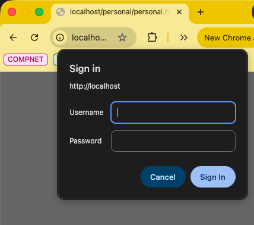
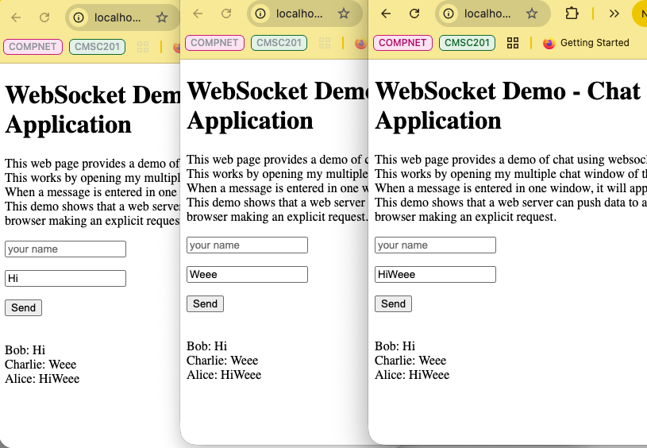

# Lab-13 : Apache Web Server Configuration Directives

This exercise provides basic overview of Apache web server configuration
file and directives.

## Learning Objectives

- Understand directives in Apache web server configuration file 
- Understand Directives for Basic Authentication 
- Understand Directives for URL Redirection. 
- Understand Directives for Proxy Application (e.g., websocket server)

## Environment

Docker Desktop, which is an application environment for your laptop environment that enables running of containerized applications. 
- The Docker Desktop integrates and provides access to a vast ecosystem of docker images via Docker Hub. 
- To access web content, use of Firefox browser is recommended as it provides easier support to dissect and analyse web request and response.


> #### Creating, running and verifying the web server
- We will customized docker images to create a web server instance.
  - `$docker run -d --name web-server -p 80:80 --rm zizutg/multi-ub22-websocket`
  - Make sure another container is not using port 80
- Note: if this doesn't work we build the image 
  - `docker build -f ./util/df/multi-ub22-websocket.df -t multi-ub22-websocket .`
  - And run it: `docker run -it --name web-server multi-ub22-websocket`

Verify that web server is up and running and serving web pages. 
- Run the following command on host (laptop) terminal.
  - `$ curl http://localhost/welcome.html`

```html
<html>
    <head>
        <title>Welcome Page<title>
    <head>
    <body>
        <h1>Welcome to HTTP Learning<h1>
        Welcome to experiential learning of HTTP protocol.
    <body>
<html>
```

## Apache directives

Apache directives are configuration instructions for Apache web server that control behaviour of the web server. 
- These directives can affect serving of contents, authentication and access control, URL rewriting, proxy application etc.

### Enabling Basic Authentication

Authentication in Apache is defined by directive AuthType which can any of following 3 values
- None
- Basic
- Digest
- Form

AuthType None is used for disabling authentication. AuthType Basic is a simple authentication that makes use of username and password. 

- The server requests username and password from the client and upon successful authentication, web server serves content from the specified directory.

In this exercise, we will work this Basic authentication type. This
authtype works in conjunction with a password file which can be managed
by a utility htpasswd.

#### Creating a password file
Access the docker container from the terminal
- `docker exec -it web-server bash  `

Use the following command to create a new password file and add a user to it
- Use a username and a password of your choice
```
root@6b0762a384f3:/# mkdir -p /etc/apache2/password
root@6b0762a384f3:/# htpasswd -c /etc/apache2/password/password.file user1
New password: 
Re-type new password: 
Adding password for user user1
```

>***To add users to this file, don't use the option -c. This option creates a new file and erases existing file.***

#### Define authentication directive in config file

Consider that directory `/var/www/html/personal` has protected contents that requires users to be authenticated. 
- Open configuration file `/etc/apache2/apache2.conf` (in docker container) as follows.
  - `root@6b0762a384f3:/# nano /etc/apache2/apache2.conf`
- Add the following instructions to the configuration file
```
<Directory /var/www/html/personal>
     AuthType Basic
     AuthName "Personal Area"
     AuthUserFile /etc/apache2/password/password.file
     Require valid-user
</Directory>
```
Reload the Apache configuration file. ***Ignore the error***
- `root@6b0762a384f3:/# apache2ctl -k graceful`
- Alternatively, restart the apache2 web server.
  - `root@6b0762a384f3:/# apache2ctl restart`

Create some content in the protected directory e.g., create/copy some
file
- `root@6b0762a384f3:/# cd /var/www/html && mkdir -p personal`
- `root@6b0762a384f3:/var/www/html# cp welcome.html personal/personal.html`
Exit from the container
- `root@195c6044e206:/# exit`


Access this protected webpage via url: <http://localhost/personal/personal.html>

- This should pop up an authentation window with the context lable "Personal Area" as shown in below .
  - Enter the username and password and you will see the successful welcome page.



### Enabling URL Redirection

A majority of websites make redirect the initial HTTP Request by a user to HTTPS or to some other URL, e.g., prefixing the domain name with "www.". 
- HTTP status codes 301 and 302 defines this redirection as temporary or permanent.
- To understand this redirection, we consider two URLs, namely, demo301.html and demo302.html and redirect both of them to another web page. 
- Redirect the first URL welcome.html and redirect the second URL to welcome.txt and then access these URLs. 
- Browser will redirect them and display the corresponding URL.

Open apache config files as we did earier and update the file to include redirection 
```
Redirect 301 "/demo301.html" "/welcome.html"
Redirect "/demo302.html" "/welcome.txt"
```
Reload the Apache2 configuration: Ignore the error
- `root@6b0762a384f3:/# apache2ctl -k graceful`

Access these URLs via browser:
- <http://localhost/demo301.html>  
- <http://localhost/demo302.html>

To analyze the behavior, access these URLs via curl as follows and it will show redirection of HTTP header requests.
- You can do this from the local machine or webserver 

```
root@6b0762a384f3:/# curl -I -L http://localhost/demo301.html
HTTP/1.1 301 Moved Permanently
Date: Fri, 06 Mar 2026 20:52:03 GMT
Server: Apache/2.4.58 (Ubuntu)
Location: http://localhost/welcome.html
Content-Type: text/html; charset=iso-8859-1

HTTP/1.1 200 OK
Date: Fri, 06 Mar 2026 20:52:03 GMT
Server: Apache/2.4.58 (Ubuntu)
Last-Modified: Fri, 21 Nov 2025 16:47:19 GMT
ETag: "d1-6441d9113d3c0"
Accept-Ranges: bytes
Content-Length: 209
Vary: Accept-Encoding
Content-Type: text/html

root@6b0762a384f3:/# curl -I -L http://localhost/demo302.html
HTTP/1.1 302 Found
Date: Fri, 06 Mar 2026 20:52:36 GMT
Server: Apache/2.4.58 (Ubuntu)
Location: http://localhost/welcome.txt
Content-Type: text/html; charset=iso-8859-1

HTTP/1.1 200 OK
Date: Fri, 06 Mar 2026 20:52:36 GMT
Server: Apache/2.4.58 (Ubuntu)
Last-Modified: Fri, 21 Nov 2025 16:47:19 GMT
ETag: "d1-6441d9113d3c0"
Accept-Ranges: bytes
Content-Length: 209
Vary: Accept-Encoding
Content-Type: text/plain
```

### Apache Directive for Proxy Applications

An apache web server can be used as reverse proxy for integrating some backend services. 
- An example is using websocket servers. 
- This instance is configured with integrating one websocket backend server. 
- These directives are defined in `/etc/apache2/site-available/000=default.conf` as shown below (use `cat` and path to view it).
```
ProxyPass "/ws/" "ws://localhost:8888/"
ProxyPassReverse "/ws/" "ws://localhost:8888/"
```

This websocket server code is `/Programs/chat_websocket_server.py`,which accepts request on port 8888 and echoes back to all connected clients i.e. browser. 
- This is an example of web socket server which acts like a group chat server. 
- The respective front end web page is given as /var/www/html/demo-chat-websocket.html. 
- To explore this behaviour of proxypass and how group chat works, open 3 browser windows, and each browser window enter the following URL.

<http://localhost/websocket/demo-chat-websocket.html>.

Enter the username (no validation is done) and then enter some chat message press enter. 
- The message will be displayed in all 3 browser windows



To explore this proxypass directive further, kill the backend websocket server. 
- Identify the process that is running the group chat and kill it.
```
root@6b0762a384f3:/# ps -efwww | grep chat
root         7     1  0 19:24 ?        00:00:00 python3 Programs/chat_websocket_server.py
root       300    82  0 21:11 pts/0    00:00:00 grep --color=auto chat
```
Note down the process id of chat backend server. In this case it is 7.
```
oot@6b0762a384f3:/# kill 7
root@6b0762a384f3:/# ps -efwww | grep chat
root       302    82  0 21:12 pts/0    00:00:00 grep --color=auto chat
```
Now if you try to chat it will not broadcast any message to other
members of the chat group.
- To restart the server: `root@6b0762a384f3:/# python3 Programs/chat_websocket_server.py`

## Summary

In this exercise, we have learnt the following

- Using Apache directives for authentication
- Using apache directives for URL Redirection
- Using Apache directives for proxy pass i.e. connecting backend servers.

## Learning Resources

### HTTP RFCs

- RFC 3828: HTTP Over TLS

### Apache Authentication

- <https://httpd.apache.org/docs/2.4/howto/auth.html>

