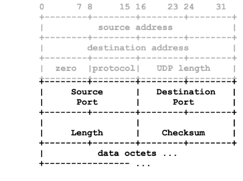
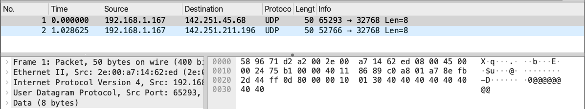
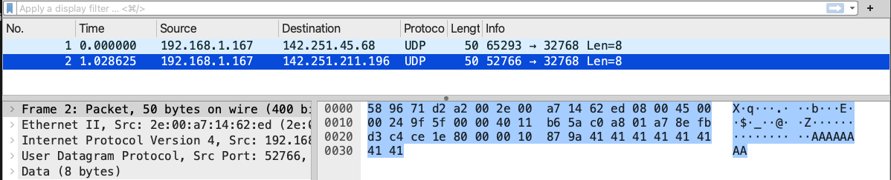
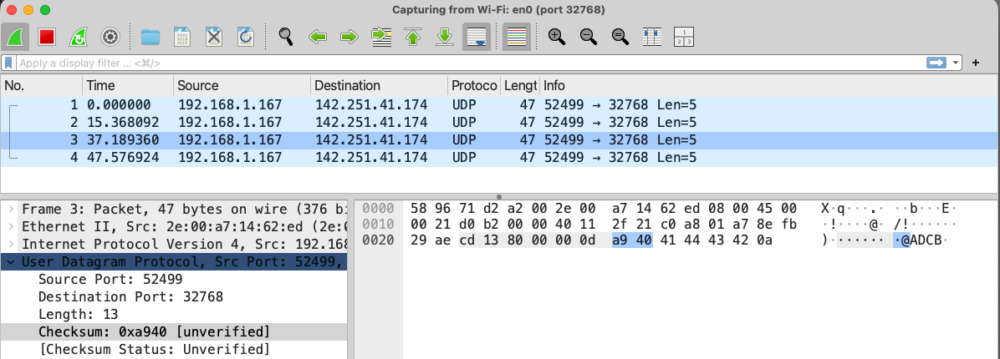

# Lab 14: UDP

This exercise provides basic overview of UDP Protocol, its message
delivery as well as checksum.

## Learning Objectives

- Understand UDP Message Oriented Delivery
- Understand Unreliability of UDP
- Understand UDP Checksum
- Understand Server communication with multiple clients

## Environment

Docker Desktop, which is an application environment for your laptop environment that enables running of containerized applications. 
- The Docker Desktop integrates and provides access to a vast ecosystem of docker images via Docker Hub.

To access web content, use of Firefox browser is recommended as it provides easier support to dissect and analyse web request and response.

To capture real life packets use wireshark.

## Description

#### Creating Simple Network


Create a simple network of four hosts connected via two routers.


Open your terminal, create a network using following command: 
- `docker compose -f ./util/yml/multi-net4-2R4H.yml up -d`

Check that all the four containers are up and running. The below command
will show
- `docker ps`

From HA, ping HB and it should be successful.
- `docker exec -it HA ping -c2 172.21.47.5`

### Simple UDP Communication

#### Start UDP Server on HB

Access HB: `docker exec -it HB bash`

start tcpdump capture with capture filter as UDP on HB
- `root@HB:/# tcpdump -n -i eth0 -A udp`

- Access HB in another terminal and tart UDP server program udp_server.py listening on port 9999 (option -p) with delay interval of 5 seconds (option -d) and buffer size of 10 (option -b). 
- `root@HB:/# python3 Programs/udp_server.py -p 9999 -b 10 -d 5`


#### Start UDP Client program on HA

Access the  docker instance HA on a third terminal
: `docker exec -it HA bash`

start UDP client program udp_client.py send 3 packets (option -c) to UDP server with buffer size of 5 (option -b) and delay interval of 2s (option -d) as shown below.
- `python3 Programs/udp_client.py -s 172.21.47.5 -p 9999 -c 3 -d 2 -b 5`

This will send UDP packets of size 5 bytes to UDP server, as shown below
```
sending: @@@@@
sending: AAAAA
sending: BBBBB
```
The same will be received at UDP server host, but UDP server program will receive these at the interval of 5s and displayed as below along with the time stamp.
```
('172.21.45.5', 45750) 12:13:59.528 @@@@@
('172.21.45.5', 45750) 12:14:04.531 AAAAA
('172.21.45.5', 45750) 12:14:09.534 BBBBB
```

Analyze the tcpdump capture on host HB where packets were received at the interval of 2 seconds, as can be seen by timestamp in tcpdump capture, but processed by application at the interval of 5 seconds.
```
tcpdump: verbose output suppressed, use -v[v]... for full protocol decode
listening on eth0, link-type EN10MB (Ethernet), snapshot length 262144 bytes
12:13:59.527871 IP 172.21.45.5.45750 > 172.21.47.5.9999: UDP, length 5 E..!..@.>.....-.../...'....S@@@@@
12:14:01.529650 IP 172.21.45.5.45750 > 172.21.47.5.9999: UDP, length 5 E..!..@.>.....-.../...'....SAAAAA
12:14:03.535715 IP 172.21.45.5.45750 > 172.21.47.5.9999: UDP, length 5 E..!..@.>.....-.../...'....SBBBBB
```
#### Understanding simple UDP Communication

In this case, client sends 3 UDP message which are received by server
and displayed by the server. This shows simple UDP communication.

### UDP Message Oriented Delivery

UDP is message oriented protocol. 
- This implies that once a program makes a socket call to read the data, the network stack will deliver the entire packet to application. 
- If the application reads lesser number of bytes, then remaining part of the message data will be discarded.
- To study this behaviour, use the UDP server program as already running earlier or if it is aborted, then restart the server program with same paramters i.e. buffer size of 10.

#### UDP Client Program with a larger buffer.

Invoke the client program with buffer size of 25 and delay interval of 2 seconds. It will send 25 bytes message to UDP as shown in client machine as below.
- `python3 Programs/udp_client.py -s 172.21.47.5 -p 9999 -c 3 -d 2 -b 25`

```
12:21:29.468 sending: @@@@@@@@@@@@@@@@@@@@@@@@@
12:21:31.471 sending: AAAAAAAAAAAAAAAAAAAAAAAAA
12:21:33.474 sending: BBBBBBBBBBBBBBBBBBBBBBBBB
```

However, the packets displayed at UDP Server window will be as follows.
```
('172.21.45.5', 54920) 12:21:32.785 @@@@@@@@@@
('172.21.45.5', 54920) 12:21:37.790 AAAAAAAAAA
('172.21.45.5', 54920) 12:21:42.795 BBBBBBBBBB
```
This indicates that remaining 15 bytes of each of 3 messages were not
processed by UDP server since it specified buffer size of 10 when
receiving packets.

#### Packet Capture of UDP Server

The tcpdump capture at server host still shows that all 25 bytes were
received by network, though application processed only 10 bytes and
remaining 15 bytes were discarded.
```
12:21:29.468427 IP 172.21.45.5.54920 > 172.21.47.5.9999: UDP, length 25 E..5.E@.>.Z>..-.../...'..!.g@@@@@@@@@@@@@@@@@@@@@@@@@
12:21:31.472432 IP 172.21.45.5.54920 > 172.21.47.5.9999: UDP, length 25 E..5/.@.>.X...-.../...'..!.gAAAAAAAAAAAAAAAAAAAAAAAAA
12:21:33.475381 IP 172.21.45.5.54920 > 172.21.47.5.9999: UDP, length 25 E..52.@.>.U...-.../...'..!.gBBBBBBBBBBBBBBBBBBBBBBBBB
```
#### Experimentation with buffer size and delay interval

Run client and server programs with different buffer sizes and delay
intervals and explore the behaviour of UDP protocols w.r.t. message
oriented delivery.

### Unreliability of UDP Delivery

To study the unreliability, we will introduce network disturbances. 
- For example, when client program is running, bring down the network interface of router R1 for some duration and then restored it. 
- You should experience that UDP client will continue to send the packets to server and since network is down, these packets will be lost. 
- When network is restored, remaining packets will be delivered as in normal case.

#### Start Client program with large number of packets.

Start the client program with packet count of 10 or more and delay interval of 10 seconds, as shown below. ***Do not wait for the sending to end. Go to the next step to turn the network down***
- `root@HA:/# python3 Programs/udp_client.py -s 172.21.47.5 -p 9999 -c 10 -d 10 -b 25`
```
12:44:59.476 sending: @@@@@
12:45:09.478 sending: AAAAA
12:45:19.483 sending: BBBBB
12:45:29.490 sending: CCCCC
12:45:39.495 sending: DDDDD
12:45:49.499 sending: EEEEE
12:45:59.503 sending: FFFFF
12:46:09.504 sending: GGGGG
12:46:19.508 sending: HHHHH
12:46:29.510 sending: IIIII
12:46:39.516 sending: JJJJJ
```
#### Bring down the network

Access R1 in another terminal: `docker exec -it R1 bash`

Bring down its eth0 interface after client has sent at least 4 packets and same has been received by udp Server. 
- `root@R1:/# ip link set dev eth0 down`

Observer the UDP client. 
- It will continue to send packets which will not be displayed by the received since these are lost by the network. 
- After network has lost 3 or more packets, bring up this interface as shown below. 
- You should see that now server will start receiving the packets. 
- This shows the unreliability of UDP protocol.

Bring up R1 eth0 interface 
- `root@R1:/# ip link set dev eth0 up `


- Given below is the UDP Server output which show that packets `"FFFFF"` and `"GGGGG"` were lost by the network.
```
('172.21.45.5', 58463) 12:44:59.476 @@@@@
('172.21.45.5', 58463) 12:45:09.479 AAAAA
('172.21.45.5', 58463) 12:45:19.485 BBBBB
('172.21.45.5', 58463) 12:45:29.491 CCCCC
('172.21.45.5', 58463) 12:45:39.496 DDDDD
('172.21.45.5', 58463) 12:45:49.500 EEEEE
('172.21.45.5', 58463) 12:46:31.579 IIIII
('172.21.45.5', 58463) 12:46:39.517 JJJJJ
```
This shows the unreliability nature of UDP and there is no retransmission of packets by the network. 

>***Everyone's result could deffer depending on when the router is stopped and started***


### Server With Multiple Clients

UDP is connection less protocols and thus if many clients send data to a server at the same time, it will receive and process data from all clients concurrently in the order these packets arrive.

Lets keep HB as a server and continue to connect to it from multiple clients
#### Using Multiple UDP Clients

Access host HA, HC, and  HD as on multiple terminals
- Start sending messages using client program udp_client.py to this server concurrently. 
- The server will receive and display the message from all clients concurrently. 
- The 3 clients are invoked with buffer size of 4,6,8 respectively and different delay intervals of 2,3,4 as shown below. 
- Each client sends about 5 packets as shown below.

Client window 1:
- `root@HA:/# python3 Programs/udp_client.py -s 172.21.47.5 -p 9999 -b 4 -d 2 -c 5`

Client window 2:
- `root@HC:/# python3 Programs/udp_client.py -s 172.21.47.5 -p 9999 -b 6 -d 3 -c 5`

Client window 3:
- `root@HD:/# python3 Programs/udp_client.py -s 172.21.47.5 -p 9999 -b 8 -d 4 -c 5`

#### Server Processing and message display

The server displays the data as received from multiple clients concurrently as below.
```
root@HB:/# python3 Programs/udp_server.py -p 9999 -b 10 -d 5
('172.21.45.5', 44313) 17:18:54.877 @@@@
('172.21.45.5', 46763) 17:18:59.881 @@@@@@
('172.21.45.5', 44313) 17:19:04.884 AAAA
('172.21.45.5', 46763) 17:19:09.890 AAAAAA
('172.21.45.5', 37263) 17:19:14.895 @@@@@@@@
('172.21.45.5', 44313) 17:19:19.901 BBBB
('172.21.45.5', 46763) 17:19:24.904 BBBBBB
('172.21.45.5', 37263) 17:19:29.906 AAAAAAAA
('172.21.45.5', 44313) 17:19:34.912 CCCC
('172.21.45.5', 46763) 17:19:39.916 CCCCCC
('172.21.45.5', 37263) 17:19:44.918 BBBBBBBB
('172.21.45.5', 44313) 17:19:49.922 DDDD
('172.21.45.5', 46763) 17:19:54.926 DDDDDD
('172.21.45.5', 37263) 17:19:59.928 CCCCCCCC
('172.21.45.5', 37263) 17:20:04.934 DDDDDDDD
```

Run your own combinations of multiple clients with different buffer size, delay intervals, packet counts and explore and understand working of UDP message delivery.


#### Packet Capture Analysis

Repeat the exercise, but along with start the packet capture on both host HA and host HB. Host HA packet capture will show transmission of all packets whereas packet capture at host HB will host only those packets received by server.

Complete this by shutting down the networ
- `docker compose -f util/yml/multi-net4-2R4H.yml down --remove-orphans`

### Checksum computation

Each UDP packet has 2 bytes (16 bits) checksum field which provides basic integrity check to detect packet corruption during transmission over the network. 
- The computation of checksum involves use of pseudo headers as shown in grayed area of the figure along with UDP headers and data. 
- Checksum is computed taking 2 bytes at a time, performing a simple addition, adding any overflow bits and then computing one's complement.



### Checksum in Real Life.

For this we will use wireshark
- Open the wireshark application and set the capture filter to `port 32768` and start capturing on your connected interface (E.g. en0)

Create a ubuntu host:
- `docker run -it -d --name host -p 80:80 --rm zizutg/net-ub22-host`

Access the host: `docker exec -it host bash`

Using these 2 packets, we will compute the checksum and verify the values in wireshark packet capture. 
-  A simple invocation of UDP Client sending 8 bytes data to website google.com (IP Address 142.250.217.4) on port 32768 is shown below.
   -  Note that IP address of google can be different on your case, even from packet to packet due to DNS and/or Load Balancing
- Using the UDP client program udp_client.py, sends 2 packets to any internet site. 
- Access the the host in another terminal and run the udp client
  - `root@ea7f1846e9d4:/# python3 Programs/udp_client.py -s google.com -p 32768 -c2 -b 8`
```
14:06:25.659 sending: @@@@@@@@
14:06:30.696 sending: AAAAAAAA
```

#### Analyzing the Packet Capture

Now observe the packet capture in wireshark:

- The first packet has ASCII Characters `'@@@@@@@@`', the corresponding value in hex code is `0x4040404040404040`. 
- The second packet `'AAAAAAAA'` had the corresponding hex code as `0x4141414141414141`.





Notice two things:
- The source IP is your actual machine IP since the container accessed google though that
- The destination IP changed for two packets as google have different IPs 


The packet capture starts with IP header of 20 bytes followed by UDP headers of 8 bytes followed by 8 bytes of UDP message. 
- Source IP Address is at offset 12 and given by `0xc0a8 01a7` which in Dotted Decimal Notation form is IP 172.17.0.3 (`c0 = 192,  a8 = 168, 01 = 1, a7 = 167`) 
- Similarly, destination IP Address is at offset of 16 and given by `0x8efb 2d44`, which in DDN is 142.251.45.68. 

The UDP source port is at offset 20, given by `0xff0d` (in decimal 65293) and destination port is at offset 22, given by `0x8000` (decimal 32768). 
- The UDP length field is at offset 24, with the value `0x0010` (decimal 16). 
- The UDP length also includes length of header bytes and since UDP message is of length 8 bytes, then length field is 16 (8 bytes of message + 8 bytes of header).
- This is followed by UDP checksum value of `0x0130` for first message, and `0x879a`for the second message. 

In the next section we will manually compute these values to understand the checksum computation.

#### Checksum computation

As per checksum computation discussed earlier (using the grayed out are): 
- The check sum for first UDP message is computed as follows. 
- Note the value of UDP protocol in IP header is 0x11 (decimal 17). 
- Also, the UDP length is counted twice in checksum computation.
```
Sum = [src IP first 2 bytes] + [src IP last 2 bytes] + 
      [Dst IP first 2 bytes ] + [Dst IP last 2 bytes] + 
      [0, UDP protocol] + [UDP Len] + [Src UDP Port] + 
      [Dst UDP Port] + [UDP Len] + [UDP msg bytes 0,1] + 
      [UDP msg bytes 2,3] + [UDP msg bytes 4,5] + [UDP msg bytes 6,7]
```
```
    = C0A8 (192.168) + 01A7 (1.167) + 8EFB (142.251) + 2D44 (45.68) + 
      0011 (zero + UDP Protocol) + 0010 (UDP Length) + FF0D (UDP Src Port) + 8000 (UDP Dst Port) + 0010 (UDP Length) + 4040 (data bytes 0,1) + 
      4040 (data bytes 2,3) + 4040 (data bytes 4,5) + 4040 (data bytes 6,7)
```
```
    = C0A8 + 01A7 + 8EFB + 2D44 + 0011 + 0010 + FF0D + 8000 + 0010 + 
      4040 + 4040 + 4040 + 4040 = 3FECC
```
- Adding the overflow bits back to 16 bits gives `FECC + 0003 = FEC`F.

- Performing 1's complete of `FECF` gives `0130`, which is the value shown at
offset 26 in wireshark capture of first message.

Similarly, checksum computation for $2^{nd}$ message is as follows.
```
Sum = C0A8 + 01A7 + 8EFB + D3C4 + 0011 + 0010 + CE1E + 8000 + 
    0010 + 4141 + 4141 + 4141 + 4141 = 47861
```
Adding the overflow bits back to 16 bits gives `7861 + 0004 = 7865`.

Performing 1's complement of `7865` gives `879a`, which is the value shown at
offset 26 in wireshark capture of second message.


### Weakness of UDP Checksum.

The UDP Checksum mechanism is a simple sum addition mechanism and since
addition follows the law of commutative sum, the data field can be
manipulated to result in the same sum.

- Given below are 3 transmissions of "ABCD", "CDAB" and "ADCB" using same source and destination IP address and port numbers.
```
root@ea7f1846e9d4:/# echo "ABCD" | ncat -u -p 16384 142.251.41.174 32768
root@ea7f1846e9d4:/# echo "CDAB" | ncat -u -p 16384 142.251.41.174 32768
root@ea7f1846e9d4:/# echo "ADCB" | ncat -u -p 16384 142.251.41.174 32768
```
#### Packet Capture using wireshark

For the 3 messages sent above, the packet capture is shown below.
In all these 3 cases, the UDP Checksum value is same i.e., `0xa940`.



#### Additional examples of checksum weakness

Send data with prefix of "UQUQUQ" to any data text and you will notice that the checksum is same. 
- For example, checksum value for sending "UQUQUQADCB" is same as that of sending "ADCB" as shown below in the packet capture.
```
root@ea7f1846e9d4:/# echo "UQUQUQABCD" | ncat -u -p 16384 142.251.41.174 32768
root@ea7f1846e9d4:/# echo "ABCD" | ncat -u -p 16384 142.251.41.174 32768
```

Analyze this packet capture and explore why this checksum happens to be same even though data length is same. 
- Thus, it is to be noted that UDP checksum provides a simple mechanism for integrity checksum to identify corrupted packets during transmission and not a security mechanism to preserve integrity.

#### Explore More Checksum computation

Use netcat (ncat) utility to send UDP message on the network, capture wireshark and verify that your computation matches with the value in packet capture.

- You may want to  exit the host and stop host for the next exercise at the port might conflict: `docker stop host`

## Summary

In this exercise, we have learnt the following

- Simple UDP Communication
- Message oriented delivery of UDP
- Unreliable delivery of UDP
- UDP Checksum computation
- Limitations of UDP Checksum computation
- UDP server working with concurrent clients.

## Learning Resources

### RFCs

- RFC 768: User Datagram Protocol
- RFC 1071: Computing The Internet Checksum
