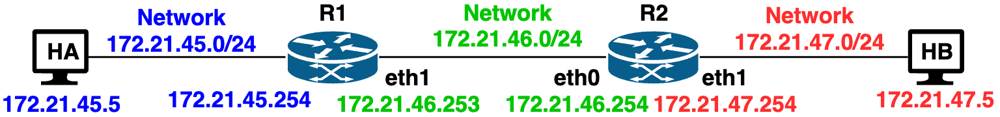
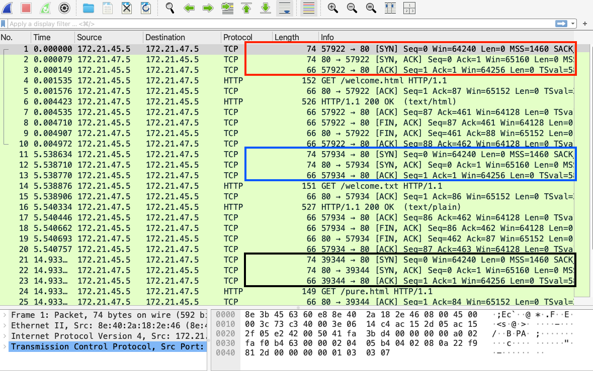
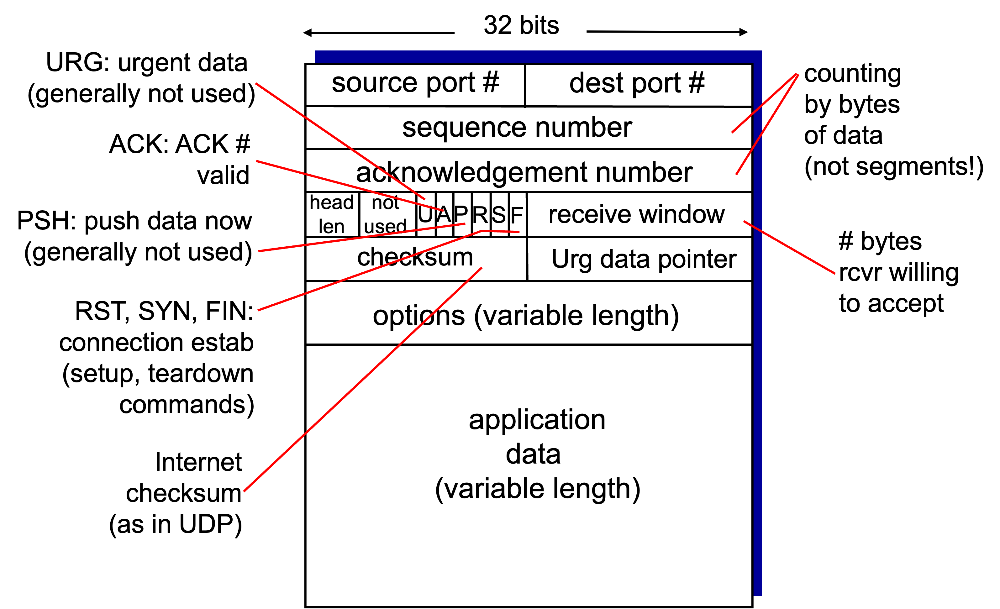
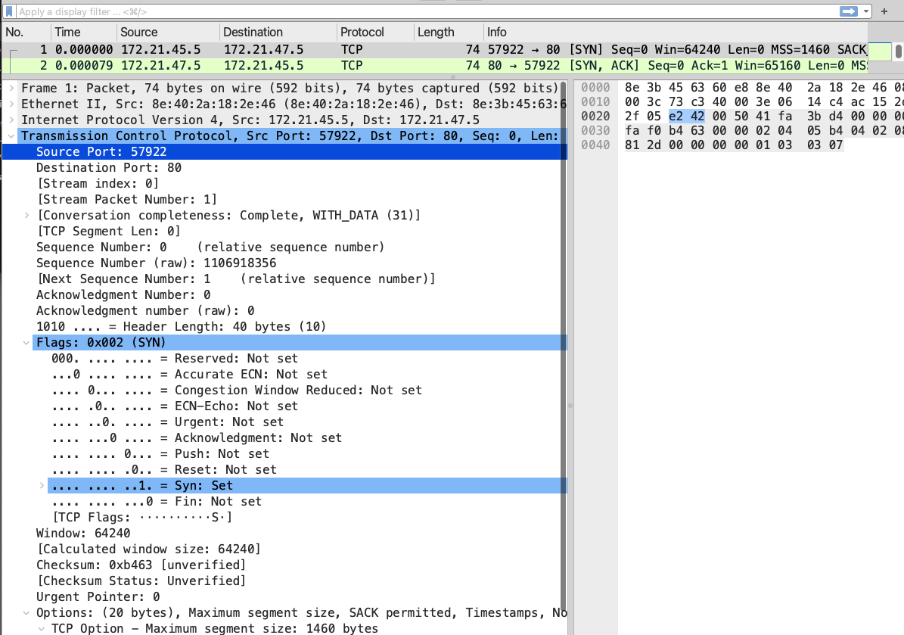
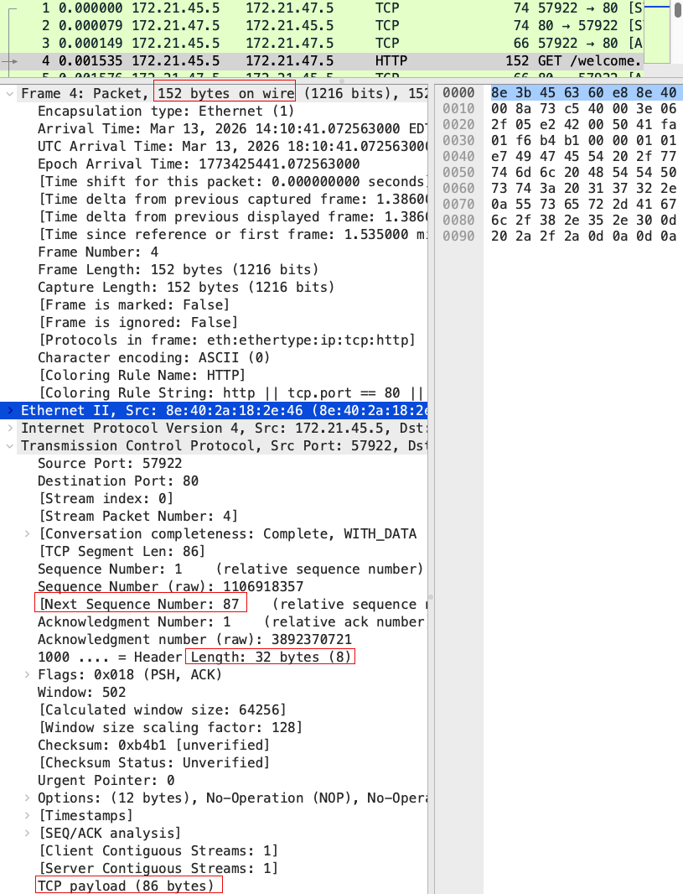
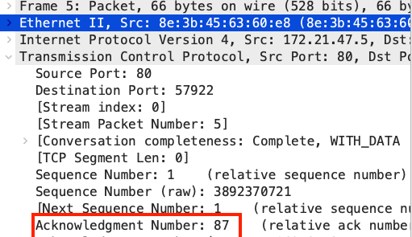

# Lab 15 - TCP Connection Setup and Segment

This exercise provides basic overview of TCP. First,  Connection setup via 3 way handshake is discussed. Then TCP Segment structure and 
interpretation of all fields in TCP segment during TCP communication follows. 

## Learning Objectives

- TCP Connection setup
- TCP 3-way Handshake
- TCP Multiplexing and Demultiplexing
- Understand TCP segment Structure
- Understand role of TCP Sequence and Acknowledgement number in TCP communication

## Environment

Docker Desktop, which is an application environment for your laptop
environment that enables running of containerized applications. The Docker Desktop integrates and provides access to a vast ecosystem of docker images via Docker Hub.

To access web content, use of Firefox browser is recommended as it
provides easier support to dissect and analyse web request and response.

## Description

Create a simple network of two hosts connected via two routers as shown below.
  - `docker compose -f util/yml/multi-net4-2R2H.yml up -d`




#### Check connectivity and reachability.

Check that all the four containers are up and running. The below command will show
- `docker ps`

From HA, ping HB and it should be successful.

- `docker exec -it HA ping -c2 172.21.47.5`

## TCP Connection Setup

#### Starting a TCP Server

Access HB instance 
- `docker exec -it HB bash`

Start a netcat (nc) server on some chosen port e.g., 4444.
- `root@HB:/# nc -l 4444`


#### Starting packet Capture 

Access host HB (or HA) on a new terminal and start the tcpdump packet capture. 
- The option `-S` is used display the actual sequence number and ack value being displayed instead of relative values w.r.t. ISNs (Initial Sequence Number) which is the default setting.
  - `root@HB:/# tcpdump -n -i eth0 -S host 172.21.45.5`


#### Start a TCP Client and Connect to Server

Access host HA on a different terminal 
- `docker exec -it HA bash`

Connect to netcat server of host HB.
- `root@HA:/# nc 172.21.47.5 4444`

#### TCP Connection Setup and 3-way Handshake

When client connects to server, a 3-way handshake occurs between client and server as follows.

- Client->SYN Server
- Server->SYN/Ack Client
- Client->Ack Server

The tcpdump packet capture shows this 3-way handshake, like below.
```
16:24:16.200447 IP 172.21.45.5.35890 > 172.21.47.5.4444: Flags [S], seq 2684699364, win 64240, options [mss 1460,sackOK,TS val 580438135 ecr 0,nop,wscale 7], length 0
16:24:16.200568 IP 172.21.47.5.4444 > 172.21.45.5.35890: Flags [S.], seq 3981856599, ack 2684699365, win 65160, options [mss 1460,sackOK,TS val 3837144724 ecr 580438135,nop,wscale 7], length 0
16:24:16.200657 IP 172.21.45.5.35890 > 172.21.47.5.4444: Flags [.], ack 3981856600, win 502, options [nop,nop,TS val 580438136 ecr 3837144724], length 0
```

- First message from client HA (IP 172.21.45.5 port 35890) to server HB (IP 172.21.47.5, port 4444) is SYN as shown by Flags `[S]`, and starts with random Initial Sequence number (ISN) of 2684699364. 
  - It has few other parameters as well such as window size (receive buffer size) and max segment size (mss) 1460. The value 1460 comes from 1500 (size of Payload in ethernet) -- 20 (size of IP Header) -- 20 (size of TCP header).

- The second message SYN/Ack is from Server (HB) to client (HA) which is shown by Flags `[S.]` and with its ISN value 3981856599 and Ack value 435805045 (one more than ISN sent by HA in its first message).

- The third message Ack is from client (HA) to server (HB) with Flags `[.]` indicating just ack, and Ack value is 3981856600 (one more than ISN sent by server HB in second message).

This shows the 3-way handshake.

#### Exploration of TCP 3-way handshake

Open the wireshark on the laptop and use capture filter `host yahoo.com` or any other website of your choice. 
- Open the browser and access the website yahoo.com. 
- Analyze the wireshark packet capture and first 3 packets will show the 3-way handshake with server. 
- In reality, browser may multiple parallel concurrent connect and wireshark will show multiple 3-way handshake packets. 
- Each new connection setup (3-way handshake) will start with a random value of ISN.

### Multiple Clients and TCP Multiplexing/DeMultiplexing

TCP Multiplexing/demultiplexing refers to situation where TCP stack on a host is able to concurrently handle multiple TCP connections. 
- To understand this, we will use Apache web server to serve multiple browser clients and understand its handling of concurrent TCP Connections.

#### Starting TCP (web) server

Access HB and start the Apache web server on instance HB (Ignore the error).
- `root@HB:/# apache2ctl start` 


#### Start packet capture.

To analyze multiplexing/demultiplexing, we will save the packet capture in a file and then analyze it later. 
- Use the option `-w` to save the capture in a file, e.g. as shown below. 

Access host HB on another terminal and start the tcpdump packet capture.
- `root@HB:/# tcpdump -n -i eth0 -w tcpdump.pcap -c 100 port 80`

#### Start Concurrent Clients.nd

Access HA and use curl to access resources from HB

- `root@HA:/#curl http://172.21.47.5/welcome.html`
- `root@HA:/#curl http://172.21.47.5/welcome.txt`
- `root@HA:/#curl http://172.21.47.5/pure.html`

#### Analysis of Concurrent Connections

After the webpages are displayed in HA terminal windows, terminate the packet capture on HB by pressing Ctrl-C in the window of packet capture. This will bytes and number of packets captured as below
```
^C30 packets captured
30 packets received by filter
0 packets dropped by kernel
```
Download the packet capture file from docker to the laptop as below. This is done via local computer terminal.
- `docker cp HB:/tcpdump.pcap wk-08`

Open this packet capture file in wireshark on the laptop. A sample of such capture is shown below.



The different connections are highlighted in 3 rectangles, each having same source IP, same destination IP, same destination port (`80`), but each with different source port number (eg. `57922`, `57934` and `39344`).
- When the server receives any data from the client, it knows the socket quartet (src IP, src Port, Dst IP, Dst Port) and accordingly delivers the data to correct thread/child on server process. 
- Similarly, when Apache web server needs to send data, it uses single TCP stack to send data on 3 TCP Connections (Multiplexing) to be delivered to respective client.
  - Observe all TCP messages after each HTTP messages

#### Exploring Concurrent Connections.

Open the wireshark program on the laptop and capture all traffic on port 80. 
- Open a browser, and access different websites (in different tabs or different browsers/windows) and analyze the traffic in wireshark capture. 
- Analyze and understanding how different connections are setup and explore the 3-way handshake messages for different connections.


## TCP Segment Structure

The TCP Segment structure is shown in below. This will help us understanding the packet capture of TCP Connection



`src: Book: Computer Networks - A Top Down Approach, v8 Kurose, Ross; Pearson publishing`

### Analyzing TCP Segment Structure of a TCP Conenction

#### Wireshark Capture of TCP Conenction

If you closed it, reopen the tcpdump.pcap again.

Double click the pkt #1 and it will open the *packet details* pane and
its *packet byte* pane in a separate window.

- Clicking on the first line of *packet details* pane shows the Ethernet frame header of **14 bytes**
  (6 bytes destination MAC address, 6 bytes source MAC address and **2 bytes EtherType** indicating IPv4).

- Selecting the $2^{nd}$ line corresponding to Internet Protocol shows **20 bytes of IP header**
  as highlighted in the *packet bytes* pane.

- Selecting the $3^{rd}$ line corresponding to Transmission Control Protocol shows the remaining
  **40 bytes**, which corresponds to the TCP segment.

  - Since this is a SYN packet, it contains **TCP options (20 bytes)** and hence the TCP header length
    is 40 bytes even though there is **no application payload data.**



The details shows source port number (57922, bytes in hex are 0xE242), destination port (80, hex value 0050), ISN sequence number (1106918356, hex value 0x 41FA3BD4). 
- This ISN is used for future reference and all future sequence numbers are shown with as base and hence wireshark shows this sequence number as 0 for reference purposes. 
- Since this is SYN packet, Ack value is zero.
-  Next it shows header length in 4 bits as '1010' (decimal 10). 
   -  Actual header length is compute by multiplying this value by 4 and hence it shows header length as 40. 
-  The Flags field shows SYN. 
   -  Expand the Flags field to see that all other bits are zero in the flag field as this is first message of 3-way handshake. 
- Next it shows 'receive window' value of 64240 (corresponding bytes in hex are FAF0). 
- The value of urgent pointer is zero as is normally the case. 
  - This makes 20 bytes of minimum TCP header size. 
- This TCP Segment has optional 20 bytes of options and thus TCP header becomes 40 bytes. 
- Expand this field to study all the options supported in this TCP connection.

To see any particular TCP field value, select that field in the *packet details* pane and corresponding bytes in hex will be highlighted in *packet bytes* pane. This helps us understand basic structure of TCP Segment.

#### TCP Sequence Number and Acknowledgement Number

The packets #2 and #3 corresponds to $2^{nd}$ and $3^{rd}$ message of 3-Way handshake of TCP connection setup as discussed earlier.
- All the remaining packets will show the appropriate values of sequence number and acknowledgement number.

Pkt #4 corresponds to HTTP request which makes use of this TCP connection. 
- Analyze the tcp of this packet in detail. 
  - It shows both seq and ack number as 1 as these are relative to their respective ISN used in 3-way handshake. 
  - The *packet details* pane also shows the next seq number as 87 implies that TCP payload size is 86 bytes corresponding to HTTP request header

```
GET /welcome.html HTTP/1.1\r\n
Host: 172.21.47.5\r\n
User-Agent: curl/8.5.0\r\n
Accept: */*\r\n
```
- There is no length field in TCP header and this length is computed by wireshark after substracting, Ethernet header (14), TCP header length (32) and IP header length (20) from the IP packet length of 152 bytes 
- i.e. TCP payload size = 152 - 14 - 20 - 32 = 86.



The pkt #5 is from server HB and it shows its seq num as 1, but ack value 87 (corresponding to seq 1 plus TCP Data of 86 bytes). 



The pkts #6 carry actual HTTP response and thus these packets have seq num 1 (segment length 460).

***This way you can analyze relation between sequence number and acknowledgement number (corresponding to sequence number of other side).***
#### Exploring Seq and Ack number

Access any website of your choice e.g., google.com and analyze the data transmission and role of sequence number and acknowledge number.

### TCP Reset

When a host receives a TCP packet with some port number on which no application is listening and accepting packets, then this host sends back TCP Reset message to the sender indicating to sender no application is running on the specified destination port.

#### Examining TCP Reset

Access host HA on two different terminals
- First terminal start a tcpdump
  - `root@HA:/# tcpdump -n -i eth0 -S host 172.21.47.5`
- On the other terminal try to connect to HB using netcat client on some port on which no application is running e.g., port 3333.
  - `root@HA:/# nc 172.21.47.5 3333`

The tcpdump capture will show that host B will respond with a TCP Reset packet `[R.]`. 
- TCP Reset is also sent by a host when a running application crashes and host receives a packet for that application. 
- This happens, because from OS perspective, no application is running corresponding destination TCP port of received TCP Segment, it will respond with TCP Reset.
```
20:20:23.177451 IP 172.21.45.5.50996 > 172.21.47.5.3333: Flags [S], seq 1825510086, win 64240, options [mss 1460,sackOK,TS val 594558953 ecr 0,nop,wscale 7], length 0
20:20:23.178134 IP 172.21.47.5.3333 > 172.21.45.5.50996: Flags [R.], seq 0, ack 1825510087, win 0, length 0
```

Complete this lab by shutting down the network
- `docker compose -f util/yml/multi-net4-2R2H.yml down --remove-orphans`

## Summary

In this exercise, we have learnt the following

- 3-Way handshake for TCP Connection Setup
- Multiplexing and Demultiplexing of TCP connections.
- TCP Segment structure of a TCP Connection
- Role of Sequence number and Acknowledgement number in data transmission
- TCP Reset response when no application is receiving data on a port 

## Learning Resources

### TCP RFCs

- RFC 9293: Transmission Control Protocol (TCP)
- RFC 793: Transmission Control Protocol (TCP) - the original specification.
