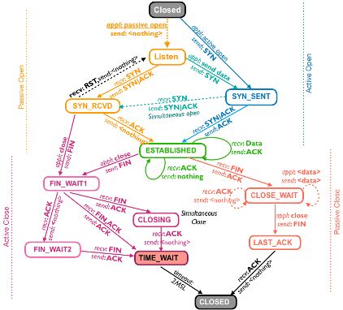

# Lab 18 - TCP Connection Teardown and Working with IP

This exercise provides basic overview of TCP state transitions during
connection teardown and explore working with IP addresses..

>***You may need to read through the lab before starting this lab as there are several moving parts and commands need to be executed sequentially as well as quickly on multiple terminals***

## Learning Objectives

- Understand TCP state transition during connection teardown
- Explore each of TCP connection state during teardown for a both sides
- Understand the role of IP address in *socket.bind*().
- Distinguish between binding to INADDR_ANY (0.0.0.0) and a specific IP.
- Learn how multiple processes share a listening socket for concurrent handling of client connections.

## Environment

Docker Desktop, which is an application environment for your laptop
environment that enables running of containerized applications. The Docker Desktop integrates and provides access to a vast ecosystem of docker images via Docker Hub.

## Description

Create a simple network of two hosts connected via two routers as shown below.
  - `docker compose -f util/yml/multi-net4-2R2H.yml up -d`


#### Check connectivity and reachability.

Check that all the four containers are up and running. The below command will show
- `docker ps`

From HA, ping HB and it should be successful.

- `docker exec -it HA ping -c2 172.21.47.5`


## TCP Connection States

#### TCP States

| Initial <br>(no connection) | Phase 1<br>Connection Setup | Phase 2<br>Data <br>Transfer | Phase 3<br>Connection Tear Down |
|-------------------------|-----------------------------|---------------------------|----------------------------------|
| CLOSED                  | LISTEN<br>SYN_SENT<br>SYN_RECV | ESTABLISHED              | FIN_WAIT_1<br>FIN_WAIT_2<br>CLOSING<br>TIME_WAIT<br>CLOSE_WAIT<br>LAST_ACK |


#### TCP State Transition Diagram



#### Use of iptables

The tool iptables is use to create specific network conditions to help use visualize the desired TCP transition states.

### TCP Connection state: Established 

When a client connects to a server and 3-way handshake is completed, the TCP connection on both client and server side is in ESTABLISHED state.

#### Setup a TCP connection

Access host HB and start the TCP server using netcat on some port
- `root@HB:/# nc -l 7777`.

Access host HA and connect to this TCP server using netcat
- `root@HA:/# nc 172.21.47.5 7777`

Send/communicate using some text e.g., "Hello". 
- Whatever text is entered on one side will be displayed on the other side. 
- This happens TCP connection is in ESTABLISHED State.

#### Viewing Connection state

Access host HA from another terminal and view all TCP connections. Notice the (The Recv-Q and Send-Q of the TCP)
- `root@HA:/# netstat -nat`
```
Active Internet connections (servers and established)
Proto Recv-Q Send-Q Local Address           Foreign Address         State      
tcp        0      0 127.0.0.11:43133        0.0.0.0:*               LISTEN     
tcp        0      0 172.21.45.5:47750       172.21.47.5:7777        ESTABLISHED
```
- It will show connection to server on port 7777 in ESTABLISHED state. 
- It also shows port number 47750 associated with a client, which is automatically assigned by Operating System, when client initiated a connection. 
  - As this port is randomly chosen and assigned by the client, it is also called ephemeral port.


Access host HB on another terminal and view all TCP Connections in a similar fashion. This will display the connection with HA.


In general, networks are very fast and 3-way handshake completes very quickly, and thus both client and server moves to ESTABLISHED state very quickly and it is unlikely to see the client and server in the intermediate transited state as shown in the transition diagram.


### TCP State Transition during Connection Teardown -- Normal Case

#### Active Close (Normal Behaviour)

To understand TCP state transition on Active Close, open three more terminal windows. 
- Let us call these windows as win3, win4 and win5, where win1 refers to terminal where netcat server is running on HB, and win2 refers to terminal where netcat client is running connected to netcat server.
  - Exchange few messages on win1 and win2 to confirm communication

We will use win4 and win5 to see the network socket status on HB and HA respectively. 
- The `netstat -nat` command should show TCP connection in `ESTABLISHED` state. 

Now on win3 access HB, and run the tcpdump packet capture command so as study the transmission of TCP FIN message.
- `root@HB:/# tcpdump -n -i eth0 host 172.21.45.5 and host 172.21.45.5`

In the terminal win1 (HB, where netcat server is running), press `Ctrl-C`. 
- This will abort the netcat server. 
- Look at the packet capture in win4. 
  - This should show Transmission of TCP FIN by HB and receipt of its Ack as shown below.
```
20:24:25.754924 IP 172.21.47.5.7777 > 172.21.45.5.55094: Flags [F.], seq 1122631885, ack 3229001031, win 510, options [nop,nop,TS val 3890782200 ecr 634045409], length 0
20:24:25.757321 IP 172.21.45.5.55094 > 172.21.47.5.7777: Flags [.], ack 1, win 502, options [nop,nop,TS val 634075614 ecr 3890782200], length 0
```

Upon receipt of Ack of FIN, TCP connection should move to state FIN_WAIT2. 
- On terminal win5, run netstat command and verify that the network connection to be in FIN_WAIT2 state.
  - `root@HB:/# netstat -nat`

```
Active Internet connections (servers and established)
Proto Recv-Q Send-Q Local Address           Foreign Address         State      
tcp        0      0 127.0.0.11:36191        0.0.0.0:*               LISTEN     
tcp        0      0 172.21.47.5:7777        172.21.45.5:55094       FIN_WAIT2  
```

#### Passive Close (Normal Behaviour)

Since the server initiated TCP FIN, and the client acknowledged it, the client should be in CLOSE_WAIT state. 
- On terminal win4, verify the connection state using netstat command.
  - `root@HA:/# netstat -nat`
```
Active Internet connections (servers and established)
Proto Recv-Q Send-Q Local Address           Foreign Address         State      
tcp        0      0 127.0.0.11:43133        0.0.0.0:*               LISTEN     
tcp        0      0 172.21.45.5:55094       172.21.47.5:7777        CLOSE_WAIT 
```

The client program is still running and it has not sent TCP FIN message.
- On terminal win2, enter **any message** or **Ctrl-C** to terminate the client program.
- It will now send TCP FIN message to server and receive the ack as shown below (in win3)

```
20:24:36.015757 IP 172.21.45.5.55094 > 172.21.47.5.7777: Flags [F.], seq 1, ack 1, win 502, options [nop,nop,TS val 634085872 ecr 3890782200], length 0
20:24:36.015796 IP 172.21.47.5.7777 > 172.21.45.5.55094: Flags [.], ack 2, win 510, options [nop,nop,TS val 3890792460 ecr 634085872], length 0

```

With the receipt of TCP FIN and network socket will be in will first be in CLOSE_AWAIT and then immidiatly move to CLOSED state i.e., network socket on client side is cleaned up.
- `root@HA:/# netstat -nat`
```
Proto Recv-Q Send-Q Local Address           Foreign Address         State      
tcp        0      0 127.0.0.11:43133        0.0.0.0:*               LISTEN     
tcp        0      0 172.21.45.5:55094       172.21.47.5:7777        CLOSE_WAIT 
```

```
Proto Recv-Q Send-Q Local Address           Foreign Address         State      
tcp        0      0 127.0.0.11:43133        0.0.0.0:*               LISTEN     
```
#### TCP State TIME_WAIT

When the server was in FIN_WAIT2 state, and receives TCP FIN from client, it sends the Acks message to client, and moves to TIME_WAIT state and will wait for 2*MSL (Maximum Segment Lifetime), i.e., 120 seconds. 
- Verify the TIME_WAIT state in win4 by using the netstat command.
  - `root@HB:/# netstat -nat`
```
Active Internet connections (servers and established)
Proto Recv-Q Send-Q Local Address           Foreign Address         State      
tcp        0      0 127.0.0.11:36191        0.0.0.0:*               LISTEN     
tcp        0      0 172.21.47.5:7777        172.21.45.5:46722       TIME_WAIT  
```
Since the socket with server port number is in TIME_WAIT state, no program can start and use this port. 
- Starting of any program that will use this port (e.g., 7777) will result in error "Address Already in Use". 
- Invoke the program tcp_server.py with option -p 7777 and it will give the error as shown below.
  - `root@HB:/# python3 Programs/tcp_server.py -p 7777`

```

Traceback (most recent call last):
  File "//Programs/tcp_server.py", line 22, in <module>
    sock.bind(srvr_addr)
OSError: [Errno 98] Address already in use
```

***Note: Using nc as the server program does not give this error since as
it uses special socket option SO_REUSEADDR.***

### Network Fault

Using iptables package, on router R2, drop the FIN packets and thus when any program who intiates connection close (Active Close), will send FIN message. 
- This will be dropped by the router and since the sender will not receive any ACK, it will remain FIN_WAIT1 sate. 
- Access R2 on win3, and use sample command to drop such FIN packets on R2 is given below:
  - `root@R2:/# iptables -I FORWARD -p tcp -s 172.21.47.5 -d 172.21.45.5 --tcp-flags ACK,FIN ACK,FIN -j DROP`

- Verify the rule
  - `root@R2:/# iptables -L -v -n`
  
```
Chain INPUT (policy ACCEPT 0 packets, 0 bytes)
 pkts bytes target     prot opt in     out     source               destination         

Chain FORWARD (policy ACCEPT 239 packets, 13026 bytes)
 pkts bytes target     prot opt in     out     source               destination         
    0     0 DROP       6    --  *      *       172.21.47.5          172.21.45.5          tcp flags:0x11/0x11

Chain OUTPUT (policy ACCEPT 0 packets, 0 bytes)
 pkts bytes target     prot opt in     out     source               destination         
root@R2:/# 
```
 
> ***You may need to reverse the packet drop rule of R2 during forwarding to either repeat the practice or for some reason. Just change the option `-I` (insert) to `-D` (delete) of the iptables FORWARD command, and verify the reverse. To drop again use the command above with -D as is.***

On win1, have HB run the nc server and win2 have HA run nc client.
- Now on Server program, enter Ctrl-C and check the network socket status on HB.
  - `root@HB:/# netstat -nat`
```
Active Internet connections (servers and established)
Proto Recv-Q Send-Q Local Address           Foreign Address         State      
tcp        0      0 127.0.0.11:33569        0.0.0.0:*               LISTEN     
tcp        0      0 172.21.47.5:2222        172.21.45.5:51670       FIN_WAIT2  

```

Also, observe the packet drop status at R2.
- `root@R2:/# iptables -L -v -n`

```
Chain INPUT (policy ACCEPT 0 packets, 0 bytes)
 pkts bytes target     prot opt in     out     source               destination         

Chain FORWARD (policy ACCEPT 263 packets, 14326 bytes)
 pkts bytes target     prot opt in     out     source               destination         
    7   364 DROP       6    --  *      *       172.21.47.5          172.21.45.5          tcp flags:0x11/0x11

Chain OUTPUT (policy ACCEPT 0 packets, 0 bytes)
 pkts bytes target     prot opt in     out     source               destination         
```

The FORWARD chain shows that about 7 packets have been dropped. 
- This is because when server sends TCP FIN, and does not receive an ack, it times out and resends the ack increasing the timeout value. 
- This can be verified by using tcpdump on HB before on win 4.
  - `root@HB:/# tcpdump -n -i eth0 host 172.21.45.5 and host 172.21.45.5`


```
tcpdump: verbose output suppressed, use -v[v]... for full protocol decode
listening on eth0, link-type EN10MB (Ethernet), snapshot length 262144 bytes
21:48:56.821927 IP 172.21.45.5.50764 > 172.21.47.5.7777: Flags [S], seq 2795789208, win 64240, options [mss 1460,sackOK,TS val 639146656 ecr 0,nop,wscale 7], length 0
21:48:56.822032 IP 172.21.47.5.7777 > 172.21.45.5.50764: Flags [S.], seq 3536728336, ack 2795789209, win 65160, options [mss 1460,sackOK,TS val 3895853245 ecr 639146656,nop,wscale 7], length 0
21:48:56.822130 IP 172.21.45.5.50764 > 172.21.47.5.7777: Flags [.], ack 1, win 502, options [nop,nop,TS val 639146657 ecr 3895853245], length 0
21:49:03.981430 IP 172.21.47.5.7777 > 172.21.45.5.50764: Flags [F.], seq 1, ack 1, win 510, options [nop,nop,TS val 3895860404 ecr 639146657], length 0
21:49:04.190245 IP 172.21.47.5.7777 > 172.21.45.5.50764: Flags [F.], seq 1, ack 1, win 510, options [nop,nop,TS val 3895860613 ecr 639146657], length 0
21:49:04.397394 IP 172.21.47.5.7777 > 172.21.45.5.50764: Flags [F.], seq 1, ack 1, win 510, options [nop,nop,TS val 3895860820 ecr 639146657], length 0
21:49:04.805389 IP 172.21.47.5.7777 > 172.21.45.5.50764: Flags [F.], seq 1, ack 1, win 510, options [nop,nop,TS val 3895861228 ecr 639146657], length 0
21:49:05.630899 IP 172.21.47.5.7777 > 172.21.45.5.50764: Flags [F.], seq 1, ack 1, win 510, options [nop,nop,TS val 3895862054 ecr 639146657], length 0
21:49:07.293386 IP 172.21.47.5.7777 > 172.21.45.5.50764: Flags [F.], seq 1, ack 1, win 510, options [nop,nop,TS val 3895863716 ecr 639146657], length 0
21:49:10.557720 IP 172.21.47.5.7777 > 172.21.45.5.50764: Flags [F.], seq 1, ack 1, win 510, options [nop,nop,TS val 3895866981 ecr 639146657], length 0
```

#### Importance of TCP Transient state

In general, if a network connection state is seen in CLOSE_WAIT, then it implies that other side has closed the connection but this side of program is yet to send TCP FIN. 
- If many such TCP connections are in this state, then this should be cause of worry and needs investigation.

When a heavily loaded server serves many client and it initiates connection close, one may find many connections in TIME_WAIT state. 
- If the number of such connection in TIME_WAIT exceeds thousands o tens of thousands, then it should be investigated if this is expected server behaviour or it may be under attack for short lived connections.

>***Kill (Ctrl + C) all processes on all terminals before moving forward to the next section. In addition, reverse the packet dropping for R2 using the command below***
- `root@R2:/# iptables -D FORWARD -p tcp -s 172.21.47.5 -d 172.21.45.5 --tcp-flags ACK,FIN ACK,FIN -j DROP`

## Role of IP and socket.bind()

A host when connected to a network via an interface has its corresponding IP address assigned to that interface belonging to the subnet. 
- For example, in the simple network of this lab, host HA has the IP address 172.21.45.5 and host HB has the IP address 172.21.47.5. 
  - Also, each router R1 and R2 have two IP addresses as each router has two network interfaces. 
- Each host is also configured with an IP address 127.0.0.1, called loopback address. 
- This loopback address is used when two applications running on the same host communicate with each other using network socket.

An application when binds to a socket need to specify the appropriate IP
address, which is typically one of the following.
- 127.0.0.1 (Loopback IP address)
- IP address of a network interface, e.g., 172.21.47.5 (host HB)
- 0.0.0.0 (IPADDR_ANY)


#### Using Loopback IP address 127.0.0.1

Access host B (HB), run a netcat server using this loopback IP address with some port number e.g., 2222, as follows
- `root@HB:/# nc -v -l -s 127.0.0.1 -p 2222`

`Listening on localhost 2222`

Open another terminal and Access HB and list socket status of all network connections
- `root@HB:/# netstat -nat`
```
Active Internet connections (servers and established)
Proto Recv-Q Send-Q Local Address           Foreign Address         State      
tcp        0      0 127.0.0.11:36191        0.0.0.0:*               LISTEN     
tcp        0      0 127.0.0.1:2222          0.0.0.0:*               LISTEN     
```
- It shows that server is listening on socket 127.0.0.1:2222. 

Since this server is using loopback IP address, any client that tries to connect to this server using the network interface IP address e.g. 172.21.47.5 will fail to connect. 
- This will fail from HA as shown below.
  - `root@HA:/# nc -v 172.21.47.5 2222`

`nc: connect to 172.21.47.5 port 2222 (tcp) failed: Connection refused`

The connection from HB itself using the network interface IP will fail, but if we use the loopback IP address, the connection should be successful as shown below. 
- Try this from another terminal
  - `root@HB:/# nc -v 172.21.47.5 2222`

`nc: connect to 172.21.47.5 port 2222 (tcp) failed: Connection refused`

- Using loopback IP
  - `root@HB:/# nc -v 127.0.0.1 2222`

`Connection to 127.0.0.1 2222 port [tcp/*] succeeded!`

Use Ctrl + C from client to stop both server and client

To verify that this is not due to a host being not connected to the network or host is incapable of accepting or sending a message run this command on both HA and HB. 
- This command confirms that hosts NIC is UP and accepts both broadcast as wells as multicast messages, and the lower layer physical layer is also up.
  - `root@HA:/# ip -4 addr show dev eth0`
```
11: eth0@if353: <BROADCAST,MULTICAST,UP,LOWER_UP> mtu 1500 qdisc noqueue state UP group default  link-netnsid 0
    inet 172.21.45.5/24 brd 172.21.45.255 scope global eth0
       valid_lft forever preferred_lft forever
```
#### Using Network Interface Address

Access HB, run a netcat server using IP address assigned to network interface (*eth0*) e.g., 172.21.47.5 with some port number e.g., 3333, as follows
- `root@HB:/# nc -v -l -s 172.21.47.5 -p 3333`

`Listening on HB 3333`

Listening on 5339c9e029f8 3333

Open another terminal, Access HB and list socket status of all network connections. 
- It should show that socket 172.21.47.5:3333 is ready for accepting connections.
  - `root@HB:/# netstat -nat`
```
Active Internet connections (servers and established)
Proto Recv-Q Send-Q Local Address           Foreign Address         State      
tcp        0      0 127.0.0.11:36191        0.0.0.0:*               LISTEN     
tcp        0      0 172.21.47.5:3333        0.0.0.0:*               LISTEN  
```
Any client can from anywhere can connect to this application. 
- For example, connecting from HA to HB will be successful but connecting from HA to loopback address will fail since there is no server running on loopback address on HA. 
- The interaction should be as follows.
  - `root@HA:/# nc -v 172.21.47.5 3333`
```
Connection to 172.21.47.5 3333 port [tcp/*] succeeded!
hello
^C
```
  - `root@HA:/# nc -v 127.0.0.1 3333`

`nc: connect to 127.0.0.1 port 3333 (tcp) failed: Connection refused`

### Using IPADDR_ANY

When a server binds to a socket with IPADDR_ANY (0.0.0.0), it means that this application can accept connection on any IP address currently assigned as well as any IP address that may be assigned in future. 
- To understanding working of this IPADDR_ANY, start the netcat server with additional -k option which implies that perpetual running of netcat server. 
- This options means that when one client connection is over, the server will continue to run and accept connecton from next client.


Access host HB, run a netcat server with some port number e.g., 4444. When IP address is not specified, by default it implies that it uses IPADDR_ANY. 
- `root@HB:/# nc -v -k -l 4444`

Open another terminal and Access HB and list socket status of all network connections. 
- It should show that socket 0.0.0.0:4444 is ready for accepting connections.
- `root@HB:/# netstat -nat`
```
Active Internet connections (servers and established)
Proto Recv-Q Send-Q Local Address           Foreign Address         State      
tcp        0      0 0.0.0.0:4444            0.0.0.0:*               LISTEN     
tcp        0      0 127.0.0.11:36191        0.0.0.0:*               LISTEN     
```

Access HB from a different terminal, and connect using loopback address 127.0.0.1 and this should be successful.
- `root@HB:/# nc -v 127.0.0.1 4444`
```
Connection to 127.0.0.1 4444 port [tcp/*] succeeded!
HB loopback 
^C
```

On the same terminal, connect using IP address of the HB itself (172.21.47.5) and this should be successful.
- `root@HB:/# nc -v 172.21.47.5 4444`
```
Connection to 172.21.47.5 4444 port [tcp/*] succeeded!
self IP address
^C
```


Access HA and connect to server and this should be successful, as show below.
- `root@HA:/# nc -v 172.21.47.5 4444`
```
Connection to 172.21.47.5 4444 port [tcp/*] succeeded!
from HA
^C
```

You will be seeing messages appearing on the serve HB
```
Listening on 0.0.0.0 4444
Connection received on localhost 34234
HB loopback
Connection received on HB 51764
self IP address
Connection received on 172.21.45.5 54980
from HA

```
Kill the netcat process at the server.

#### Connect to a newly assigned IP after server Start.

The server is listening on socket with wildcard address 0.0.0.0. 
- Thus, when it is assigned another IP address, and a client connects to this new IP address, that connection will be successful as well.
- Assign a new IP address to server HB as follows. 
  - `root@HB:/# ip addr add 172.21.47.11/24 dev eth0`
- Show all the IP Address assigned to the network interface. 
  - `root@HB:/# ip -4 addr show dev eth0`

```11: eth0@if351: <BROADCAST,MULTICAST,UP,LOWER_UP> mtu 1500 qdisc noqueue state UP group default  link-netnsid 0
    inet 172.21.47.5/24 brd 172.21.47.255 scope global eth0
       valid_lft forever preferred_lft forever
    inet 172.21.47.11/24 scope global secondary eth0
       valid_lft forever preferred_lft forever
```

>***It is to be noted that there is no limit on how many IP Addresses can be assigned to an interface.***

#### Connect to Server remotely on to Newly Assigned IP Address

Access HB and run the netcat server:
- `root@HB:/# nc -v -k -l 4444`

Access HA and connect to server using multiple IPs, and this should be successful, as show below.
- `root@HA:/# nc -v 172.21.47.11 4444`
```
Connection to 172.21.47.11 4444 port [tcp/*] succeeded!
one
^C
```
- `root@HA:/# nc -v 172.21.47.5 4444`
```
Connection to 172.21.47.5 4444 port [tcp/*] succeeded!
two
^C
```

Kill the netcat process at the server.

### Sharing of listening socket among multiple children process

A TCP server serves multiple clients concurrently at a time. 
- In a typical program, the server parent process creates a child to deal with new connection. 
- The parent process accepts the connection, spawns a child (or thread) and passes on accepted socket to the child to process client's request. 
- Another alternate way used by some server is to pre-spawn specified number of children and let these children accept the connection and serve the client. 
- In this case, a listening socket is shared among many children. 
- To understand the implementation with preforked children, a sample program tcp_server_prefored.py is provided which creates 3 children on invocation and then each child accepts the connection and process client's request.

#### Launching Server with Preforked Children

Access HB, and start the server process as shown below.
- `root@HB:/# python3 Programs/tcp_server_preforked.py 172.21.47.5 2345`

created new client, pid =  367
created new client, pid =  368
created new client, pid =  369

On another terminal, access HB and run netstat
- root@HB:/# netstat -nat
```
Active Internet connections (servers and established)
Proto Recv-Q Send-Q Local Address           Foreign Address         State      
tcp        0      0 127.0.0.11:36191        0.0.0.0:*               LISTEN     
tcp        0      0 172.21.47.5:2345        0.0.0.0:*               LISTEN   
```
- The *netstat* utility shows that server is ready to accept connections on port 2345. 
- It will show a single entry for this port as parent process is listening on it.

#### Connecting clients

Access HA on three separated terminals and connect to the server program using netcat client and send messages:
- `root@HA:/# nc 172.21.47.5 2345 `

>***This is a simple server program which simply accepts a message from clients responds back with the message converted to all caps.***


- All three will be successful and this server program window will show connection acceptance for each client as well as the netstat command will show 3 ESTABLISHED connections
- Access HB on another terminal and run netstat
  - `root@HB:/# netstat -nat`
```  
Active Internet connections (servers and established)
Proto Recv-Q Send-Q Local Address           Foreign Address         State      
tcp        0      0 127.0.0.11:36191        0.0.0.0:*               LISTEN     
tcp        0      0 172.21.47.5:2345        0.0.0.0:*               LISTEN     
tcp        0      0 172.21.47.5:2345        172.21.45.5:55932       ESTABLISHED
tcp        0      0 172.21.47.5:2345        172.21.45.5:55928       ESTABLISHED
tcp        0      0 172.21.47.5:2345        172.21.45.5:37970       ESTABLISHED
```

Observe the message at the HB running the TCP server too, especially when clients kill the process for netcat.

```
Child with pid = 367 accepted conn from <socket.socket fd=4, family=2, type=1, proto=0, laddr=('172.21.47.5', 2345), raddr=('172.21.45.5', 55928)>
Child with pid = 368 accepted conn from <socket.socket fd=4, family=2, type=1, proto=0, laddr=('172.21.47.5', 2345), raddr=('172.21.45.5', 55932)>
Child with pid = 369 accepted conn from <socket.socket fd=4, family=2, type=1, proto=0, laddr=('172.21.47.5', 2345), raddr=('172.21.45.5', 37970)>
[Parent] Child 369 exited.
[Parent] Child 368 exited.
[Parent] Child 367 exited.
```
## Summary

In this exercise, we have learnt the following

- TCP State transition during tear down.
- TCP State transition during teardown on active close..
- TCP State transition during teardown on passive close..
- Role of IP address in *socket.bind()*
- Use of IPADDR_ANY (0.0.0.0), for accepting connections on all IP addresses
- Using preforked children to serve concurrent clients by a server.

## Learning Resources

### TCP RFCs

- RFC 9293: Transmission Control Protocol (TCP)
- RFC 793: Transmission Control Protocol (TCP) - the original specification.

### Iptables Tutorial

- <https://www.frozentux.net/iptables-tutorial/iptables-tutorial.html>
