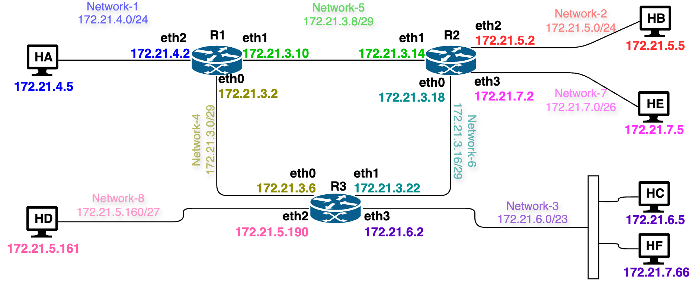

# Lab 21 - IP Basics

This exercise provides basic understanding of hierarchical IP addressing, Longest Prefix Match and route aggregation.

## Learning Objectives

- Create multiple subnets from the ISP assigned network range
- create the routing entries for smaller subnets
- Understand working of IP protocol.
- Understand and implement IP Routing.
- Understand and implement Longest Prefix Match in IP Routing.

### Environment 

Docker Desktop, which is an application environment for your laptop environment that enables running of containerized applications. The Docker Desktop integrates and provides access to a vast ecosystem of docker images via Docker Hub.

## Hierarchical IP

 

The goal of this exercise to create a network as shown above. 
- You are given a network range of 172.21.20.0/23 and your task is to divide this network range into creating 3 subnetworks, namely, `network-A having 31 hosts`, `network-B having 65 hosts` and `network-C having 126 hosts`. 
- Further, you also need to create 3 smaller connecting subnets with the netmask of /29 that will connect router R1 to routers R2, R3 and R4.

### Creating sub networks

The given network range is 172.21.20.0/23 and your task is to divide this into 6 subnets as required for the network. 
- The process to start the subnet is creation is as follows. 
  - Start with the network with the largest number of IP addresses required and compute its applicable netmask. 
  - Assign the subnet work for this netmask and repeat the process. 
  - In the decreasing order of number IP addresses.
- Note that `172.21.20.0/23` is larger than a single `/24` network.
  - It covers the full address range `172.21.20.0 - 172.21.21.255`.
  - Equivalently, it contains two contiguous `/24` blocks:
    - `172.21.20.0/24`
    - `172.21.21.0/24`
- Thus, after assigning `172.21.20.0/24` to one subnet, the remaining available range is `172.21.21.0 - 172.21.21.255`.

#### Network-C

This network needs 127 IP addresses corresponding to 126 hosts and 1 router interface. 
- For the network range, add 2 more to account for network number and broadcast address. 
- Thus, we need a total of 129 address. 
- This means a netmask of /24. The netmask of /25 will only contain 128 address and hence falls short by 1 address.

Thus, network C is to be assigned network number as 172.21.20.0/24
- The remaining range is 172.21.21.0-172.21.21.255
- This does **not** mean that network C uses `172.21.21.x`.
  - Network C uses only `172.21.20.0/24`.
  - The `172.21.21.x` range remains available for the smaller subnets.

#### Network-B

This network has 65 hosts and thus we need 65+1(router)+2=68 addresses in the network range. Hence the corresponding required netmask is /25. 

Thus, this network is to be assigned a network number of 172.21.21.0/25
- The remaining range is 172.21.21.128-172.21.21.255
- There is no overlap with network C because network B is entirely within the remaining `172.21.21.x` block.

#### Network-A

This network has 31 hosts and thus we need 31+1(router)+2=34 addresses in the network range. Hence the corresponding required netmask is /26. 

Thus, this network is to be assigned a network number of 172.21.21.128/26.
- The remaining range is 172.21.21.192-172.21.21.255
- This also does not overlap network B.
  - Network B uses `172.21.21.0 - 172.21.21.127`.
  - Network A uses `172.21.21.128 - 172.21.21.191`.
  - The remaining range `172.21.21.192 - 172.21.21.255` is then used for the router-to-router `/29` links and any future unused space.

### Summary of the allocation

The final subnet allocation is:

- Network C: `172.21.20.0/24`
- Network B: `172.21.21.0/25`
- Network A: `172.21.21.128/26`
- Router links:
  - `172.21.21.192/29`
  - `172.21.21.200/29`
  - `172.21.21.208/29`

These subnetworks do not overlap.

#### Networks connecting Routers to each other.

When creating a network in docker-compose it consumes the first applicable address and the minimum netmask tof /29 is to be used. 

Thus, network numbers for 3 networks would be as follows

- R1 ↔️ R2: 172.21.21.192/29
- R1 ↔️ R3: 172.21.21.200/29
- R1 ↔️ R4: 172.21.21.208/29

### Creating the Hierarchical network

#### Creating a docker compose file: `multi-net4-4R6H.yml`

Create a docker compose file that will have these 6 networks. 
- Creates two hosts in the docker compose file for each of network-A, network-B and network-C.
  - Assign boundary IPs, because it implies that the middle assignment works
- In the , carefully assign the IP Addresses to router interfaces and 2 hosts in each of network-A, network-B and network-C.

It is recommended that you create the file in the `util/yml` directory.
- But you can also create it in the wk-11 directory

Add the routing table in the docker-compose file to ensure each host is reachable from other hosts.

#### Create the hierarchical network

Run docker-compose command to create the network.
Check reachability of each of the 6 hosts from all others hosts.

#### Reserved range

Identify the unused IP addresses which can be used later to create other networks.
- You can create a network and test it


## Longest Prefix Match

### Description



To study and understand IP routing and Longest Prefix Match (LPM), create the network (as shown above). 
- The network consists of 3 routers and 5 hosts connecting 8 networks. 
- The addresses shown in the diagram belongs to network ranges: 
  | Network | CIDR | Purpose |
  |---------|------|---------|
  | network-4 | 172.21.3.0/29 | Router R1 ↔ R3 |
  | network-5 | 172.21.3.8/29 | Router R1 ↔ R2 |
  | network-6 | 172.21.3.16/29 | Router R2 ↔ R3 |
  | network-1 | 172.21.4.0/24 | Host network A |
  | network-2 | 172.21.5.0/24 | Host network B |
  | network-8 | 172.21.5.160/27 | Overlapping subnet |
  | network-3 | 172.21.6.0/23 | Host network C|
  | network-7 | 172.21.7.0/26 | Overlapping subnet |


### Creating the Network

Using the Docker Compose file, create the network as follows
- `docker compose -f util/yml/multi-net4-LPM-Routing.yml up -d`

#### Check Basic Reachability of Local Routers

From hosts HA, HB, HC and HF, check reachability of their respective routers, e.g., following command should be successful

- `docker exec -it HA ping -c2 172.21.4.2`
- `docker exec -it HB ping -c2 172.21.5.2`
- `docker exec -it HC ping -c2 172.21.6.2`
- `docker exec -it HF ping -c2 172.21.6.2`

The hosts HD and HE are to be configured with smaller overlapping subnets.
- Docker Compose does not permit creation of overlapping networks, so these need to be configured manually.

#### Check Basic Reachability of Hosts

Check each of the HA, HB, HC and HF are reachable from each other. For example, following command should be successful.
- Reachability of HB, HC and HF from HA.
  - `docker exec -it HA ping -c2 172.21.5.5`
  - `docker exec -it HA ping -c2 172.21.6.5`
  - `docker exec -it HA ping -c2 172.21.7.66`

Check reachability of HD and HE from HA or any other host. It should not be successful.
- `docker exec -it HA ping -c2 172.21.7.5`
- `docker exec -it HA ping -c2 172.21.5.161`

### Creating Overlapping subnetwork

The provided docker compose example file does not have network entries for overlapping smaller subnets. 
- `172.21.5.160/27` subnet is contained in `(fully overlapped by) 172.21.5.0/24`
- `172.21.7.0/26` subnet is contained in `(fully overlapped by) 172.21.6.0/23`. 

This is because the Docker Compose file does not permit overlapping networks (***i.e., it gives an error when container instances are created with overlapping networks.***).
Thus, a workaround mechanism is used in this assignment to create the required interfaces.
- Filler addresses `172.21.5.99` and `172.21.6.99` are used on the routers to create interfaces corresponding to the overlapping networks.
- After these interfaces are created, assign the appropriate IP addresses belonging to the overlapping networks as described below.


#### Reconfiguring Router R2

Access `R2` and identify the ethernet interface that currently has the filler address `172.21.6.99` by using the `ip -4 -br addr` command.
- `root@R2:/# ip -4 -br addr`
```
root@R2:/# ip -4 -br addr
lo               UNKNOWN        127.0.0.1/8 
eth0@if282       UP             172.21.3.18/29 
eth1@if290       UP             172.21.3.14/29 
eth2@if293       UP             172.21.5.2/24 
eth3@if295       UP             172.21.6.99/23 
```
- In this example, the interface is *`eth3`*, but it may be different on your machine.
- Reassign this interface to the smaller subnet `172.21.7.0/26` by using the second usable address in that subnet, i.e., `172.21.7.2`.
- If your interface name is not *`eth3`*, then use the correct interface name in the commands below.
  - `root@R2:/# ip addr flush dev eth3`
  - `root@R2:/# ip addr add 172.21.7.2/26 dev eth3`
  - `root@R2:/# ip link set dev eth3 up`
  

- Check the changes again
  - `root@R2:/# ip -4 -br addr`

```
lo               UNKNOWN        127.0.0.1/8 
eth0@if282       UP             172.21.3.18/29 
eth1@if290       UP             172.21.3.14/29 
eth2@if293       UP             172.21.5.2/24 
eth3@if295       UP             172.21.7.2/26 
```
Also, add the route to the other overlapping network, and restore reachability to the larger `172.21.6.0/23` network through `R3`.
-  `root@R2:/# ip route add 172.21.5.160/27 via 172.21.3.22`
-  `root@R2:/# ip route add 172.21.6.0/23 via 172.21.3.22`

#### Reconfiguring Router R3

Similar to router R2, access R3 and find out the ethernet interface corresponding to filler network `172.21.5.99`.
- `root@R3:/# ip -4 -br addr`
```
lo               UNKNOWN        127.0.0.1/8 
eth0@if289       UP             172.21.5.99/24 
eth1@if291       UP             172.21.6.2/23 
eth2@if294       UP             172.21.3.6/29 
eth3@if297       UP             172.21.3.22/29 
```

Then use the last assignable address in the smaller subnet of `172.21.5.160/27` i.e., the IP address `172.21.5.190` to this interface (e.g., *eth0*) as below:
- `root@R3:/# ip addr flush dev eth0`
- `root@R3:/# ip addr add 172.21.5.190/27 dev eth0`
- `root@R3:/# ip link set dev eth0 up`
- `root@R3:/# ip -4 -br addr`
```
lo               UNKNOWN        127.0.0.1/8 
eth0@if289       UP             172.21.5.190/27 
eth1@if291       UP             172.21.6.2/23 
eth2@if294       UP             172.21.3.6/29 
eth3@if297       UP             172.21.3.22/29 
```

Also, add the route to the other overlapping network, and restore reachability to the larger `172.21.5.0/24` network through `R2`.

- `root@R3:/# ip route add 172.21.7.0/26 via 172.21.3.18`
- `root@R3:/# ip route add 172.21.5.0/24 via 172.21.3.18`

#### Reassigning Host HD

Access HD and find the ethernet interface corresponding to filler network address `172.21.5.199`. Then assign the first usable IP address from the smaller subnet `172.21.5.160/27` (which is `172.21.5.161`) to that interface as follows:
- `root@HD:/# ip -4 -br addr`
```
lo               UNKNOWN        127.0.0.1/8 
eth0@if284       UP             172.21.5.199/24 
```
- `root@HD:/# ip addr flush dev eth0`
- `root@HD:/# ip addr add 172.21.5.161/27 dev eth0`
- `root@HD:/# ip link set dev eth0 up`
- `root@HD:/# ip route add default via 172.21.5.190`
- `root@HD:/# ip -4 -br addr`
```
lo               UNKNOWN        127.0.0.1/8 
eth0@if284       UP             172.21.5.161/27 
```

#### Reassigning Host HE

Access HE and find the ethernet interface corresponding to filler network address `172.21.6.199`. Then assign the IP address `172.21.7.5/26` from the smaller subnet `172.21.7.0/26` to that interface as follows:
- `root@HE:/# ip -4 -br addr`
```
lo               UNKNOWN        127.0.0.1/8 
eth0@if287       UP             172.21.6.199/23  
```
- `root@HE:/# ip addr flush dev eth0`
- `root@HE:/# ip addr add 172.21.7.5/26 dev eth0`
- `root@HE:/# ip link set dev eth0 up`
- `root@HE:/# ip route add default via 172.21.7.2`
- `root@HE:/# ip -4 -br addr`
```
lo               UNKNOWN        127.0.0.1/8 
eth0@if287       UP             172.21.7.5/26 
```

#### Adding Entry on Host HB
This host has the IP address 172.21.5.5/24
- Thus all addresses within the network 172.21.5.0/24 will be considered locally connected. 
- It will not send the packets for smaller overlapping network 172.21.5.160/27 to the router (Try pinging HD, it should be unreachable). 
- For packets delivery to this network, an additional routing entry needs to be added to HB. Access HB and add entry
  - `root@HB:/# ip route add 172.21.5.160/27 via 172.21.5.2`

#### Adding Entry on Host HC

This host has the IP address 172.21.6.5/23.
- Thus all addresses within the network 172.21.6.0/23 will be considered locally connected.
- It will not send the packets for smaller overlapping network 172.21.7.0/26 to the router (Try pinging HE, it should be unreachable).
- For packets delivery to this network, an additional routing entry needs to be added to HC. Access HC and add entry
  - `root@HC:/# ip route add 172.21.7.0/26 via 172.21.6.2`

#### Adding Entry on Host HF

This host has the IP address 172.21.7.66/23.
- Thus all addresses within the network 172.21.6.0/23 will be considered locally connected.
- It will not send the packets for smaller overlapping network 172.21.7.0/26 to the router (Try to ping HE and it will not be reachable).
- For packets delivery to this network, an additional routing entry needs to be added to HF. Access HF and add entry
  - `root@HF:/# ip route add 172.21.7.0/26 via 172.21.6.2`

### Reachability using Longest Prefix Match

With proper routing entries defined on the routers and hosts, each host should be reachable from every other host.
- Access host HA, and ping all other hosts:
  - `HB: 172.21.5.5`
  - `HC: 172.21.6.5`
  - `HD: 172.21.5.161`
  - `HE: 172.21.7.5`
  - `HF: 172.21.7.66`
- This should work fine. 
- Use the `tcpdump` packet capture on the destination hosts to verify receipt of ICMP Echo Request and generation of ICMP Echo Reply. For instance HD:
  - `root@HD:/# tcpdump -n icmp`
- In a similar way, check reachability from HB, and other hosts. Verify packet transmission and delivery on hosts and routers using `tcpdump`.

## Summary

In this exercise, we have studied and learnt the following
- Divide a given large network range to create smaller network in a hierarchical fashion.
- Evaluate the subnet mask for a given network size.
- Define routing table for hierarchical network
- Create a docker compose file to create the hierarchical network
- Creating a network topology with overlapping subnetwork
- Assigning addresses to hosts that belong to two overlapping subnetworks.
- Define routing entries at routers and host to use Longest Prefix Match.

## Learning Resources

- Understand IP Addressing: Everything you ever wanted to know
  - https://ia800606.us.archive.org/21/items/B-001-002-066/501302.pdf
- Computer Networks - A Top Down Approach, v8, Kurose, Ross; Pearson publishing
