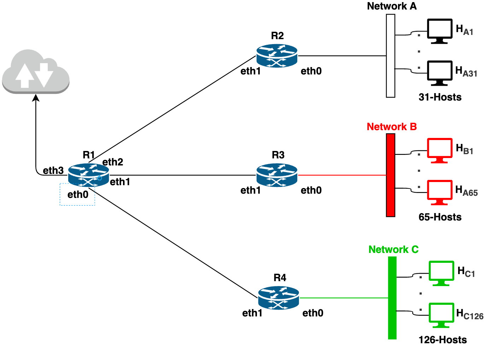

# Lab 21 - Hierarchical IP Addressing

This exercise provides basic understanding of hierarchical IP addressing.

## Learning Objectives

- Create multiple subnets from the ISP assigned network range
- create the routing entries for smaller subnets

## Environment 

Docker Desktop, which is an application environment for your laptop environment that enables running of containerized applications. The Docker Desktop integrates and provides access to a vast ecosystem of docker images via Docker Hub.

## Description

 

The goal of this exercise to create a network as shown above. 
- You are given a network range of 172.21.20.0/23 and your task is to divide this network range into creating 3 subnetworks, namely, network-A having 31 hosts, network-B having 65 hosts and network-C having 126 hosts. 
- Further, you also need to create 3 smaller connecting subnets with the netmask of /29 that will connect router R1 to routers R2, R3 and R4.

### Creating sub networks

The given network range is 172.21.20.0/23 and your task is to divide this into 6 subnets as required for the network. 
- The process to start the subnet is creation is as follows. 
  - Start with the network with the largest number of IP addresses required and compute its applicable netmask. 
  - Assign the subnet work for this netmask and repeat the process. 
  - In the decreasing order of number IP addresses.

#### Network-C

This network needs 127 IP addresses corresponding to 126 hosts and 1 router interface. 
- For the network range, add 2 more to account for network number and broadcast address. 
- Thus, we need a total of 129 address. 
- This means a netmask of /24. The netmask of /25 will only contain 128 address and hence falls short by 1 address.

Thus, network C is to be assigned network number as 172.21.20.0/24

The remaining range is 172.21.21.0-172.21.21.255

#### Network-B

This network has 65 hosts and thus we need 65+1(router)+2=68 addresses
in the network range. Hence the corresponding required netmask is /25.
Thus, this network is to be assigned a network number of 172.21.21.0/25

The remaining range is 172.21.21.128-172.21.21.255

#### Network-A

This network has 31 hosts and thus we need 31+1(router)+2=34 addresses
in the network range. Hence the corresponding required netmask is /26.
Thus, this network is to be assigned a network number of
172.21.21.128/26.

The remaining range is 172.21.21.192-172.21.21.255

#### Networks connecting Routers to each other.

When creating a network in docker-compose it consumes the first
applicable address and the minimum netmask tof /29 is to be used. Thus,
network numbers for 3 networks would be as follows

R1🡨🡪 R2: 172.21.21.192/29

R1🡨🡪R3: 172.21.21.200/29

R1🡨🡪R4: 172.21.21.208/29

### Creating the Hierarchical network

#### Creating a docker compose file

Create a docker compose file that will have these 6 networks. Creates
two hosts in the docker compose file for each of network-A, network-B
and network-C.

In the docker-compose file, carefully assign the IP Addresses to router
interfaces and 2 hosts in each of network-A, network-B and network-C.

Add the routing table in the docker-compose file to ensure each host is
reachable from other hosts.

#### Create the hierarchical network

Run docker-compose command to create the network.

Check reachability of each of the 6 hosts from all others hosts.

#### Reserved range

Identify the unused IP addresses which can be used later to create other
networks.

## Summary

In this exercise, we have studied and learnt the following
- Divide a given large network range to create smaller network in a hierarchical fashion.
- Evaluate the subnet mask for a given network size.
- Define routing table for hierarchical network
- Create a docker compose file to create the hierarchical network

## Learning Resources

- Understand IP Addressing: Everything you ever wanted to know
  - https://ia800606.us.archive.org/21/items/B-001-002-066/501302.pdf
- Computer Networks - A Top Down Approach, v8, Kurose, Ross; Pearson publishing

