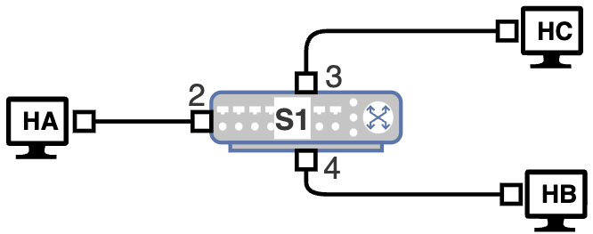
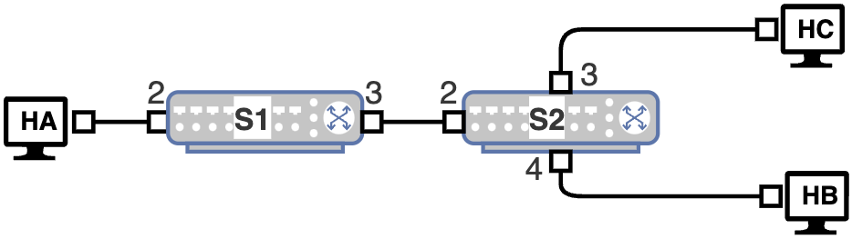
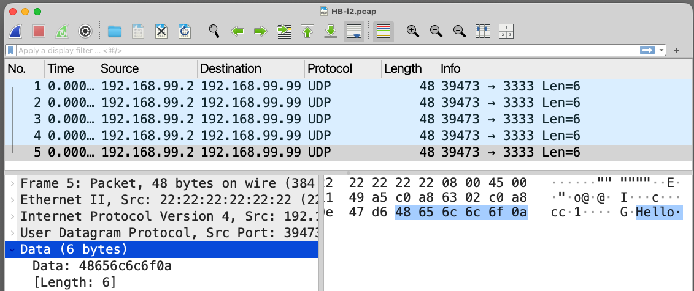
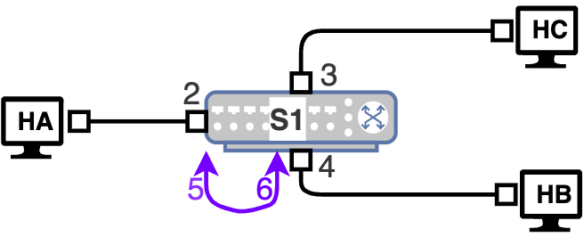
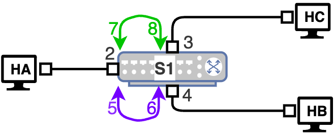

# Lab 23 - L2 Switching - Self Learning using Docker

This exercise provides a Docker-based version of Layer 2 switching self-learning. It uses a Linux software bridge inside a container to emulate an unmanaged Layer 2 switch as closely as possible in a container environment.

## Learning Objectives

- Understand packet forwarding by Layer 2 switches
- Understand MAC table construction in Layer 2 switching
- Observe unknown unicast and broadcast forwarding

### Environment

Docker Desktop, which is an application environment for your laptop environment that enables running of containerized applications. The Docker Desktop integrates and provides access to a vast ecosystem of docker images via Docker Hub.

### Description

The main topology in this lab is based on the one-switch setup shown below. 
- In reality, it would be preferable to have a LAN setup consisting of two switches. 
- Create a simple network of three hosts `HA`, `HB`, `HC` and one switch `S1`as shown below.
  - `docker compose -f util/yml/multi-net4-l2-switch-self-learning.yml up -d`

| One Switch |Two Switch |
|------|-|
|  |   |


Since hosts are directly connected to the switch without a DHCP server, assign IP addresses manually.

- If not locally assigned in the range 169.254.0.0/16, use the addresses shown in Table 1 below.
- For your hands-on exercise, use the actual IP and MAC addresses applicable to your setup.
- The switch container acts as a software Layer 2 switch by using Linux bridge `br0` inside the container.

| Host | IP Address | MAC Address |
|------|-----------|-------------|
| A | 192.168.99.2 | 02:22:22:22:22:22 |
| B | 192.168.99.4 | 02:44:44:44:44:44 |
| C | 192.168.99.5 | 02:55:55:55:55:55 |
| X | 192.168.99.99| 02:99:99:99:99:99 |

### Configuring the Hosts

The Docker networks only create point-to-point links. 
- Reconfigure the host containers so that all three hosts belong to the same IP subnet `192.168.99.0/24`.
  - ***Host A***: Access host HA and use the following commands to configure the subnet
    - `root@HA:/# ip addr flush dev eth0 && ip link set dev eth0 address 02:22:22:22:22:22 && ip addr add 192.168.99.2/24 dev eth0 && ip link set dev eth0 up && ip -4 -br addr`

      ```
      lo               UNKNOWN        127.0.0.1/8 
      eth0@if396       UP             192.168.99.2/24 
      ```
  - ***Host B***: Access host HB and use the following commands to configure the subnet
    - `root@HB:/# ip addr flush dev eth0 && ip link set dev eth0 address 02:44:44:44:44:44 && ip addr add 192.168.99.4/24 dev eth0 && ip link set dev eth0 up && ip -4 -br addr`
  
      ```
      lo               UNKNOWN        127.0.0.1/8 
      eth0@if22        UP             192.168.99.4/24 
      ```
  - ***Host C***: Access host HC and use the following commands to configure the subnet
    - `root@HC:/# ip addr flush dev eth0 && ip link set dev eth0 address 02:55:55:55:55:55 && ip addr add 192.168.99.5/24 dev eth0 && ip link set dev eth0 up && ip -4 -br addr`
      ```
      lo               UNKNOWN        127.0.0.1/8 
      eth0@if23        UP             192.168.99.5/24 
      ```
### ***The Switch***

***Crtitical Note: configuring the switch will take up too much resource and can cripple your computer. Do this after this in the middle of the unknown unicast experiment and immediately stop S1 after the capture is completed. You will then do this same config, and add one loop, observe flooding, stop S1. You will do the same thing for observing broadcast storm after starting S1 again, configuring and adding two loops***

The Switch initially has IP addresses on its link interfaces only so that Docker can create the links. 
  - These interfaces need to be converted to pure Layer 2 ports and attached to a bridge.
  - 
  - Access the switch `S1` and identify interfaces using:
  - `root@S1:/# ip -4 -br addr`
    ```
    lo               UNKNOWN        127.0.0.1/8 
    eth0@if394       UP             10.10.1.3/29 
    eth1@if397       UP             10.10.2.3/29 
    eth2@if398       UP             10.10.3.3/29 
    ```
  - The interfaces will have a preconfigured IP addresses, reconfigure `S1` as follows:
  - `root@S1:/# ip addr flush dev eth0 && ip addr flush dev eth1 && ip addr flush dev eth2 && ip link add name br0 type bridge && ip link set dev br0 type bridge stp_state 0 && ip link set dev br0 up && ip link set dev eth0 master br0 && ip link set dev eth1 master br0 && ip link set dev eth2 master br0 && ip link set dev eth0 up && ip link set dev eth1 up && ip link set dev eth2 up && ip -4 -br addr && bridge link`
    ```
    lo               UNKNOWN        127.0.0.1/8 
    11: eth0@if20: <BROADCAST,MULTICAST,UP,LOWER_UP> mtu 1500 master br0 state forwarding priority 32 cost 2 
    12: eth1@if24: <BROADCAST,MULTICAST,UP,LOWER_UP> mtu 1500 master br0 state forwarding priority 32 cost 2 
    13: eth2@if25: <BROADCAST,MULTICAST,UP,LOWER_UP> mtu 1500 master br0 state forwarding priority 32 cost 2 
    ```

### Unknown Unicast

Initially, the switch MAC table is empty. 
- Thus, when the switch receives a frame with an unknown destination MAC address, it floods the frame on all active ports except the one on which it was received.


#### Packet Capture in Save Mode
HA will send data to X. Since switch does not have the entry for MAC address of host X, this packet is forwarded by switch to all hosts and
hence host B receives this packet.

- Access HB and start a `tcpdump` on the save mode, to capture the first 5 packets only

  - `root@HB:/# tcpdump -i eth0 -s 0 -c 5 -w HB-l2.pcap 'arp or (udp and port 3333)'`

#### Configure the switch
Configure the switch now according to the setup discussion and see if it has learned any mac dynamically. ***Move from here to the next subsection quicly***
- `root@S1:/# bridge fdb show br br0 dynamic`
  - Should not show any dynamically learned mac

#### Create Neighbor and Send Message

To avoid an initial ARP exchange, create a static neighbor entry on `HA` for the unused/unknown host `X`.
- `root@HA:/# ip neigh add 192.168.99.99 lladdr 02:99:99:99:99:99 nud permanent dev eth0`
- `root@HA:/# ip neigh show`
  ```
  192.168.99.99 dev eth0 lladdr 02:99:99:99:99:99 PERMANENT 
  ```

From host `HA`, send a UDP message to `X`:

- `root@HA:/# echo "Hello" | nc -u 192.168.99.99 3333`


#### Check learned mac 

Now `S1` learned the source MAC of host `A`, access S1 and check leaned mac again:
- `root@S1:/# bridge fdb show br br0 dynamic`
```
02:22:22:22:22:22 dev eth0 master br0 
```
- Exit the S1 terminal and stop S1

#### Analyze Packet Capture
`S1` flooding the frame toward both `HB` and `HC`, because destination MAC `02:99:99:99:99:99` is unknown. 
- The packet captures on `HB` should show the UDP packet.
- Exit HB and copy packet capture from HB to wk-12 from the 
  - `docker cp HB:HB-l2.pcap wk-12`

Analyze the packet capture on wireshark to see see the packet captured at HB.



### Known Unicast and Broadcast

An ARP request uses destination MAC `ff:ff:ff:ff:ff:ff`, which is a broadcast frame. 
- Once the destination MAC becomes known, the switch forwards subsequent traffic as known unicast.

#### Restart the network 
- Stop the network
  - `docker compose -f util/yml/multi-net4-l2-switch-self-learning.yml down --remove-orphans`
- Start the network
  - `docker compose -f util/yml/multi-net4-l2-switch-self-learning.yml up -d`
- Configure the three Hosts HA, HB, and HC, and the switch.
  - `root@HA:/# ip addr flush dev eth0 && ip link set dev eth0 address 02:22:22:22:22:22 && ip addr add 192.168.99.2/24 dev eth0 && ip link set dev eth0 up && ip -4 -br addr`
  - `root@HB:/# ip addr flush dev eth0 && ip link set dev eth0 address 02:44:44:44:44:44 && ip addr add 192.168.99.4/24 dev eth0 && ip link set dev eth0 up && ip -4 -br addr`
  - `root@HC:/# ip addr flush dev eth0 && ip link set dev eth0 address 02:55:55:55:55:55 && ip addr add 192.168.99.5/24 dev eth0 && ip link set dev eth0 up && ip -4 -br addr`
  - `root@S1:/# ip addr flush dev eth0 && ip addr flush dev eth1 && ip addr flush dev eth2 && if ! ip link show br0 >/dev/null 2>&1; then ip link add name br0 type bridge; fi && ip link set dev br0 type bridge stp_state 0 && for port in eth0 eth1 eth2; do ip link set dev "$port" master br0 && ip link set dev "$port" promisc on && ip link set dev "$port" up && bridge link set dev "$port" flood on; done && ip link set dev br0 up && echo '--- Bridge Status ---' && bridge link show && echo '--- Interface Details (Promiscuity Check) ---' && ip -d link show eth0 | grep -i prom`

#### Start Packet capture on HB and HC
Access HB and start packet capture
- `root@HB:/# tcpdump -i eth0 -s 0 -c 50 -w HB-l2-K.pcap 'arp or icmp or (udp and port 3333)'`

Access HC and start packet capture
- `root@HC:/# tcpdump -i eth0 -s 0 -c 50 -w HC-l2-K.pcap 'arp or icmp or (udp and port 3333)'`

#### Start UDP Server at Host C
On another terminal start a udp server using netcat
- `root@HC:/# nc -u -l 3333`

#### Sending Packet from Host A to Host C

From host `HA`, add neighbor entry for host `C` and send a UDP message:
- `root@HA:/# ip neigh add 192.168.99.5 lladdr 02:55:55:55:55:55 nud permanent dev eth0`

Then send the echo message from A to C
- `ip neigh show`
- `root@HA:/# echo "Response Again" | nc -u -w1 192.168.99.5 3333`

### MAC Table Observation

Unlike a physical unmanaged switch, a Linux software bridge exposes its forwarding database. 
- You may inspect it to see that the switch has learned the two mac:
- `docker exec -it s1 bridge fdb show br br0 dynamic`

### Creating a Real Layer 2 Loop

The main lab uses a single switch. To emulate connecting two ports of the same physical switch with a cable, create a veth pair inside `S1` and attach both ends to the bridge.

### Enable the Loop Ports

- `docker exec -it s1 ip link add loop0 type veth peer name loop1`
- `docker exec -it s1 ip link set dev loop0 up`
- `docker exec -it s1 ip link set dev loop1 up`
- `docker exec -it s1 ip link set dev loop0 master br0`
- `docker exec -it s1 ip link set dev loop1 master br0`

At this point, there are two extra switch ports connected back into the same switch and no spanning tree. This is analogous to connecting two ports of a physical switch with a cable while loop protection is disabled.

## Flooding with a Layer 2 Loop

Start short packet captures before triggering the looped traffic. Use packet limits so the capture files do not grow too large.

- `docker exec -it HB tcpdump -i eth0 -s 0 -c 200 -w HB-flood.pcap 'udp and port 3333'`
- `docker exec -it HB tcpdump -i eth0 -s 0 -c 200 -w HC-flood.pcap 'udp and port 3333'`

From host `HA`, send one unknown unicast packet again:

- `docker exec -it HA bash -lc 'echo "Looped Unknown Unicast" | nc -u 192.168.99.99 3333'`

Because the switch still does not know the destination MAC of host `X`, the frame is flooded. With the Layer 2 loop present, the same frame can circulate repeatedly and produce many duplicate packets in the capture files.

Copy the captures for analysis:

- `docker cp HB:/tmp/HB-flood.pcap wk-12`
- `docker cp HC:/tmp/HC-flood.pcap wk-12`

## Broadcast Storm

With the Layer 2 loop still active, a broadcast packet can create a broadcast storm.

Start a short ARP-inclusive capture:

- `docker exec -it HB tcpdump -i eth0 -s 0 -c 300 -w HB-storm.pcap 'arp or (udp and port 3333)'`
- `docker exec -it HB tcpdump -i eth0 -s 0 -c 300 -w HC-storm.pcap 'arp or (udp and port 3333)'`

Trigger a broadcast by forcing host `HA` to ARP again for host `HC`:

- `docker exec -it HA ip neigh del 192.168.99.5 dev eth0`
- `docker exec -it HA bash -lc 'echo "Storm Test" | nc -u 192.168.99.5 3333'`

In this scenario, the ARP request broadcast can circulate repeatedly through the loop and generate a large number of duplicate broadcast frames.

## Recovery from the Loop

If the loop causes excessive traffic, remove the two loop ports from the bridge:

- `docker exec -it s1 ip link set dev loop0 nomaster`
- `docker exec -it s1 ip link set dev loop1 nomaster`
- `docker exec -it s1 ip link delete loop0`

If the containers become unstable, stop and recreate the topology:

- `docker compose -f util/yml/multi-net4-l2-switch-self-learning.yml down --remove-orphans`
- `docker compose -f util/yml/multi-net4-l2-switch-self-learning.yml up -d`

## Two-Switch Variation

The one-switch topology is the main setup for this lab. A two-switch topology can still be built later as an extension, but it is not required for the core self-learning, unknown unicast, known unicast, and broadcast exercises.

## Summary

In this exercise, we have studied and learnt the following
- Layer 2 switching and self-learning
- Unknown unicast flooding
- Broadcast delivery and known unicast forwarding
- Packet capture using `tcpdump` in save mode and offline analysis using Wireshark
- Layer 2 flooding and broadcast storm caused by a switching loop

## Learning Resources

- Computer Networks - A Top Down Approach, v8, Kurose, Ross; Pearson publishing


The later flooding and broadcast storm sections correspond to the looped-switch examples shown in `l2-3.png` and `l2-4.png`.

| Flooding Loop | Broadcast Storm |
|------|------|
|  |  |

### Packet Capture in Save Mode

Use `tcpdump` in save mode on each host. 
- Save the captures and later copy them to the laptop for Wireshark analysis.
- Access each host on three different terminals and start a `tcpdump`, to capture the first 5 packets only
  - `root@HA:/# tcpdump -i eth0 -s 0 -c 5 -w HA-l2.pcap 'arp or (udp and port 3333)'`
  - `root@HB:/# tcpdump -i eth0 -s 0 -c 5 -w HB-l2.pcap 'arp or (udp and port 3333)'`
  - `root@HC:/# tcpdump -i eth0 -s 0 -c 5 -w HC-l2.pcap 'arp or (udp and port 3333)'`


Let the capture happen for while, and at later stage of the lab, we will stop stop the live `tcpdump`, press `Ctrl+C`. 
- Then, we will copy the capture files to the our machine to analyze it using wireshark:
    - `docker cp HB:HB-l2.pcap wk-12`
    - `docker cp HC:HC-l2.pcap wk-12`
    - `docker cp HA:HA-l2.pcap wk-12`

Open the copied `.pcap` files in Wireshark for analysis.


tcpdump -i eth0 -n -e -s 0 -c 1000 -w HC-l2.pcap 'arp or (udp and port 3333)'
tcpdump -i eth0 -n -e -s 0 -c 1000 -w HC-l2.pcap 'icmp or (udp and port 3333)'

nc -u -l -p 3333

ip neigh del 192.168.99.5 dev eth0 2>/dev/null || true
ip neigh replace 192.168.99.5 lladdr 02:55:55:55:55:55 nud permanent dev eth0


echo "Response Again" | nc -u 192.168.99.5 3333

This will result in:
- an ARP request broadcast from `HA`
- the ARP request being delivered to both `HB` and `HC`
- an ARP reply from `HC` to `HA` as known unicast
- a UDP packet from `HA` to `HC` as known unicast

The packet capture at `HB` should show the ARP request but not the ARP reply or the UDP message to `HC`.