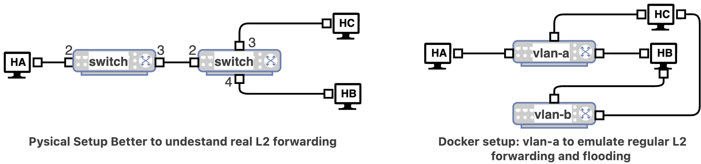
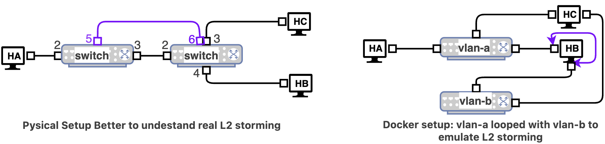
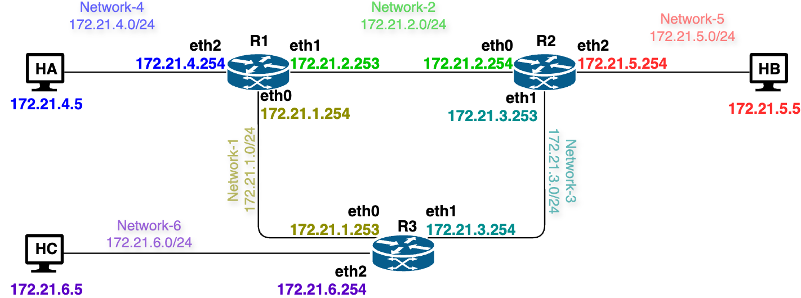

# Lab 23 - Switching and Routing Fundamentals

This exercise provides a basic understanding of Layer 2 self-learning, Longest Prefix Match, and route aggregation.

## Learning Objectives

- Observe ARP request broadcast on a shared LAN
- Observe that the first communication to a real host triggers ARP, while later communication may not
- Observe host-visible flooding behavior for broadcast traffic
- Experimentally observe storm-like repeated broadcast traffic after manually creating loops
- Understand Packet Forwarding in Real Life situations.
- Analyze of working of ARP in conjunction with packet forwarding.

### Environment 

Docker Desktop, which is an application environment for your laptop environment that enables running of containerized applications. The Docker Desktop integrates and provides access to a vast ecosystem of docker images via Docker Hub.

## Self Learning Mechanism

### Network Topology
***Note***: A setup with two physical switches would demonstrate Layer 2 forwarding behavior more clearly and more realistically. 
- However, in this introductory lab we use `macvlan` to approximate that behavior in a simpler environment.
- For this lab, `net-LAN-A` and `net-LAN-B` are treated as simplified Layer 2 LAN segments. 
  - You can think of each segment as a basic switch-connected LAN. T
- The goal is to observe host-visible packet behavior with `tcpdump`, not to inspect an internal switch MAC table.




The network consists of 2 switches and 3 hosts in two vlans.

| Host | Container | net-LAN-A IP | net-LAN-B IP | MAC Address |
|------|-----------|--------------|--------------|-------------|
| A | `HA` | 172.21.0.2 | not connected | 02:22:22:22:22:22 |
| B | `HB` | 172.21.0.4 | 172.21.1.44 | 02:44:44:44:44:44 |
| C | `HC` | 172.21.0.5 | 172.21.1.45 | 02:55:55:55:55:55 |
| X | not created | 172.21.0.99 | not applicable | not applicable |

Host `X` is not a real container. It is only used in the unknown-host ARP section.

#### Creating the Network
Using the Docker Compose file, create the network as follows

- `docker compose -f util/yml/multi-net4-l2-macvlan-2S3R.yml up -d`

To stop it use:
- `docker compose -f util/yml/multi-net4-l2-macvlan-2S3R.yml down --remove-orphans`


#### Check Basic Configuration of Hosts

Access host `HA`, and verify the host IP and MAC settings.:

- `root@HA:/# ip -4 -br addr && ip link show eth0`
```
lo               UNKNOWN        127.0.0.1/8 
eth0@if4         UP             172.21.0.2/24 
19: eth0@if4: <BROADCAST,MULTICAST,UP,LOWER_UP> mtu 65535 qdisc noqueue state UP mode DEFAULT group default 
    link/ether 02:22:22:22:22:22 brd ff:ff:ff:ff:ff:ff link-netnsid 0
```
- Do the same for HB and HC.


### Unknown Host ARP Broadcast (Flooding)

In this part, `HA` attempts to contact fake host `X` without any preinstalled neighbor entry. 
- Since `HA` does not know the MAC address for `172.21.0.99`, it first sends an ARP request as a broadcast frame.

Access `HC` and start Packet Capture on , *you will see the result once HA sends a ping to X*.

- `docker exec -it HC tcpdump -i eth1 -n -e 'arp or icmp'`
```
tcpdump: verbose output suppressed, use -v[v]... for full protocol decode
listening on eth1, link-type EN10MB (Ethernet), snapshot length 262144 bytes
01:53:29.545197 02:22:22:22:22:22 > ff:ff:ff:ff:ff:ff, ethertype ARP (0x0806), length 42: Request who-has 172.21.0.99 tell 172.21.0.2, length 28
01:53:30.566273 02:22:22:22:22:22 > ff:ff:ff:ff:ff:ff, ethertype ARP (0x0806), length 42: Request who-has 172.21.0.99 tell 172.21.0.2, length 28
01:53:31.590914 02:22:22:22:22:22 > ff:ff:ff:ff:ff:ff, ethertype ARP (0x0806), length 42: Request who-has 172.21.0.99 tell 172.21.0.2, length 28
```

Send One Ping from `HA` to `X`

- `root@HA:/# ping -c 1 172.21.0.99`     
```        
PING 172.21.0.99 (172.21.0.99) 56(84) bytes of data.
From 172.21.0.2 icmp_seq=1 Destination Host Unreachable

--- 172.21.0.99 ping statistics ---
1 packets transmitted, 0 received, +1 errors, 100% packet loss, time 0ms
```

This demonstrates ARP request broadcast for an unknown host. 
- Even tough, the ping is not sent to HC, it still receives the ARP broadcast flooding
- This phenomenon is can be observed at HB as well. 
  - You can capture the tcpdum and observe.


#### Known Unicast After ARP Learning

In this part, `HA` pings a real host `HB`. 
- The first ping triggers ARP. 
- The second ping usually does not. `HC` acts as the observer.

Access `HC` (if not already) and re/start Packet Capture on , *you will see the result once HA sends a ping to HB*. HC will only receive the first ARP broadcast.

- `root@HC:/# tcpdump -i eth1 -n -e 'arp or icmp'`
```
tcpdump: verbose output suppressed, use -v[v]... for full protocol decode
listening on eth1, link-type EN10MB (Ethernet), snapshot length 262144 bytes
02:04:34.168558 02:22:22:22:22:22 > ff:ff:ff:ff:ff:ff, ethertype ARP (0x0806), length 42: Request who-has 172.21.0.4 tell 172.21.0.2, length 28
```

Access `HB` (if not already) and re/start Packet Capture on , *you will see the result once HA sends a ping to HB*. 
- If you can not see capture at HB via eth0, try eth1 

- `root@HB:/# tcpdump -i eth0 -n -e 'arp or icmp'`
```
tcpdump: verbose output suppressed, use -v[v]... for full protocol decode
listening on eth0, link-type EN10MB (Ethernet), snapshot length 262144 bytes
02:08:27.553421 02:22:22:22:22:22 > be:df:4a:c9:b7:c6, ethertype IPv4 (0x0800), length 98: 172.21.0.2 > 172.21.0.4: ICMP echo request, id 6, seq 1, length 64
02:08:27.553759 be:df:4a:c9:b7:c6 > 02:22:22:22:22:22, ethertype IPv4 (0x0800), length 98: 172.21.0.4 > 172.21.0.2: ICMP echo reply, id 6, seq 1, length 64
02:08:29.823027 02:22:22:22:22:22 > be:df:4a:c9:b7:c6, ethertype IPv4 (0x0800), length 98: 172.21.0.2 > 172.21.0.4: ICMP echo request, id 7, seq 1, length 64
02:08:29.823059 be:df:4a:c9:b7:c6 > 02:22:22:22:22:22, ethertype IPv4 (0x0800), length 98: 172.21.0.4 > 172.21.0.2: ICMP echo reply, id 7, seq 1, length 64
02:08:32.968797 be:df:4a:c9:b7:c6 > 02:22:22:22:22:22, ethertype ARP (0x0806), length 42: Request who-has 172.21.0.2 tell 172.21.0.4, length 28
02:08:32.968842 02:22:22:22:22:22 > be:df:4a:c9:b7:c6, ethertype ARP (0x0806), length 42: Request who-has 172.21.0.4 tell 172.21.0.2, length 28
02:08:32.968860 be:df:4a:c9:b7:c6 > 02:22:22:22:22:22, ethertype ARP (0x0806), length 42: Reply 172.21.0.4 is-at be:df:4a:c9:b7:c6, length 28
02:08:32.968861 02:22:22:22:22:22 > be:df:4a:c9:b7:c6, ethertype ARP (0x0806), length 42: Reply 172.21.0.2 is-at 02:22:22:22:22:22, length 28
```

Check the Neighbor Table on `HA`, it should only show the failed attempt to ping HA.
- `root@HA:/# ip neigh show`
```
172.21.0.99 dev eth0 FAILED 
```

Send the First Ping from `HA` to `HB`
- `root@HA:/# ping -c 1 172.21.0.4`
  - Ping more than once and observe

Check the Neighbor Table on `HA`, if you checked a late, you will see `STALE`, otherwise you will see 
- `root@HA:/# ip neigh show`
```
172.21.0.4 dev eth0 lladdr be:df:4a:c9:b7:c6 STALE 
172.21.0.99 dev eth0 FAILED 
```

This demonstrates that once the destination is already known to `HA`, later communication can proceed as known unicast without another ARP broadcast.

To observe ARP flooding again, clear Old Neighbor State on `HA`

- `docker exec -it HA sh -lc 'ip neigh del 172.21.0.4 dev eth0 2>/dev/null || true'`
- `docker exec -it HA ip neigh show`

### Broadcast Experimental Storm Comparison
***Note***: This expriment, will make your computer stack. You may need to stop the docker itself, and then remove the network. 

This part compares two cases using the same broadcast ping `ping -b -c 1 172.21.0.255`:
- **zero loop**: the broadcast message is sent one to 3 times, due to flooding
- **one loop**: the broadcast message is copied and forwarded from one vlan interface to another and back, repeated multiple times.
  - You need to go into HB and connect the two interfaces via a bridge to emulate looping.
  - In a physical setup this is like connecting two switches with two cables




#### Important Timing Note

For the loop cases, the ping should be sent immediately after the manual bridge commands are completed. 
- The looped configuration may quickly make the lab unstable.

In the loop case, Docker may become unresponsive. 
- This is acceptable for the experiment. 
- If that happens, restart the lab and repeat the capture sequence.

>*It is acceptable of this expriment does not succeed. Do not create any loop bridge on `HB` or `HC`, unless you have time to complete it*

##### No Loop: baseline flooding behavior for a broadcast frame

Access `HB` (if not already) and re/start Packet Capture on , *you will see the result once HA sends a broadcast*. 
- If you can not see capture at HB via eth0, try eth1 
- `root@HB:/# tcpdump -i eth0 -n -e 'arp or icmp'`

```
tcpdump: verbose output suppressed, use -v[v]... for full protocol decode
listening on eth0, link-type EN10MB (Ethernet), snapshot length 262144 bytes
02:34:11.712829 02:22:22:22:22:22 > ff:ff:ff:ff:ff:ff, ethertype IPv4 (0x0800), length 98: 172.21.0.2 > 172.21.0.255: ICMP echo request, id 8, seq 1, length 64
```
Access `HC` (if not already) and re/start Packet Capture on , *you will see the result once HA sends a broadcast*. 
- If you can not see capture at HC via eth0, try eth1 

- `root@HC:/# tcpdump -i eth1 -n -e 'arp or icmp'`
```
tcpdump: verbose output suppressed, use -v[v]... for full protocol decode
listening on eth1, link-type EN10MB (Ethernet), snapshot length 262144 bytes
02:34:11.712620 02:22:22:22:22:22 > ff:ff:ff:ff:ff:ff, ethertype IPv4 (0x0800), length 98: 172.21.0.2 > 172.21.0.255: ICMP echo request, id 8, seq 1, length 64
```

Send the broadcast ping from `HA`
- `root@HA:/# ping -b -c 1 172.21.0.255`

This is ordinary broadcast delivery on the LAN. every time, you send a ping everyone receives. Let the tcpdump continue. 

#### Looped: case as broadcast storm behavior

Prepare a the broadcast ping from `HA`, ***`do not send it yet`***. You will send it immediately after the loop. 
- `root@HA:/# ping -b -c 1 172.21.0.255`


Access `HB` on another terminal, and create a loop by creating bridge inside between the two interfaces of HB, ***It is ok to copy paste this command and execute the ping command immediately*** 

- `docker exec -it HB bash -lc 'brctl addbr loop-bridge && brctl addif loop-bridge eth0 && brctl addif loop-bridge eth1 && brctl stp loop-bridge off && ip link set loop-bridge up && brctl show'`

- If there was a lingering broadcast ping message on the network already, the flooding can occur immediately after the loop is created

Observe the capture on HB and HC, you will see something similar to this. And your computer may heat up.
```
02:34:11.712620 02:22:22:22:22:22 > ff:ff:ff:ff:ff:ff, ethertype IPv4 (0x0800), length 98: 172.21.0.2 > 172.21.0.255: ICMP echo request, id 8, seq 1, length 64
02:45:46.173077 02:22:22:22:22:22 > ff:ff:ff:ff:ff:ff, ethertype IPv4 (0x0800), length 98: 172.21.0.2 > 172.21.0.255: ICMP echo request, id 9, seq 1, length 64
02:45:46.173208 02:22:22:22:22:22 > ff:ff:ff:ff:ff:ff, ethertype IPv4 (0x0800), length 98: 172.21.0.2 > 172.21.0.255: ICMP echo request, id 9, seq 1, length 64
02:45:46.173213 02:22:22:22:22:22 > ff:ff:ff:ff:ff:ff, ethertype IPv4 (0x0800), length 98: 172.21.0.2 > 172.21.0.255: ICMP echo request, id 9, seq 1, length 64
02:45:46.173218 02:22:22:22:22:22 > ff:ff:ff:ff:ff:ff, ethertype IPv4 (0x0800), length 98: 172.21.0.2 > 172.21.0.255: ICMP echo request, id 9, seq 1, length 64
```

 ***If you can see this, congratulations, you have successfully emulated broadcast storm. Stop the network by first restarting the docker and then removing the network***

## Internet Packet Traversal

### Network Topology



This network demonstrates network behaviour packet traversal in a network when a user initiates any activity on the network. 
- In this network Router R1, R2 and R3 uses default routing which forwards the packets to router R2, R3 and R1 respectively. 
- Thus, when host R1 receives a packet, it forwards the packet to R2 unless its destination belongs to 172.21.4.0/24. 
- Similarly, router R2 forwards the packet to R3 unless its destination belongs to 172.21.5.0/24. 
- In the same way router R3 forwards the packet to R1 unless its destination belongs to 172.21.6.0/24. 
- This exercise helps in understanding the network activities in terms packets and protocols when any hosts HA, HB or HC sends a packet to some destination. 
- Specifically, this exercise help in understanding all the packets generated with their respective source and destination IP and MAC addresses when HA sends one ping request to HB
and its reply back to HA

### Packet Traversal. 

#### Network Protocols and Packets

A host when sends a packet on to its connected network, fills the source and destination MAC address at Ethernet layer. 
- When HA sends ping request packet to HB, the packet goes to R1 which forwards to R2 and then to HB. 
- At each link, the source and destination MAC address changes though source IP (HA) and destination IP (HB) address remains the same. 
- When HB send ping Reply message, it traverses via `HB->R2->R3->R1->HA` as per default routing. 
- Again, at each link source and destination MAC address will change but source IP (HB) and destination IP(HA) address will remain the same in this return path traversal. 

#### Creating the Network
Using the Docker Compose file, create the network as follows

- `docker compose -f util/yml/multi-net4-Routing-Loop.yml up -d`

- To analyze the packet traversal, open the about 10 terminals and access hosts using docker exec(e.g. accessing HA: `docker exec -it HA bash`) and in each terminal window run tcpdump capture using the filter the given interface 'arp or icmp' (e.g. `root@HA:/# tcpdump -i eth0 -n -e 'arp or icmp'`)and then from HA send one ping request.
  - Packet capture at HA (eth0)
  - Packet capture at R1 (eth2)
  - Packet capture at R1 (eth1)
  - Packet capture at R2 (eth0)
  - Packet capture at R2 (eth2)
  - Packet capture at HB (eth0)
  - Packet capture at R2 (eth1)
  - Packet capture at R3 (eth1)
  - Packet capture at R3 (eth0)
  - Packet capture at R1 (eth0)


#### Packet Capture at Hosts and Routers

Now access HA, one a 11th terminal, ping HB, and analyze the packet capture in all of above widows.
- `ping -c1 172.21.5.5`

Packet capture at HA. 
- First two packets show ARP request so that HA can get the MAC address of router R1 interface connecting HA having destination MAC address as broadcast address. 
- ARP Request by HA ($1^{st}$ packet) is transmitted at time `08.707587`.
- `root@HA:/# tcpdump -i eth0 -n -e 'arp or icmp'`
```
tcpdump: verbose output suppressed, use -v[v]... for full protocol decode
listening on eth0, link-type EN10MB (Ethernet), snapshot length 262144 bytes
11:26:08.707587 16:0c:d2:25:7c:10 > ff:ff:ff:ff:ff:ff, ethertype ARP (0x0806), length 42: Request who-has 172.21.4.254 tell 172.21.4.5, length 28
11:26:08.707855 16:0c:d2:25:7c:10 > ff:ff:ff:ff:ff:ff, ethertype ARP (0x0806), length 42: Request who-has 172.21.4.254 tell 172.21.4.5, length 28
11:26:08.707860 22:a7:d6:16:34:24 > 16:0c:d2:25:7c:10, ethertype ARP (0x0806), length 42: Reply 172.21.4.254 is-at 22:a7:d6:16:34:24, length 28
11:26:08.707862 16:0c:d2:25:7c:10 > 22:a7:d6:16:34:24, ethertype IPv4 (0x0800), length 98: 172.21.4.5 > 172.21.5.5: ICMP echo request, id 1, seq 1, length 64
11:26:08.708631 22:a7:d6:16:34:24 > 16:0c:d2:25:7c:10, ethertype IPv4 (0x0800), length 98: 172.21.5.5 > 172.21.4.5: ICMP echo reply, id 1, seq 1, length 64
11:26:14.215087 22:a7:d6:16:34:24 > 16:0c:d2:25:7c:10, ethertype ARP (0x0806), length 42: Request who-has 172.21.4.5 tell 172.21.4.254, length 28
11:26:14.215126 16:0c:d2:25:7c:10 > 22:a7:d6:16:34:24, ethertype ARP (0x0806), length 42: Reply 172.21.4.5 is-at 16:0c:d2:25:7c:10, length 28
```

This packet is received at R1 at time `08.707771` and R1 sends the ARP Reply at time `08.707854`. 
- This reply is received by HA at time 10.779425s (pkt #3). 
- Then, HA sends the ICMP echo request (pkt #4) at time `08.707862` which is received by router R1 at time `8.707940` (pkt #3).
- `root@R1:/# tcpdump -i eth2 -n -e 'arp or icmp'`
```
tcpdump: verbose output suppressed, use -v[v]... for full protocol decode
listening on eth2, link-type EN10MB (Ethernet), snapshot length 262144 bytes
11:26:08.707771 16:0c:d2:25:7c:10 > ff:ff:ff:ff:ff:ff, ethertype ARP (0x0806), length 42: Request who-has 172.21.4.254 tell 172.21.4.5, length 28
11:26:08.707854 22:a7:d6:16:34:24 > 16:0c:d2:25:7c:10, ethertype ARP (0x0806), length 42: Reply 172.21.4.254 is-at 22:a7:d6:16:34:24, length 28
11:26:08.707940 16:0c:d2:25:7c:10 > 22:a7:d6:16:34:24, ethertype IPv4 (0x0800), length 98: 172.21.4.5 > 172.21.5.5: ICMP echo request, id 1, seq 1, length 64
11:26:08.708628 22:a7:d6:16:34:24 > 16:0c:d2:25:7c:10, ethertype IPv4 (0x0800), length 98: 172.21.5.5 > 172.21.4.5: ICMP echo reply, id 1, seq 1, length 64
11:26:14.214978 22:a7:d6:16:34:24 > 16:0c:d2:25:7c:10, ethertype ARP (0x0806), length 42: Request who-has 172.21.4.5 tell 172.21.4.254, length 28
11:26:14.215155 16:0c:d2:25:7c:10 > 22:a7:d6:16:34:24, ethertype ARP (0x0806), length 42: Reply 172.21.4.5 is-at 16:0c:d2:25:7c:10, length 28
```

Router R1 needs to forward this packet to router R2, but it needs to know the MAC address of R2 interface. 
- Thus R1 sends ARP Request on interface eth1 at time `08.708020` (pkt #1). 
- It receives the ARP reply from R2 at time `08.708142` and only then R1 forwards the ICMP Echo request to R2 (pkt #4).
- `root@R1:/# tcpdump -i eth1 -n -e 'arp or icmp'`
```
tcpdump: verbose output suppressed, use -v[v]... for full protocol decode
listening on eth1, link-type EN10MB (Ethernet), snapshot length 262144 bytes
11:26:08.708020 7a:f8:82:b0:16:80 > ff:ff:ff:ff:ff:ff, ethertype ARP (0x0806), length 42: Request who-has 172.21.2.254 tell 172.21.2.253, length 28
11:26:08.708064 7a:f8:82:b0:16:80 > ff:ff:ff:ff:ff:ff, ethertype ARP (0x0806), length 42: Request who-has 172.21.2.254 tell 172.21.2.253, length 28
11:26:08.708142 be:f7:49:1c:ed:aa > 7a:f8:82:b0:16:80, ethertype ARP (0x0806), length 42: Reply 172.21.2.254 is-at be:f7:49:1c:ed:aa, length 28
11:26:08.708144 7a:f8:82:b0:16:80 > be:f7:49:1c:ed:aa, ethertype IPv4 (0x0800), length 98: 172.21.4.5 > 172.21.5.5: ICMP echo request, id 1, seq 1, length 64
```

When R2 received ICMP echo request, it first sends ARP Request for HB's MAC address as shown in  at time `08.708252` (pkt #1).
- `root@R2:/# tcpdump -i eth2 -n -e 'arp or icmp'`

```
tcpdump: verbose output suppressed, use -v[v]... for full protocol decode
listening on eth2, link-type EN10MB (Ethernet), snapshot length 262144 bytes
11:26:08.708252 32:ed:ae:7c:f9:26 > ff:ff:ff:ff:ff:ff, ethertype ARP (0x0806), length 42: Request who-has 172.21.5.5 tell 172.21.5.254, length 28
11:26:08.708266 32:ed:ae:7c:f9:26 > ff:ff:ff:ff:ff:ff, ethertype ARP (0x0806), length 42: Request who-has 172.21.5.5 tell 172.21.5.254, length 28
11:26:08.708324 4a:4c:7b:de:d0:7b > 32:ed:ae:7c:f9:26, ethertype ARP (0x0806), length 42: Reply 172.21.5.5 is-at 4a:4c:7b:de:d0:7b, length 28
11:26:08.708325 32:ed:ae:7c:f9:26 > 4a:4c:7b:de:d0:7b, ethertype IPv4 (0x0800), length 98: 172.21.4.5 > 172.21.5.5: ICMP echo request, id 1, seq 1, length 64
11:26:08.708439 4a:4c:7b:de:d0:7b > 32:ed:ae:7c:f9:26, ethertype IPv4 (0x0800), length 98: 172.21.5.5 > 172.21.4.5: ICMP echo reply, id 1, seq 1, length 64
11:26:14.215139 4a:4c:7b:de:d0:7b > 32:ed:ae:7c:f9:26, ethertype ARP (0x0806), length 42: Request who-has 172.21.5.254 tell 172.21.5.5, length 28
11:26:14.215149 32:ed:ae:7c:f9:26 > 4a:4c:7b:de:d0:7b, ethertype ARP (0x0806), length 42: Reply 172.21.5.254 is-at 32:ed:ae:7c:f9:26, length 28
```

Host HB receives this ARP Request at time `10.779938s` (pkt #1) and sends ARP Reply at time 10.779989s (pkt #2). 
- R2 receives ARP Reply at time `08.708324` (pkt #3). 
- Only then R2 forwards the ICMP Echo Request to HB at time `08.708325`(pkt #4).
- HB receives ICMP Echo Request at time `08.708340` (pkt #3) and sends its ICMP Echo Reply at time `08.708433`. 
- This Echo Reply is received by R2 at time `8.708439` (pkt #5).

- `root@HB:/# tcpdump -i eth0 -n -e 'arp or icmp'`

```
tcpdump: verbose output suppressed, use -v[v]... for full protocol decode
listening on eth0, link-type EN10MB (Ethernet), snapshot length 262144 bytes
11:26:08.708283 32:ed:ae:7c:f9:26 > ff:ff:ff:ff:ff:ff, ethertype ARP (0x0806), length 42: Request who-has 172.21.5.5 tell 172.21.5.254, length 28
11:26:08.708315 4a:4c:7b:de:d0:7b > 32:ed:ae:7c:f9:26, ethertype ARP (0x0806), length 42: Reply 172.21.5.5 is-at 4a:4c:7b:de:d0:7b, length 28
11:26:08.708340 32:ed:ae:7c:f9:26 > 4a:4c:7b:de:d0:7b, ethertype IPv4 (0x0800), length 98: 172.21.4.5 > 172.21.5.5: ICMP echo request, id 1, seq 1, length 64
11:26:08.708433 4a:4c:7b:de:d0:7b > 32:ed:ae:7c:f9:26, ethertype IPv4 (0x0800), length 98: 172.21.5.5 > 172.21.4.5: ICMP echo reply, id 1, seq 1, length 64
11:26:14.215017 4a:4c:7b:de:d0:7b > 32:ed:ae:7c:f9:26, ethertype ARP (0x0806), length 42: Request who-has 172.21.5.254 tell 172.21.5.5, length 28
11:26:14.215157 32:ed:ae:7c:f9:26 > 4a:4c:7b:de:d0:7b, ethertype ARP (0x0806), length 42: Reply 172.21.5.254 is-at 32:ed:ae:7c:f9:26, length 28
```

ARP broadcast and ICMP echo goes to R3 as well, examine all the remaining traces.

- This shows that even a single packet ICMP echo request results in lot of network activity and corresponding packet traversal on all the links constituting the path between HA and HB. 
- This network activity also shows that there is another return path is different from forward path, this is observable by examining the tcpdump at R3 
- This exercise thus provides a glimpse of what happens in internet when a user opens any application, for example, and makes a URL request.

***Do not forget to shut down the network once this is completed***

## Summary

In this exercise, we have studied and learnt the following
- L2 switching and self-learning.
- L2 Switching for unknown unicast
- L2 Switching for broadcast
- Flooding and Broadcast Strom.
- Need for ARP Request and Reply to forward the upper layer packets
- Packet traversal in internet.
- Packet Forward Path and Return path can be different between two communicating hosts.


## Learning Resources

- Understand IP Addressing: Everything you ever wanted to know
  - https://ia800606.us.archive.org/21/items/B-001-002-066/501302.pdf
- Computer Networks - A Top Down Approach, v8, Kurose, Ross; Pearson publishing
- Docker Docs - Macvlan network driver: `https://docs.docker.com/engine/network/drivers/macvlan/`
