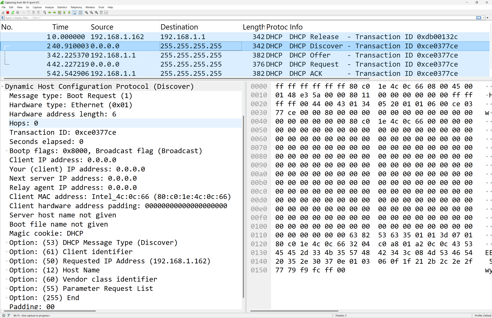
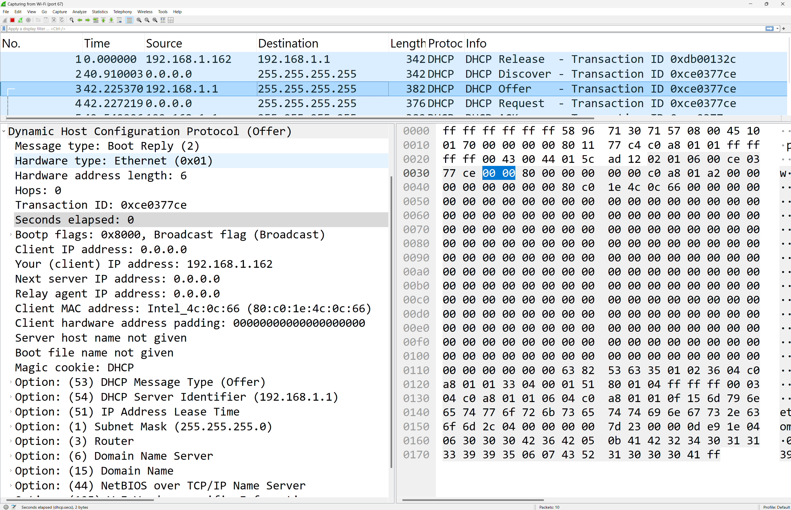
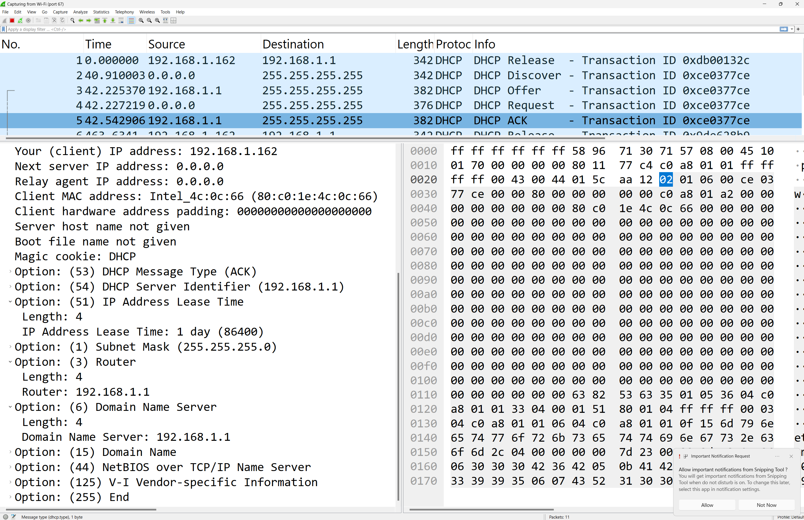

# Lab 24 -  NAT and DHCP

This exercise provides basic understanding of NAT and DHCP protocol.

## Learning Objectives

- Understand Destination Network Address Translation (DNAT)
- Understand Source Network Address Translation (SNAT)
- Understand DHCP protocol mechanism to enable a client to get IP Address
- Understand other required parameter using DHCP

### Environment 

For NAT, Docker Desktop, which is an application environment for your laptop environment that enables running of containerized applications. 
- The Docker Desktop integrates and provides access to a vast ecosystem of docker images via Docker Hub. 

For DHCP,  a laptop (Macbook or Windows) installed with wireshark. 


## Description
#### Creating Simple Network


Create a simple network of four hosts connected via two routers.


Open your terminal, create a network using following command: 
- `docker compose -f ./util/yml/multi-net4-2R4H.yml up -d`


Check reachability i.e. from HA, ping HB and it should be successful.
- `docker exec -it HA ping -c2 172.21.47.5`


### Configuring NAT

In the network above, the subnet 172.2145.0/24 is taken as a private network and thus invisible to out side and eth1 interface of router R1 is considered as connected to public Internet. 
- That any packet that originates from HA or HC, should be NATted with source IP of eth1 interface of R1. 
  - As this changes source IP address of outgoing packet, it is SNAT (source NAT) 
- Similarly, when R1 receives a packet with destination IP address of 172.21.46.253, this destination must be appropriately changed to HA or HC. 
  - This is known as DNAT (Destination NAT).

#### Configuring NAT 

Access R1, and configure NAT at router R1 on outgoing interface eth1. Issue the command on R1 as follows:
- `root@R1:/# iptables -t nat -o eth1 -I POSTROUTING -j MASQUERADE`

#### Analyzing NAT Functionality with packet capture

On three terminals access to R1. 
- On first terminal, run tcpdump packet capture on eth0 interface and on second terminal run tcpdump on interface eth1 capturing all traffic for IP network 172.21.47.0/24.

On first terminal, capture traffic of eth0
- `root@R1:/# tcpdump -n# -i eth0 net 172.21.47.0/24`

On second terminal, capture traffic of eth1
- `root@R1:/# tcpdump -n# -i eth1 net 172.21.47.0/24`

To monitor NAT table entries, on third terminal, track connections with `conntrack`
- `root@R1:/# conntrack -E`

#### Generate Network Traffic

On host HB, run netcat UDP server on some port e. g., 3333
- `root@HB:/# nc -u -l 3333`

On host HD, run netcat TCP server on some port e.g., 4444 
- `root@HD:/# nc  -l 4444`

On HA, run the UDP netcat client sending some data to UDP server on HB. 
- `root@HA:/# echo "Hello UDP" | nc -u 172.21.47.5 3333`

Similarly, on HC, run TCP netcat client and send some message to TCP server on HD. 
- `root@HC:/# echo "Hello TCP" | nc  172.21.47.7 4444`

Next section discusses packet capture and hel
understand working of NAT Mechanism.


#### Packet Capture Analysis
The trace of `conntrack` on R1 shows the creation of NAT Entries and update of the same. 
- `root@R1:/# conntrack -E`
- The entry #1 shows a UDP message from source 172.21 45.5 (HA) to 172.21.47.5 (HB) corresponding to UDP Client on HA sending a UDP message to UDP Server on HB. 
- The function of NAT is identified from `pkt #1 in in eth0` (aka `private` side) capture and pkt #1 in eth1 capture (aka `Internet` side). 
- The entry from pkt #1 in private side shows that source IP as 172.21.45.5(HA) and destination IP as 172.21.47.5 (HB) as this is within the private network and hence these address corresponds as sent by HA. 
- The entry pkt #1 in in the Internet shows the functioning of NAT. 
  - It shows source IP as 172.21.46.253 (eth1 of R1) and destination IP as 172.21.47.5 (HB). 
  - The source IP is changed from private IP to public IP (Internet connected IP) while destination IP remains the same. 
  - Thus, when HB receives this packet it will see the source IP as coming from router R1 (eth1 IP) and not from HA. 
  - The corresponding NAT record is shown in entry #1 in on the conntrack trace. 
  - It basically ma
private side IP:Port (172.21.45.5:59551) to public side IP:Port (172.21.46.253:59551.
```
 root@R1:/# conntrack -E
    [NEW] udp      17 30 src=172.21.45.5 dst=172.21.47.5 sport=59551 dport=3333 [UNREPLIED] src=172.21.47.5 dst=172.21.46.253 sport=3333 dport=59551
    [NEW] tcp      6 120 SYN_SENT src=172.21.45.7 dst=172.21.47.7 sport=43626 dport=4444 [UNREPLIED] src=172.21.47.7 dst=172.21.46.253 sport=4444 dport=43626
 [UPDATE] tcp      6 60 SYN_RECV src=172.21.45.7 dst=172.21.47.7 sport=43626 dport=4444 src=172.21.47.7 dst=172.21.46.253 sport=4444 dport=43626
 [UPDATE] tcp      6 432000 ESTABLISHED src=172.21.45.7 dst=172.21.47.7 sport=43626 dport=4444 src=172.21.47.7 dst=172.21.46.253 sport=4444 dport=43626 [ASSURED]
[DESTROY] udp      17 src=172.21.45.5 dst=172.21.47.5 sport=59551 dport=3333 [UNREPLIED] src=172.21.47.5 dst=172.21.46.253 sport=3333 dport=59551
 [UPDATE] tcp      6 120 FIN_WAIT src=172.21.45.7 dst=172.21.47.7 sport=43626 dport=4444 src=172.21.47.7 dst=172.21.46.253 sport=4444 dport=43626 [ASSURED]
 [UPDATE] tcp      6 29 LAST_ACK src=172.21.45.7 dst=172.21.47.7 sport=43626 dport=4444 src=172.21.47.7 dst=172.21.46.253 sport=4444 dport=43626 [ASSURED]
 [UPDATE] tcp      6 120 TIME_WAIT src=172.21.45.7 dst=172.21.47.7 sport=43626 dport=4444 src=172.21.47.7 dst=172.21.46.253 sport=4444 dport=43626 [ASSURED]

```

Packet capture on ***`private network`*** side of NAT
Router (eth0)
- `root@R1:/# tcpdump -n# -i eth0 net 172.21.47.0/24`
```
tcpdump: verbose output suppressed, use -v[v]... for full protocol decode
listening on eth0, link-type EN10MB (Ethernet), snapshot length 262144 bytes
    1  13:28:02.161488 IP 172.21.45.5.59551 > 172.21.47.5.3333: UDP, length 10
    2  13:28:46.052663 IP 172.21.45.7.43626 > 172.21.47.7.4444: Flags [S], seq 320760902, win 64240, options [mss 1460,sackOK,TS val 3512734493 ecr 0,nop,wscale 7], length 0
    3  13:28:46.053379 IP 172.21.47.7.4444 > 172.21.45.7.43626: Flags [S.], seq 688607112, ack 320760903, win 65160, options [mss 1460,sackOK,TS val 16148294 ecr 3512734493,nop,wscale 7], length 0
    4  13:28:46.053449 IP 172.21.45.7.43626 > 172.21.47.7.4444: Flags [.], ack 1, win 502, options [nop,nop,TS val 3512734494 ecr 16148294], length 0
    5  13:28:46.053851 IP 172.21.45.7.43626 > 172.21.47.7.4444: Flags [P.], seq 1:11, ack 1, win 502, options [nop,nop,TS val 3512734494 ecr 16148294], length 10
    6  13:28:46.053905 IP 172.21.47.7.4444 > 172.21.45.7.43626: Flags [.], ack 11, win 509, options [nop,nop,TS val 16148295 ecr 3512734494], length 0
```

Packet capture on ***`Internet side`*** of NAT
Router (eth1)
- root@R1:/# tcpdump -n# -i eth1 net 172.21.47.0/24

```
tcpdump: verbose output suppressed, use -v[v]... for full protocol decode
listening on eth1, link-type EN10MB (Ethernet), snapshot length 262144 bytes
    1  13:28:02.161518 IP 172.21.46.253.59551 > 172.21.47.5.3333: UDP, length 10
    2  13:28:46.052880 IP 172.21.46.253.43626 > 172.21.47.7.4444: Flags [S], seq 320760902, win 64240, options [mss 1460,sackOK,TS val 3512734493 ecr 0,nop,wscale 7], length 0
    3  13:28:46.053343 IP 172.21.47.7.4444 > 172.21.46.253.43626: Flags [S.], seq 688607112, ack 320760903, win 65160, options [mss 1460,sackOK,TS val 16148294 ecr 3512734493,nop,wscale 7], length 0
    4  13:28:46.053456 IP 172.21.46.253.43626 > 172.21.47.7.4444: Flags [.], ack 1, win 502, options [nop,nop,TS val 3512734494 ecr 16148294], length 0
    5  13:28:46.053868 IP 172.21.46.253.43626 > 172.21.47.7.4444: Flags [P.], seq 1:11, ack 1, win 502, options [nop,nop,TS val 3512734494 ecr 16148294], length 10
    6  13:28:46.053902 IP 172.21.47.7.4444 > 172.21.46.253.43626: Flags [.], ack 11, win 509, options [nop,nop,TS val 16148295 ecr 3512734494], length 0
```

Similarly, when netcat client on HC communicates with netcat server on HD:
- It first performs 3-way handshake and hence correspondingly there are 3 records in NAT table as shown by entries #2 (SYN), #3(SYN_RECV) and #4(ESTABLISHED). 
- Corresponding, these packets on private side of router R1 (eth0) are pkt #2, #3 and #4. 
- Respective entries #2, #3 and 4 on public side of NAT router are given in the Internet side trace, R1 (eth1) .

Entries for the message exchanges from private and Internet side are shown in the tcpdump as well. 
- You can capture the tcpdum
on save mode, copy it to you actual machine and analyze it via wireshark.
### Exploring NAT mechanism

#### Monitoring existing enries.

Perform more exercises by sending packets from private side to public and receiving responses and monitor the NAT entries. 
- In case you just want to see the current NAT entries and not as and when these are created, use the following command on R1.
  - `root@R1:/# conntrack -L`
- This will show all the existing entries.
- To learn more about conntrack use: `conntrack --help`

Similarly, analyze the packet capture on R1(eth0) and R1(eth1) to see the mapping of private and public IP.

#### ICMP traffic and NAT

ICMP is on layer 3 and hence there is no notion of port number. 
- So, this is an interesting case study about how NAT works in the absence of port number. 
- Look at the other fields in the NAT table in place of port number to recognize and analyze the working of NAT.

#### Double NAT

Another interesting case to explore is to also make Router R2 as NAT box. 
- Thus, now there will be two NAT operations from any packets in 172.21.45.0/24 network to 172.21.47.0/24 network. 
- Analyze these NAT entries as well as corresponding packet captures on eth0 and eth1 interface of router R2.

***Remove the network after completing the experiment***

## Understanding DHCP

A client device (laptop/desktop/phone etc.) when connects to any network, it gets its IP address using Dynamic Host Configuration Protocol (DHCP), along with subnet mask, default router and DNS server address. 
- As laptop already gets the IP Address assigned to it when we connect it to network, we need to make explicit invocation of system commands to trigger DHCP exchange on the connected network interface. 
- These commands first need to release the current IP Address and get a new one.

### DHCP on Windows

#### Start Packet Capture

Start wireshark program, select the active network interface (such as Wifi or ethernet) and start the packet capture using the capture filter "port 67". 
- DHCP server listens on port 67 and hence this capture filter will show packets of our interest i.e. DHCP protocol.

#### Invoking DHCP Exchange

Open a terminal on vscode
-  First release the DHCP obtained IP address by entering the command 
- `ipconfig /release`
  - This will result in **"DHCP Release"** message capture in wireshark capture. 
- Kill the release command with `Ctrl + C`

- Now to see full DHCP Exchange between laptop and DHCP server, issue the command 
  - "`ipconfig /renew`" as shown in below. 
- This initiates a complete DHCP protocol exchange consisting of DHCP Discover, Offer, Request and Ack messages between client and server.

```
C:\Users\zyalew\Documents\umbc-sp26-cmsc481-yalew-zelalem-ky59771481> ipconfig /release

Windows IP Configuration

No operation can be performed on Wi-Fi 4 while it has its media disconnected.

C:\Users\zyalew\Documents\umbc-sp26-cmsc481-yalew-zelalem-ky59771481> ipconfig /renew  

Windows IP Configuration

No operation can be performed on Wi-Fi 4 while it has its media disconnected.
No operation can be performed on Wi-Fi 5 while it has its media disconnected.

Wireless LAN adapter Wi-Fi 4:

   Media State . . . . . . . . . . . : Media disconnected
   Connection-specific DNS Suffix  . : 

Wireless LAN adapter Wi-Fi 5:

   Media State . . . . . . . . . . . : Media disconnected
   Connection-specific DNS Suffix  . : 

Wireless LAN adapter Wi-Fi:

   Connection-specific DNS Suffix  . : mynetworksettings.com
   IPv6 Address. . . . . . . . . . . : 2600:4040:2155:bd00:b7e4:c4be:5c63:3963
   Temporary IPv6 Address. . . . . . : 2600:4040:2155:bd00:cc61:6a32:21aa:ec32
   Link-local IPv6 Address . . . . . : fe80::363e:30ea:8aa5:edbe%16
   IPv4 Address. . . . . . . . . . . : 192.168.1.162
   Subnet Mask . . . . . . . . . . . : 255.255.255.0
   Default Gateway . . . . . . . . . : fe80::5a96:71ff:fe30:7157%16
                                       192.168.1.1

Ethernet adapter vEthernet (WSL (Hyper-V firewall)):

   Connection-specific DNS Suffix  . :
   Link-local IPv6 Address . . . . . : fe80::62b6:a7ca:8f3a:4076%38
   IPv4 Address. . . . . . . . . . . : 172.24.64.1
   Subnet Mask . . . . . . . . . . . : 255.255.240.0
   Default Gateway . . . . . . . . . :
```
#### DHCP Protocol Analysis

Analyze the wireshark capture for this DHCP exchange on your laptop. 
- A sample of such wireshark capture of DHCP Exchange is shown the figure below. 

- The first packet corresponds to `DHCP Release` which releases the existing IP Address assigned to the device. 
  - In general practical life, this exchange does not happen since no user explicitly release the assigned IP address. 
  - So, our focus is only obtaining IP address from the start of DHCP Exchange
- The second packet shows `DHCP Discover` from client to server,
- The third packet `DHCP Offer` from DHCP Server in response to DHCP Discover. 
- $4^{th}$ packet is `DHCP Request` which a client formally requests to assign it the offered IP address 
- And finally $5^{th}$ packet is `ACK` confirming the assignment of IP address to the client device.

As shown in DHCP Discover, the source IP address is 0.0.0.0 since client does not know its IP address and destination address is 255.255.255.255 (global broadcast address) since client does not DHCP Server IP address and its needs to discover it first. 
- The expanded packet details pane shows the parameters used in DHCP protocol. 



The discover message is delivered to all hosts on the network but only DHCP server will process this packet and respond with DHCP offer, which is shown in $3^{rd}$ packet. 
- The packet has source IP address as 192.168.1.1 (DHCP Server) and it also fills in the destination IP Address which client is yet to assign to itself. 
- However, the destination MAC address would correspond to client's MAC address as DHCP Server knows it when it received DHCP Discover message. 
- Thus, the client process this DHCP offer and formally makes a request via DHCP Request message ($4^{th}$) requesting the server to assign the offered IP address.



The server responds with DHCP ACK confirming that client can assign itself the offered and request IP address. 
- For client to be able to properly access the internet, it also need few other values such as
  - Subnet Mask to know the subnet to which it belongs
  - Default router to which it should send the packet. 
  - DNS server which should be used to resolve the hostname to IP address
  - Lease time, which specifies time duration till when client can use the IP address.

In the last image, the value of default router and DNS server are same as that corresponding to DHCP server itself, which is typically the case in home or small office network. 
- But, in bigger corporate network, these are likely to be different from IP address of DHCP Server.
- Analyze your wireshark capture to study these and other such parameters.


### DHCP on Macbook

#### Identifying Network Interface

Typically, a Macbook connected to internet would have few network interfaces, some of which correspond to some logical network connectivity. 
- So, first out the interface name that connects it to network (sost likely it may be en0) by issuing the following command in the terminal.
- `networksetup -listallhardwareports`
- It will list all the network interfaces, but identify the interface of interest (ethernet or Wifi). A sample output is shown below.

```
Hardware Port: Ethernet Adapter (en3)
Device: en3
Ethernet Address: 12:7e:e0:2b:d0:28

Hardware Port: Ethernet Adapter (en4)
Device: en4
Ethernet Address: 12:7e:e0:2b:d0:29

Hardware Port: Thunderbolt Bridge
Device: bridge0
Ethernet Address: 36:e9:a7:2a:fc:00

Hardware Port: Wi-Fi
Device: en0
Ethernet Address: 9c:3e:53:7b:2c:d5

Hardware Port: Thunderbolt 1
Device: en1
Ethernet Address: 36:e9:a7:2a:fc:00

Hardware Port: Thunderbolt 2
Device: en2
Ethernet Address: 36:e9:a7:2a:fc:04

VLAN Configurations
===================
```
This identifies the interface as en0.

#### DHCP Exchange

Start the wireshark capture and use the capture filter "port 67" to capture only DHCP Related messages.

Now in the terminal window, first release DHCP IP address and then initiate DHCP exchange using the following commands
- `ipconfig set en0 NONE`
- `ipconfig set en0 DHCP`

The wireshark will show similar packet capture details as seen in the previous analysis. 
- Analyze all the four DHCP protocol messages w.r.t. 
- Source IP, Destination IP, offered IP address to client, DHCP Server IP, Subnet mask, default router, DNS server address, lease time etc.

### Exploring DHCP Further

When lease is about to over, a DHCP clients needs to review the IP Address and other parameters. 
- At that time, it simply make DHCP Request since it already knows DHCP Server and does not to discover the same. 
- The server will respond back with DHCP Ack.

On windows, issues the command
- `ipconfig /renew`

This should only show two messages exchange. Analyze the same in wireshark capture to understand and recognize the working of DHCP protocol


## Summary

In this exercise, we have studied and learnt the following
- NAT function to enable multiple hosts in private network to use the same public IP address when packet goes out on the internet.
- NAT table entries generation and monitoring on the NAT Box
- Source NAT and Destination NAT
- Use of DHCP protocol to obtain IP Address
- DHCP protocol provides the subnet mask, default router, DNS server and lease time.
- Renewal of client's IP Address.
- DHCP Release protocol (Generally not seen in practical life).

## Learning Resources

- Understand IP Addressing: Everything you ever wanted to know
  - https://ia800606.us.archive.org/21/items/B-001-002-066/501302.pdf
- Computer Networks - A Top Down Approach, v8, Kurose, Ross; Pearson publishing
- RFC 2131: Dynamic Host Configuration Protocol
