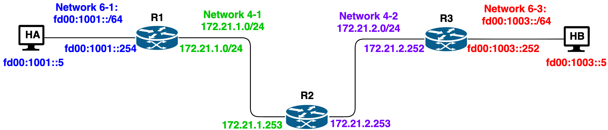
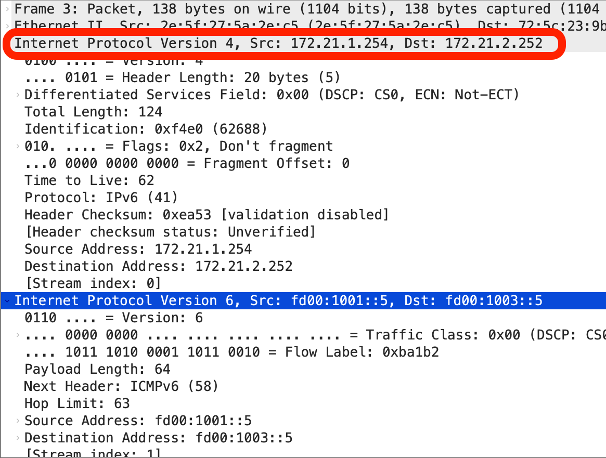
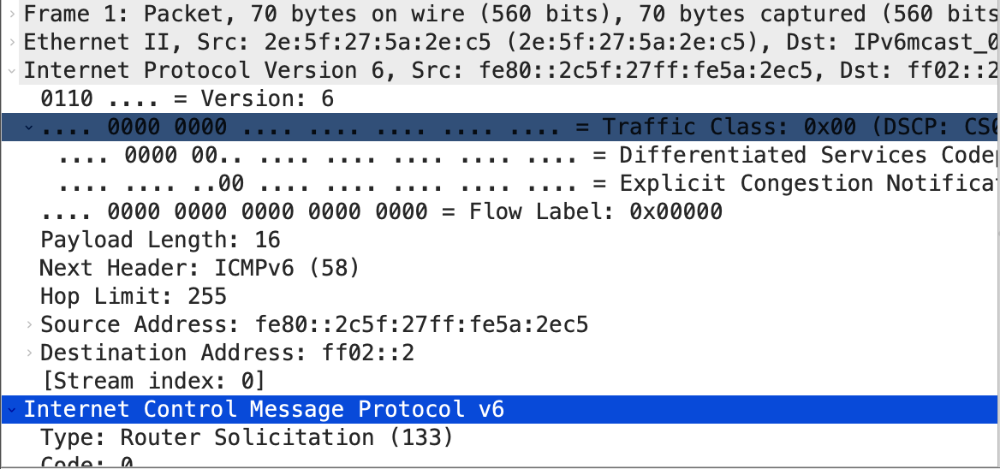

# Lab 25 - IPv6 and Dual Stack

This exercise explains how to enable end-to-end IPv6 communication along with IPV4 communication across a network that supports both IPv4 and IPv6. 
- The exercise also demonstrate communication between two ipv6 only end system which connect via a network that includes an IPv4-only segment. 
- By configuring IPv6-over-IPv4 tunnelling between dual-stack routers, the exercise emulates a real-world networking scenario where IPv6 connectivity must be maintained over legacy infrastructure. 
- It also includes packet capture and analysis to illustrate how encapsulation works at the protocol level.

## Learning Objectives

- Set up an IPv6-over-IPv4 tunnel using dual-stack routers.
- Configure tunnel interfaces using the ip tunnel command.
- Enable IPv6 communication across an IPv4-only path.
- Capture and analyze tunnelled packets using Wireshark.

## Environment 

Docker Desktop, which is an application environment for your laptop environment that enables running of containerized applications. The Docker Desktop integrates and provides access to a vast ecosystem of docker images via Docker Hub.

## IPv6 Networks connected via IPv4 networks.

The network used in this assignment is composed of three routers and two hosts, arranged in the linear path as shown in below. The network consists of following hosts and routers:



- HA, and HB are pure IPv6-only nodes.
- R1 and R3 are dual-stack routers, supporting both IPv4 and IPv6. These are the tunnel endpoints.
- R2 is an IPv4-only router that connects the two dual-stack routers (R2 and R4), forming the segment that lacks native IPv6 support.

#### IPv6 Tunnel
Router `R2` is the intermediate IPv4 router between the two dual-stack edge routers `R1` and `R3`. 
- Since the middle path between `R1` and `R3` is IPv4-only, native IPv6 packets cannot cross it directly. 
- To bridge this gap and allow IPv6 packets to travel from `HA` to `HB`, an IPv6-over-IPv4 tunnel is configured between `R1` and `R3`. 
- This tunnel encapsulates IPv6 packets inside IPv4 headers while they traverse the IPv4 network through `R2`.


#### IP Addressing Scheme

IPv6 Addressing Format:
- IPv6 edge LANs use subnets such as `fd00:1001::/64` and `fd00:1003::/64`.
- The IPv6-over-IPv4 tunnel uses a separate IPv6 subnet configured during the lab.

IPv4 Addressing Format:
- The IPv4 transit networks use subnets `172.21.1.0/24` and `172.21.2.0/24`.


#### Subnet Assignment for the Topology

| Link | IPv6 Subnet | IPv4 Subnet |
|------|-------------|-------------|
| HA -- R1 | `fd00:1001::/64` | -- |
| R1 -- R2 | -- | `172.21.1.0/24` |
| R2 -- R3 | -- | `172.21.2.0/24` |
| R3 -- HB | `fd00:1003::/64` | -- |
| R1 ↔ R3 Tunnel | `fd00:1002::/64` (Tunnel subnet) | Uses `R1 ↔ R2 ↔ R3` path |


### Creating IPv6 Network

#### Containers and Network definitions

All networks are explicitly configured with either IPv6 or IPv4 subnets. 
- IPv6 networks are used where end-to-end IPv6 communication is required, and IPv4 networks are used between R2-R3 and R3-R4, simulating an IPv4-only segment.

#### Routing Configuration Overview

- `HA` and `HB` are IPv6 hosts. Each host uses its directly connected router as the default IPv6 gateway.
  - `HA` forwards IPv6 traffic to `R1`
  - `HB` forwards IPv6 traffic to `R3`

- `R1` and `R3` are dual-stack routers.
  - Each router has one IPv6-facing interface toward a host LAN and one IPv4-facing interface toward the middle transit network.
  - Both IPv4 and IPv6 forwarding must be enabled on these routers.

- `R2` is an IPv4 transit router.
  - It forwards only IPv4 traffic between `R1` and `R3`.
  - It does not forward native IPv6 packets.

- Because the middle path is IPv4-only, an IPv6-over-IPv4 tunnel is configured between `R1` and `R3`.
  - `R1` encapsulates IPv6 packets inside IPv4 before sending them across the IPv4 network.
  - `R3` decapsulates the packets and forwards them to `HB`.
  - Traffic in the reverse direction follows the same tunnel in the opposite direction.

- Static routes are required so that:
  - `R1` can reach the remote IPv6 subnet behind `R3` through the tunnel
  - `R3` can reach the remote IPv6 subnet behind `R1` through the tunnel
  - `R1` and `R3` can reach the opposite IPv4 transit subnet through `R2`

#### Creating the Network

Create the docker containers using the following command:
- `docker compose -f util/yml/multi-net64-3R2H-v6-over-v4.yml up -d`

```
 ✔ Network yml_net4-2 Created                               0.0s
 ✔ Network yml_net6-3 Created                               0.0s
 ✔ Network yml_net4-1 Created                               0.0s
 ✔ Network yml_net6-1 Created                               0.0s
 ✔ Container R2     Started                               0.2s
 ✔ Container R1     Started                               0.2s
 ✔ Container HA     Started                               0.2s
 ✔ Container R3     Started                               0.2s
 ✔ Container HB     Started                               0.2s
```

To stop it use:
- `docker compose -f util/yml/multi-net64-3R2H-v6-over-v4.yml down --remove-orphans`
### Tunnel Setup

#### IPv6 Tunnel over IPv4 network

To enable IPv6 communication across the IPv4-only segment between `R1` and `R3`, an IPv6-over-IPv4 tunnel must be configured between the dual-stack routers `R1` and `R3`.
- This tunnel encapsulates IPv6 packets inside IPv4 headers, allowing them to pass through the IPv4-only router `R2`.
- Ensure that the IPv4 addresses of `R1` (`172.21.1.254`) and `R3` (`172.21.2.252`) are correctly configured before proceeding.
- Configure an IPv6-over-IPv4 tunnel between `R1` and `R3` using subnet `fd00:1002::/64`.

Access `R1`, and setup tunnel in R1:
- `root@R1:/# ip tunnel add mytun mode sit remote 172.21.2.252 local 172.21.1.254`
- `root@R1:/# ip link set mytun up`
- `root@R1:/# ip -6 addr add fd00:1002::1/64 dev mytun`
- `root@R1:/# ip -6 route add fd00:1003::/64 via fd00:1002::2`
- `root@R1:/# exit`

On `R3`, set up the tunnel in the reverse direction using the information below:

- remote as `172.21.1.254`and local as `172.21.2.252` 
- Tunnel address: `fd00:1002::2/64`
- Route to reach `fd00:1001::/64` via `fd00:1002::1`


#### Verifying End to End IPv6 Connectivity

Check the end to end connectivity by issuing following command on H1
- `root@HA:/# ping -6 -c 5 fd00:1003::5`
```

PING fd00:1003::5 (fd00:1003::5) 56 data bytes
64 bytes from fd00:1003::5: icmp_seq=1 ttl=62 time=1.40 ms
64 bytes from fd00:1003::5: icmp_seq=2 ttl=62 time=0.275 ms
64 bytes from fd00:1003::5: icmp_seq=3 ttl=62 time=0.291 ms
64 bytes from fd00:1003::5: icmp_seq=4 ttl=62 time=0.234 ms
64 bytes from fd00:1003::5: icmp_seq=5 ttl=62 time=0.474 ms

--- fd00:1003::5 ping statistics ---
5 packets transmitted, 5 received, 0% packet loss, time 4098ms
rtt min/avg/max/mdev = 0.234/0.533/1.395/0.438 ms
```
Ping should be successful as shown 

### Packet Capture and Analysis

#### Capture Tunnelled IPv6 over IPv4 (on R2)

To verify that IPv6 packets are encapsulated within IPv4 during transmission through the tunnel, perform a packet capture on the tunnel path using tcpdump.

- Start packet capture on R2's IPv4 interface (eth1) using the following
  command:
  - `root@R2:/# tcpdump -i eth1 -w tunnel-capture.pcap`

From HA send the same ping to HB.
- Once the ping completes successfully, stop the capture on R2 using `Ctrl+C`.

Copy the captured file from the R2 container to week 13 folder the desktop
- You can exit R2, since you wont be using it, that gets you back to your computer terminal. 
  - `docker cp R2:/tunnel-capture.pcap wk-13/`

- Open the .pcap file in Wireshark to view encapsulated packets.



The figure shows a tunneled IPv6 packet captured on the IPv4 interface of R2. 
- Note the encapsulated IPv6 header inside the IPv4 packet, with IPv4 source `172.21.1.254` and destination `172.21.2.252`, and the inner IPv6 source `fd00:1001::5` to destination `fd00:1003::5`.

#### IPv6 Packet Capture only.

In a similar way, if you observe the first frame from HA to R1 it shows native IPv6 forwarding between two IPv6-only nodes without any IPv4 encapsulation.



## Summary

In this exercise, we have studied and learnt the following
- IPv6 packet Forwarding
- Tunnelling IPv6 traffic over IPv4 network

## Learning Resources

- Kurose, Ross: Computer Networking: A Top-Down Approach, 8th Edition.
- Wireshark Documentation: <https://www.wireshark.org/docs/>
- Docker Documentation: <https://docs.docker.com/>
- Computer Networks - A Top Down Approach, v8, Kurose, Ross; Pearson publishing