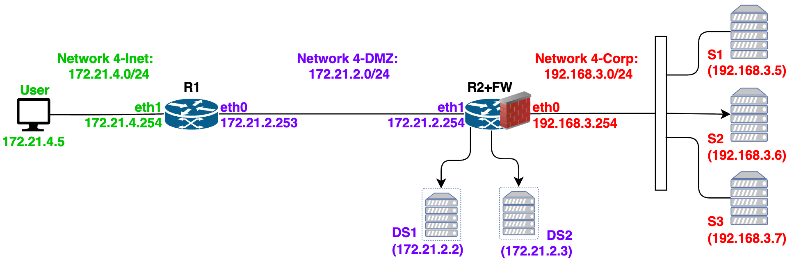

# Lab 26 - Firewall, SSH-VPN, and Loadbalancing

This exercise provides hands-on experienceexplores how a Linux firewall/router can control traffic between an external user network, a DMZ, and an internal corporate network using `iptables`. 
- It demonstrates firewall policy enforcement, including which services are allowed or blocked between the Internet, DMZ servers, and internal servers. 
- The lab also introduces SSH tunneling as a way to bypass firewall restrictions by carrying blocked services through permitted SSH connections. 
- Finally, it shows how `iptables` NAT rules can be used to distribute web traffic across multiple internal servers for load balancing.

## Learning Objectives

- Understand basics of Firewalls
- Understand working of Linux firewalls(iptables)
- Understand working of VPN via SSh
- Understand setting up SSH Ingress Egress port forwarding
- Understand HTTP Based Load Balancing
- Understand TCP Based Load Balancing

## Environment 

Docker Desktop, which is an application environment for your laptop environment that enables running of containerized applications. 
- The Docker Desktop integrates and provides access to a vast ecosystem of docker images via Docker Hub.


## Network Topology



This network setup is used for demonstrating basic functionality of firewall. 
- The network consists of a DMZ network connected by a router to internet and accessed directly by users on the internet, and a corporate LAN which is protected by firewalls.

Create the docker network using the following command:
- `docker compose -f util/yml/multi-Firewall-Functionality.yml up -d`
    ```
    [+] up 11/11
    ✔ Network yml_net4-net  Created                                0.0s
    ✔ Network yml_net4-Corp Created                                0.0s
    ✔ Network yml_net4-DMZ  Created                                0.0s
    ✔ Container DS2         Started                                0.3s
    ✔ Container DS1         Started                                0.3s
    ✔ Container GW          Started                                0.3s
    ✔ Container S3          Started                                0.3s
    ✔ Container S1          Started                                0.3s
    ✔ Container FW          Started                                0.3s
    ✔ Container S2          Started                                0.3s
    ✔ Container User        Started        
    ```

To stop it use:
- `docker compose -f util/yml/multi-Firewall-Functionality.yml down --remove-orphans`

#### Check Connectivity

Verify, via ping, the initial connectivity allowed by the current topology and routing configuration.

- `User` (`172.21.4.5`) should be able to reach `DS1` (`172.21.2.2`) and `DS2` (`172.21.2.3`).
- Access from `User` to the internal servers `S1` (`192.168.3.5`), `S2` (`192.168.3.6`), and `S3` (`192.168.3.7`) should only succeed if the current firewall policy allows it.

## Firewall Functionality

#### Firewall Policies

Here we will define simple firewall requirement. 
- The default approach of firewall is to Deny all traffic unless specifically permitted. 
- To understand firewall functionality, define the following policy requirements.
    - Permit user to access any traffic on DMZ network 
      - i.e., user should be able to access any service (all ports) on server DS1.
    - Permit DMZ network to access web services (port 80) on Corporate network
    - Permit DMZ network to access any services on Internet.
    - Corporate servers should be able to access any service on DMZ network.
    - All other traffic should be blocked, e.g.,
        - User can't access corporate servers (S1, S2, and S3)
        - Corporate network can't access User on the Internet

#### Implementing Firewall Rules

As there is no restriction between user (internet) and DMZ network, router R1 simply works as regular router and no firewall rules are implemented on R1. 
- All the firewall policies are to be implemented on firewall router (FW).


- Access FW and verify the interface names with their respective address, e.g., eth0 interface should have IP address 192.168.3.254 and eth1 interface should have IP address 172.21.2.254. 
  - `root@FW:/# ip -4 -br addr`
    ```
    lo               UNKNOWN        127.0.0.1/8 
    eth0@if21        UP             192.168.3.254/24 
    eth1@if28        UP             172.21.2.254/24 
    ```
- If it is other way around, interchange the interface names accordingly in the below commands.

As per the firewall policy requirement, run following firewall commands.

- Set the default policy to DROP
  - `root@FW:/# iptables -P FORWARD DROP`
- Permit DMZ network to access web services on Corporate network
  - `root@FW:/# iptables -I FORWARD -i eth1 -p tcp -s 172.21.2.0/24 -d 192.168.3.0/24 --dport 80 -j ACCEPT`
- Permit corporate servers to access any service on DMZ
  - `root@FW:/# iptables -I FORWARD -i eth0 -p tcp -s 192.168.3.0/24 -d 172.21.2.0/24 -j ACCEPT`
- Permit return TCP traffic (established sessions) from DMZ network to
    corporate servers.
  - `root@FW:/# iptables -I FORWARD -p tcp -m conntrack --ctstate RELATED,ESTABLISHED -j ACCEPT`


#### Starting Services on DMZ network and Corporate servers.

Access the DMZ server DS1, start Apache and a netcat server on port 9999
- `root@DS1:/# apache2ctl start` > As usual ignore the error
- `root@DS1:/# nc -l 9999`   
    
Access the corporate server S1, start Apache web server
- `root@S1:/# apache2ctl start`

Access corporate server S2, start netcat server on port 3333
- `root@S2:/# nc -l 3333`

### Checking Firewall Rules

#### User should not be able to reach any servers in corporate network
On the terminal you are accessing `User` machine and all of following access to corporate network should fail
Web Access to server S1.
- `root@User:/# curl -v -m 5 http://192.168.3.5/welcome.html`
```
*   Trying 192.168.3.5:80...
* Connection timed out after 5006 milliseconds
* Closing connection
curl: (28) Connection timed out after 5006 milliseconds
```

Access to netcat server on S2
- `root@User:/# nc -v -w 5 192.168.3.6 3333`
```
nc: connect to 192.168.3.6 port 3333 (tcp) timed out: Operation now in progress
```

Ping to server S3.
- `root@User:/# ping -c2 192.168.3.7`
```
PING 192.168.3.7 (192.168.3.7) 56(84) bytes of data.

--- 192.168.3.7 ping statistics ---
2 packets transmitted, 0 received, 100% packet loss, time 1028ms
```

#### User should be able to Access DMS Server.

Access to web server on DS1 should be successful.
- `root@User:/# curl http://172.21.2.2/welcome.html`
```html
<html>
    <head>
          <title>Welcome Page</title>
    </head>
    <body>
          <h1>Welcome to HTTP Learning</h1>
              Welcome to experiential learning of HTTP protocol.
    </body>
</html>
```

#### DMZ server should be able to access Web Services on Corporate network

Access DMZ server DS1 on another terminal, then access the web server on S1 from DS1. This should be successful
- `root@DS1:/# curl -m 5 http://192.168.3.5/welcome.html`

```html
<html>
    <head>
          <title>Welcome Page</title>
    </head>
    <body>
          <h1>Welcome to HTTP Learning</h1>
              Welcome to experiential learning of HTTP protocol.
    </body>
</html>
```

#### DMZ server should not be able to access any other services on Corporate Network

Connecting to netcat server on S2 should fail.
- `root@DS1:/# nc -v -w 5 192.168.3.6 3333`
```  
nc: connect to 192.168.3.6 port 3333 (tcp) timed out: Operation now in progress
```

Check ping reachability to S3 should fail.
- `root@DS1:/# ping -c2 192.168.3.7`
```
PING 192.168.3.7 (192.168.3.7) 56(84) bytes of data.

--- 192.168.3.7 ping statistics ---
2 packets transmitted, 0 received, 100% packet loss, time 1030ms
```
#### Corporate Access

Access to web server on DS1 from S1 should succeed.
- `root@S1:/# curl -m 5 http://172.21.2.2/welcome.html`

```html
<html>
    <head>
          <title>Welcome Page</title>
    </head>
    <body>
          <h1>Welcome to HTTP Learning</h1>
              Welcome to experiential learning of HTTP protocol.
    </body>
</html>
```

Access to netcat server (port 3333) from S1 should succeed.
- `root@S1:/# nc -v -w 5 172.21.2.2 9999`
```
Connection to 172.21.2.2 9999 port [tcp/*] succeeded!
Hello
```

Ping to DS1 from S1 should fail.
- `root@S1:/# ping -c2 172.21.2.2`
```
PING 172.21.2.2 (172.21.2.2) 56(84) bytes of data.

--- 172.21.2.2 ping statistics ---
2 packets transmitted, 0 received, 100% packet loss, time 1063ms
```

Ping to User from S1 should fail.
- `root@S1:/# ping -c2 172.21.4.5`

```
PING 172.21.4.5 (172.21.4.5) 56(84) bytes of data.

--- 172.21.4.5 ping statistics ---
2 packets transmitted, 0 received, 100% packet loss, time 1029ms
```
***Kill All the netcat servers running on all hosts***

### Explore Firewalls

To enhance your understanding of firewall functionality, define your own policy and implement the iptables rules for meeting policy requirements and verify the same.

***To clear all firewall rules and check that all reachability is restored among all systems, you can use this command. However, for now do not clear it as the policy is required by the next section.***
- `root@FW:/# iptables -F`


## SSH based VPN 

We will use the same network setup to understand SSH based VPN mechanism which can be used to access services which are prevented by firewall.

### Firewall Evasion

A corporate user would like to access the some services which are blocked by firewall directly.
- The user can't change firewall configuration and thus need to implement some mechanisms at hosts levels. 
- The user would like to access following services:
    - Accessing Netcat Servers on Corporate network from DMZ Networks
        - Access netcat server on S2 (port 3333) from DS1 and DS2.
        - Access netcat server on S3 (port 4444) from DS1 and DS2.
    - Accessing web services on Internet (User) from corporate network.
        - Access web server on Internet (User) from corporate network
        - Access netcat server (port 8888) on Internet user from corporate
    network.
### Implementing Firewall evasion -- Egress Port Forwarding (Reverse Tunnel)

Though DS1 and DS2 can't access ssh (secure shell) to S1, S2 and S3, due to firewall policies, yet the servers S1, S2 and S3 can access any services on DS1 and DS2. 
- Thus, setup the reverse SSH Port forwarding from S1 to DS1 and DS2.

#### Updating sshd_config file on DS1, DS2

To enable reverse port forward, modify the file `/etc/ssh/sshd_config` on both DS1 and DS2.

Access DS1, edit ssh_config, save and exit
- `root@DS1:/# nano /etc/ssh/sshd_config`
  -  Replace the following entry `#GatewayPorts No` with the entry `GatewayPorts clientspecified`
-  Restart ssh services 
   -  `root@DS1:/# service ssh restart`
        ```
        * Restarting OpenBSD Secure Shell server sshd            [ OK ] 
        ```
- ***Access DS2, and do the same***

#### Setting Up SSH Reverse Port Forwarding


Access `S1` and set up SSH reverse port forwarding so that services on the internal servers can be reached through `DS1` and `DS2`.
- `root@S1:/# ssh -f -4NT -R 0.0.0.0:33333:192.168.3.6:3333 root@172.21.2.2`
  - If there is a message as shown below, type `yes`
```
The authenticity of host '172.21.2.2 (172.21.2.2)' can't be established.
ED25519 key fingerprint is SHA256:LZn68jNy8as+QbGgC+93g8IsAnh8ZnELGZHiarRB0Eg.
This key is not known by any other names.
Are you sure you want to continue connecting (yes/no/[fingerprint])? yes
Warning: Permanently added '172.21.2.2' (ED25519) to the list of known hosts.
```
- `root@S1:/# ssh -f -4NT -R 0.0.0.0:44444:192.168.3.7:4444 root@172.21.2.3`

These commands create the following reverse port forwards:
- This means that if a TCP connection reaches `DS1` on port `33333`, it is carried through the SSH tunnel to `S2` on port `3333`. 
- Similarly, traffic sent to `DS2` on port `44444` is forwarded to `S3` on port `4444`.

Because the forwarded traffic travels inside an SSH connection that is already allowed, this mechanism can bypass firewall restrictions if such SSH access is permitted.

#### Accessing Reverse Proxy.

Access S2, start netcat ssh server on port 3333 in perpetual mode (option -k)
- `root@S2:/# nc -kl 3333`

Similarly, access S3, start netcat server on port 4444 in perpetual mode.
- `root@S3:/# nc -kl 4444`

Access DS1 and connect to S3, use the following command to connect and exchange chat messages
- ` root@DS1:/# nc -v 172.21.2.3 44444`
    ```
    Connection to 172.21.2.3 44444 port [tcp/*] succeeded!
    great
    ```
Access DS2 and connect to S2  use the following command to connect and
exchange chat messages
- `root@DS2:/# nc -v 172.21.2.2 33333`
    ```
    Connection to 172.21.2.2 33333 port [tcp/*] succeeded!
    wow
    ```
#### More tunnels

Using this approach, define your own ssh VPN tunnels to access service on any port in corporate network which is not directly permitted by firewall.

### Implementing Firewall evasion -- Ingress Port Forwarding (Forward Tunnel)

To enable corporate network to access internet (User), set up ssh port
forwarding DS1 to user

***Kill all the netcat servers and clients***

#### Web Services on Internet (User)

Start ssh service on User/Internet
- `root@User:/# service ssh restart`
```
 * Restarting OpenBSD Secure Shell server sshd               [ OK ] 
```

Start the apache web server on User/Internet(If it is not already running)
- `root@User:/# apache2ctl start`

#### Setup Ingress Port Forwarding

Access a DS1 terminal and setup as ssh forward tunnel as follows
- `root@S1:/# ssh -f -4NT -R 0.0.0.0:44444:192.168.3.7:4444 root@172.21.2.3`

#### Access Public Internet from Corporate network.

Access S1 server and access the web server using the ssh port forwarding

- `root@User:/# curl http://172.21.2.2:8080/welcome.html`
```html
<html>
    <head>
          <title>Welcome Page</title>
    </head>
    <body>
          <h1>Welcome to HTTP Learning</h1>
              Welcome to experiential learning of HTTP protocol.
    </body>
</html>
```

## Load Balancing

Load balancing in a network is implemented many ways, but in this exercise, we will focus on using iptables for load balancing.
- This mechanism uses the same connection, but works by changing transport and network level protocol parameters. 
- We will continue to use the same network setup  for load balancing 

Further, in this exercise, we will implement load balancing at both of the following protocol levels.
- HTTP Based load balancing, which is primarily used for balancing web traffic among servers, and
- TCP Based load balancing.

If not already, start the Apache web on of 3 servers, (*as usual ignore the errors when starting apache*)e.g.,
- `root@S1:/# apache2ctl start`
- `root@S2:/# apache2ctl start`
- `root@S3:/# apache2ctl start`

###  Load Balancing using IPTABLES based Network Address Translation

When using reverse proxy, the connection from client terminates at the load balancer and load balancer initiates new connection with the web server. 
- An alternative way is to use NAT functionality along with distributing the traffic among NATted servers to achieve load balancing.

#### IPTABLES Rules for Load Balancing

Access the firewall (i.e., load balancer) and run the iptables commands to define loadbalacning rules as per requirements. 
- Consider that we would like the web traffic to be directed to server S1, S2 and S3 in the ratio 5:3:2 i.e., out of 10 requests, 5 requests should be served by S1, 3 by S2 and remaining by S3. 
- To meet this policy requirements, implement the following rules on Firewall FW

Direct 50% traffic to Server S1
- `root@FW:/# iptables -t nat -A PREROUTING -p tcp --dport 80 -m statistic --mode random --probability 0.5 -j DNAT --to-destination 192.168.3.5:80`

Direct 30% traffic (60% of remaining 50% to Server S2)
- `root@FW:/# iptables -t nat -A PREROUTING -p tcp --dport 80 -m statistic --mode random --probability 0.6 -j DNAT --to-destination 192.168.3.6:80`
 
Direct remaining 20% traffic to Server S3
- `root@FW:/# iptables -t nat -A PREROUTING -p tcp --dport 80 -j DNAT --to-destination 192.168.3.7:80`

Enables servers to respond back traffic thru load balance, may need masquerading
- `root@FW:/# iptables -t nat -A POSTROUTING -p tcp -d 192.168.3.0/24 --dport 80 -j MASQUERADE`


When firewall receives any packet, it matches the rules sequentially. 
- Thus, first rule will be considered for every packet and it will probabilistically match 50% of the web traffic. 
- The second rule will be evaluated for all those packets which does not match first rule i.e. it will be evaluated for 50% of traffic and will match 60% time (probability of 0.6). 
- Thus, if 10 web requests are sent to firewall, about 5 packets will be matched by rule 1, 3 packets will be matched by rule 2 and remaining 2 packets will be accepted by rule 3. 
- This provides load distribution among servers S1, S2 and S3 in the respective ratio of 5:3:2

The last rule is required for NAT purposes so that FW can appropriately carry out DNAT and SNAT operation. 
- A sample execution of accessing the web URL <http://192.168.3.100/cgi-bin/index.cgi> is shown in [Table 4](#_Ref206160479). 
- This tables shows 10 web requests from host DS1 and then from from the web page received, grep command is used to display the local IP address of the web server, which helps in identifying the web server that served the web request. 
- Since these rules are probability based, it may happen that for small number of packets, e.g., 10 or 20, the distribution may not be precisely in the ratio of 5:3:2, but when large number of web requsts will be send, the load distribution will show the expected results.

Access DS1 and observe this: 
```
root@DS1:/# curl -s http://192.168.3.100/cgi-bin/index.cgi | grep 192
192.168.3.5
root@DS1:/# curl -s http://192.168.3.100/cgi-bin/index.cgi | grep 192
192.168.3.5
root@DS1:/# curl -s http://192.168.3.100/cgi-bin/index.cgi | grep 192
192.168.3.5
root@DS1:/# curl -s http://192.168.3.100/cgi-bin/index.cgi | grep 192
192.168.3.5
root@DS1:/# curl -s http://192.168.3.100/cgi-bin/index.cgi | grep 192
192.168.3.5
root@DS1:/# curl -s http://192.168.3.100/cgi-bin/index.cgi | grep 192
192.168.3.6
root@DS1:/# curl -s http://192.168.3.100/cgi-bin/index.cgi | grep 192
192.168.3.5
root@DS1:/# curl -s http://192.168.3.100/cgi-bin/index.cgi | grep 192
192.168.3.5
root@DS1:/# curl -s http://192.168.3.100/cgi-bin/index.cgi | grep 192
192.168.3.5
root@DS1:/# curl -s http://192.168.3.100/cgi-bin/index.cgi | grep 192
192.168.3.7
root@DS1:/# curl -s http://192.168.3.100/cgi-bin/index.cgi | grep 192
192.168.3.5
root@DS1:/# curl -s http://192.168.3.100/cgi-bin/index.cgi | grep 192
192.168.3.5
root@DS1:/# curl -s http://192.168.3.100/cgi-bin/index.cgi | grep 192
192.168.3.6
root@DS1:/# curl -s http://192.168.3.100/cgi-bin/index.cgi | grep 192
192.168.3.6
root@DS1:/# curl -s http://192.168.3.100/cgi-bin/index.cgi | grep 192
192.168.3.5
root@DS1:/# curl -s http://192.168.3.100/cgi-bin/index.cgi | grep 192
192.168.3.7
root@DS1:/# curl -s http://192.168.3.100/cgi-bin/index.cgi | grep 192
192.168.3.7
root@DS1:/# curl -s http://192.168.3.100/cgi-bin/index.cgi | grep 192
192.168.3.5
root@DS1:/# curl -s http://192.168.3.100/cgi-bin/index.cgi | grep 192
192.168.3.6
root@DS1:/# curl -s http://192.168.3.100/cgi-bin/index.cgi | grep 192
192.168.3.5
root@DS1:/# curl -s http://192.168.3.100/cgi-bin/index.cgi | grep 192
192.168.3.6
root@DS1:/# curl -s http://192.168.3.100/cgi-bin/index.cgi | grep 192
192.168.3.7
root@DS1:/# curl -s http://192.168.3.100/cgi-bin/index.cgi | grep 192
192.168.3.5
root@DS1:/# curl -s http://192.168.3.100/cgi-bin/index.cgi | grep 192
192.168.3.6
```

#### A Different Load distribution

- To develop a better understanding of iptables based load balancing, rewrite these rules providing uniform load balancing among all 3 servers i.e. each server should approximately serve 1/3 of all web requests.

- As an additional exercise, design the network with 4 servers and implement uniform load balancing i.e each server should server 25% of web traffic.

- Modify the IP Tables rule to implement TCP load balancing for some chosen port e.g., 9999 and run netcat server on this chosen port. Analyze the web traffic for load balancing the netcat traffic to these servers.

Once done stop the network with:
- `docker compose -f util/yml/multi-Firewall-Functionality.yml down --remove-orphans`

## Summary

In this exercise, we have studied and learnt the following

- Designing a network with firewall
- Implement firewall rules using iptables as per policy
- Verification of firewall functionality.
- Mechanism to evade or bypass firewall using the existing access to end systems.
- Setting up SSH Ingress port forwarding (ssh forward tunnel)
- Setting up SSH Egress port forwarding (Reverse Tunnel)
- Load balancing of web traffic using nginx as reverse proxy
- Load balancing of TCP traffic using nginx as reverse proxy
- Load balancing of web traffic using iptables.

## Learning Resources

Hands on network security
- <https://www.handsonsecurity.net/resources.html>

Understand IP Addressing: Everything you ever wanted to know
- <https://ia800606.us.archive.org/21/items/B-001-002-066/501302.pdf>

Computer Networks - A Top Down Approach, v8, Kurose, Ross; Pearson publishing

Iptables tutorial
- <https://www.frozentux.net/iptables-tutorial/iptables-tutorial.html>