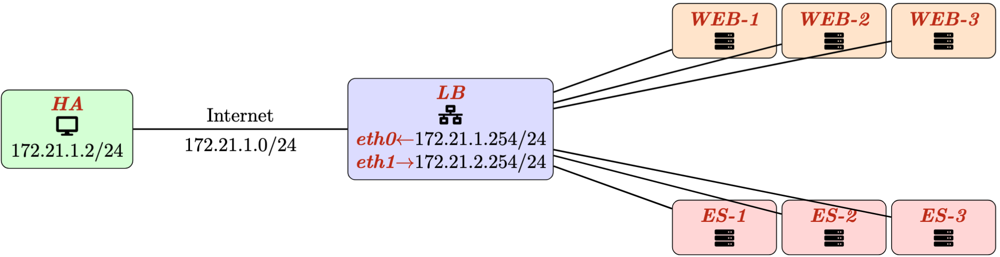
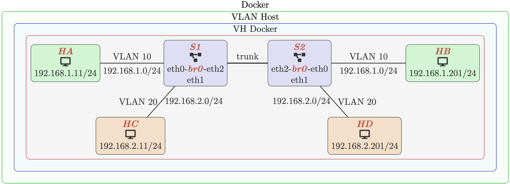

# Lab 27 - Loadbalancing and VLANs

This exercise first introduces load balancing using Nginx reverse proxy, and then continues with VLAN configuration and verification.

## Learning Objectives

- Understand basic VLAN behavior
- Understand 802.1Q VLAN tags
- Verify access ports, trunk ports, and VLAN isolation
- Understand Load Balancing using Reverse Proxy
- Differentiate between load balancing of web traffic and general TCP traffic


## Environment

Docker Desktop, which is an application environment for your laptop environment that enables running of containerized applications. The Docker Desktop integrates and provides access to a vast ecosystem of docker images via Docker Hub.

## Load Balancing using Nginx Reverse Proxy

### Network Topology

This network setup is used to learn and practically experience functioning of load balancing in a network. 
- Load balancing in a network is implemented many ways, but in this exercise, we will focus on following two mechanisms.
- Load Balancing using Reverse Proxy (nginx) as shown in figure below. 
- The TCP connection from client terminates at Load Balancer and a new connection is established between load balancer and backend server.



Further, in this exercise, we will implement load balancing at both of the following protocol levels.

- HTTP Based load balancing, which is primarily used for balancing web traffic among servers, and
- TCP Based load balancing.

### Load Balancing using Reverse Proxy

#### Creating Network

The network using nginx reverse proxy does load balancing for web traffic at HTTP Protocol level as well as at TCP level. 
- Since this network is using nginx, it requires a configuration file to be provided at the time of starting the load balancer. 
- A sample configuration is available is available below. 
- This network consists of 3 web servers (Apache web server) and 3 TCP echo servers. 
- TCP echo server simply echoes back the user input prefixing it with its local IP address to help in identification of the echo server who is serving the request. 
- Load balancer listens on port 80 for web traffic and port 9000 for echo service. 
- The actual echo server uses the port number 5555 as shown. When docker instances are created, it prefixes the current directory name with the server. 
- In this example, current directory is "yml" and hence all the 3 web servers and echo servers are prefixed with "yml-". If your directory is different, modify this file accordingly.
```json
events {}

stream {
  upstream echoservers {
    server yml-echoserver-1:5555;
    server yml-echoserver-2:5555;
    server yml-echoserver-3:5555;
  }
  server {
       listen 9000;
       proxy_pass echoservers;
  }
}


http {
  upstream backend {
    server yml-web-1:80;
    server yml-web-2:80;
    server yml-web-3:80;
  }
  server {
       listen 80;
       location / {
         proxy_pass http://backend;
       }
  }
}

```


Create the network as shown in above using `multi-LB-web-echo.yml` as below. 
- As load balancer is using 3 web servers and 3 echo server, there number needs to be specified at the time of creating the network with the option `--scale`.
- `docker compose -f util/yml/multi-LB-web-echo.yml up -d --scale web=3 --scale echoserver=3`

Thus, this should create 7 instances as shown above. 
- The load balancer is listening on port 80 for web and port 9000 for TCP Echo service.
- Confirm the creation using `ps`:
  - `docker ps`


#### Load Balancing - TCP Echo Server

Open few terminal windows and using netcat client, connect to localhost on port 9000 and communicate with it. 
- Each response will show the Echo Server IP address before echoing back the text. 
- You are doing this from your machine not the docker container, use `ncat` or `nc`

On Terminal 1: `nc localhost 9000`
```
Hello From Terminal 1
172.21.2.4: HELLO FROM TERMINAL 1
```

On Terminal 2: `nc localhost 9000`
```
Hello From Terminal 2
172.21.2.6: HELLO FROM TERMINAL 2
```

On Terminal 3: `nc localhost 9000`
```
Hello From Terminal 3
172.21.2.2: HELLO FROM TERMINAL 3
```


#### Load Balancing - Web Service

Since all web servers serve the same content and thus from the web client perspective (curl or browser), we can't identify the web server which is serving the web page unless the content contains some unique information about the web server. 
- For this purpose, the cgi-bin program index.cgi is used to display the IP address of the web server. 
- Thus, to recognize the functioning of web server load balancing, access the URL `<http://localhost/cgi-bin/index.cgi>` few times using `curl`, and its content will display the local IP address of the web server. This is one multiple times from same terminal
  - `curl http://localhost/cgi-bin/index.cgi`
- This helps us recognize the web server from which the web content is being server. 
- The response below, which is only parts of the web for the sake of brevity, shows that every curl is treated by different web servers. 

```html
<html> 
  <body>
    ...
    This response is from web server: 
    172.21.2.5
  </body> 
</html>
```

```html
<html> 
  <body>
    ...
    This response is from web server: 
    172.21.2.7
  </body> 
</html>
```

```html
<html> 
  <body>
    ...
    This response is from web server: 
    172.21.2.3
  </body> 
</html>
```

### Exploration of Load Balancing

To develop a better understanding of load balancing, create different combinations of echo servers and web servers and load balance traffic among them. 
- For example, create only 2 TCP echo servers, and 5 web servers and then access these. 
- Choose port numbers of your choice. Access different contents from the web server an recognize the functioning of nginx based load balancing.


## Virtual Local Area Network

### Network Topology

In this exercise we will use `multi-vlan-host`. At a high level, the VH is a Docker container that gives access to a prepared Linux environment named `VH` (VLAN Host). 
- Inside `VH`, create the VLAN topology and complete the networking tasks from a terminal.
- This is done because VLAN requires native Linux kernel.



The network consists of:
- two switches: `S1`, `S2`
- four hosts: `HA`, `HB`, `HC`, `HD`
  - Hosts `HA` and `HB` belong to VLAN `10`.
  - Hosts `HC` and `HD` belong to VLAN `20`.

Broadcast and unicast traffic within one VLAN should not be visible to
hosts in the other VLAN.

#### Starting the VH

Start the prepared VH using the following command:
- `docker run --rm -dit --privileged --pid=host --hostname VH -v /var/run/docker.sock:/var/run/docker.sock  --name VH zizutg/multi-vlan-host:latest`

If pulling the image from Docker Hub is unsuccessful, build the image locally from the `util/df` directory and then run it:

- `docker build -f util/df/multi-vlan-host.df -t multi-vlan-host .`
- `docker run --rm -dit --privileged --pid=host --hostname VH -v /var/run/docker.sock:/var/run/docker.sock --name VH multi-vlan-host`


- The `-v` mounts the Docker socket from the local machine into 
  -  `-v /var/run/docker.sock:/var/run/docker.sock`
- The `pid` shares the host PID namespace with the container

Access the VH using docker exec, once inside, the prompt should appear similar to:
- `root@VH:/#`

VH contains 5 important file, which are also available in our repo under `util/df/Programs`, that allows us to create the VLAN.
- `multi-vlans.yml`
- `vlan0-create-interfaces.sh`
- `vlan1-create-bridge-if-inside-switch.sh`
- `vlan2-create-vlans.sh`
- `vlan3-assign-ips.sh`

Confirm if the following five files are already available at the root of the VH:
- `root@VH:/# ls -l`

To view the files inside VH, you can use `cat`
- `root@VH:/# cat vlan0-create-interfaces.sh `

#### Creating the VLAN Topology

On the terminal VH is accessed, start the containers. Note that this docker compose occurs inside VH not vlan
- `root@VH:/# docker-compose -p vlans -f /multi-vlans.yml up -d`
  - These containers are initially created without the final VLAN topology.

Create interfaces for each that is quired to connect `veth` pairs:
- `root@VH:/# ./vlan0-create-interfaces.sh`
  - This creates the required `veth` pairs and connects:
    - `HA` to `S1`
    - `HC` to `S1`
    - `HB` to `S2`
    - `HD` to `S2`
    - `S1` to `S2` as a trunk link

Create bridge `br0` inside `S1` and `S2`, which attaches the switch
ports to the bridge, and enables VLAN filtering.
- `root@VH:/# ./vlan1-create-bridge-if-inside-switch.sh`

Create VLANs
-` root@VH:/# ./vlan2-create-vlans.sh`      
  - This configures:
    - VLAN `10` on `S1` and `S2`
    - VLAN `20` on `S1` and `S2`
    - access ports for the end hosts
    - a trunk port between `S1` and `S2`

The final step is to assigns IP addresses to the hosts and enables their interfaces.
- `root@VH:/# ./vlan3-assign-ips.sh `

#### Check Connectivity

Access HA from another terminal, although this is a docker inside another docker, the Docker Desktop appliaction allows us to access it in similar fashion to the past `docker exec -it HA bash`.
- Check if HB is reachable from HA
  - `root@HA:/# ping -c 2 192.168.1.201`
- Confirm HC is not reachable from HA
  - `root@HA:/# ping -c 2 192.168.2.201`

### Packet Capture

Use `tcpdump` to compare trunk traffic and host traffic.
- Capture on the switch trunk at `S1`:
  - `root@S1:/# tcpdump -e -n -i s1-eth2`
- The result below will be shown after you sent a ping message from HA. 
```
tcpdump: verbose output suppressed, use -v[v]... for full protocol decode
listening on s1-eth2, link-type EN10MB (Ethernet), snapshot length 262144 bytes
16:28:09.953335 42:8d:ed:dd:64:69 > 0e:0f:78:96:bd:d7, ethertype 802.1Q (0x8100), length 102: vlan 10, p 0, ethertype IPv4 (0x0800), 192.168.1.11 > 192.168.1.201: ICMP echo request, id 6, seq 1, length 64
16:28:09.953668 0e:0f:78:96:bd:d7 > 42:8d:ed:dd:64:69, ethertype 802.1Q (0x8100), length 102: vlan 10, p 0, ethertype IPv4 (0x0800), 192.168.1.201 > 192.168.1.11: ICMP echo reply, id 6, seq 1, length 64
16:28:10.958150 42:8d:ed:dd:64:69 > 0e:0f:78:96:bd:d7, ethertype 802.1Q (0x8100), length 102: vlan 10, p 0, ethertype IPv4 (0x0800), 192.168.1.11 > 192.168.1.201: ICMP echo request, id 6, seq 2, length 64
16:28:10.958265 0e:0f:78:96:bd:d7 > 42:8d:ed:dd:64:69, ethertype 802.1Q (0x8100), length 102: vlan 10, p 0, ethertype IPv4 (0x0800), 192.168.1.201 > 192.168.1.11: ICMP echo reply, id 6, seq 2, length 64
16:28:11.983071 42:8d:ed:dd:64:69 > 0e:0f:78:96:bd:d7, ethertype 802.1Q (0x8100), length 102: vlan 10, p 0, ethertype IPv4 (0x0800), 192.168.1.11 > 192.168.1.201: ICMP echo request, id 6, seq 3, length 64
16:28:11.983217 0e:0f:78:96:bd:d7 > 42:8d:ed:dd:64:69, ethertype 802.1Q (0x8100), length 102: vlan 10, p 0, ethertype IPv4 (0x0800), 192.168.1.201 > 192.168.1.11: ICMP echo reply, id 6, seq 3, length 64
16:28:15.372178 42:8d:ed:dd:64:69 > 0e:0f:78:96:bd:d7, ethertype 802.1Q (0x8100), length 46: vlan 10, p 0, ethertype ARP (0x0806), Request who-has 192.168.1.201 tell 192.168.1.11, length 28
16:28:15.372179 0e:0f:78:96:bd:d7 > 42:8d:ed:dd:64:69, ethertype 802.1Q (0x8100), length 46: vlan 10, p 0, ethertype ARP (0x0806), Request who-has 192.168.1.11 tell 192.168.1.201, length 28
16:28:15.372230 42:8d:ed:dd:64:69 > 0e:0f:78:96:bd:d7, ethertype 802.1Q (0x8100), length 46: vlan 10, p 0, ethertype ARP (0x0806), Reply 192.168.1.11 is-at 42:8d:ed:dd:64:69, length 28
16:28:15.372232 0e:0f:78:96:bd:d7 > 42:8d:ed:dd:64:69, ethertype 802.1Q (0x8100), length 46: vlan 10, p 0, ethertype ARP (0x0806), Reply 192.168.1.201 is-at 0e:0f:78:96:bd:d7, length 28
16:29:02.476992 b2:74:5f:11:b4:36 > 33:33:00:00:00:02, ethertype IPv6 (0x86dd), length 70: fe80::b074:5fff:fe11:b436 > ff02::2: ICMP6, router solicitation, length 16
```

- Capture on host `HB`:
  - `root@HB:/# tcpdump -e -n -i hb-eth0`
- The result below will be shown after you sent a ping message from HA. 
```
tcpdump: verbose output suppressed, use -v[v]... for full protocol decode
listening on hb-eth0, link-type EN10MB (Ethernet), snapshot length 262144 bytes
16:28:09.953504 42:8d:ed:dd:64:69 > 0e:0f:78:96:bd:d7, ethertype IPv4 (0x0800), length 98: 192.168.1.11 > 192.168.1.201: ICMP echo request, id 6, seq 1, length 64
16:28:09.953641 0e:0f:78:96:bd:d7 > 42:8d:ed:dd:64:69, ethertype IPv4 (0x0800), length 98: 192.168.1.201 > 192.168.1.11: ICMP echo reply, id 6, seq 1, length 64
16:28:10.958208 42:8d:ed:dd:64:69 > 0e:0f:78:96:bd:d7, ethertype IPv4 (0x0800), length 98: 192.168.1.11 > 192.168.1.201: ICMP echo request, id 6, seq 2, length 64
16:28:10.958256 0e:0f:78:96:bd:d7 > 42:8d:ed:dd:64:69, ethertype IPv4 (0x0800), length 98: 192.168.1.201 > 192.168.1.11: ICMP echo reply, id 6, seq 2, length 64
16:28:11.983147 42:8d:ed:dd:64:69 > 0e:0f:78:96:bd:d7, ethertype IPv4 (0x0800), length 98: 192.168.1.11 > 192.168.1.201: ICMP echo request, id 6, seq 3, length 64
16:28:11.983207 0e:0f:78:96:bd:d7 > 42:8d:ed:dd:64:69, ethertype IPv4 (0x0800), length 98: 192.168.1.201 > 192.168.1.11: ICMP echo reply, id 6, seq 3, length 64
16:28:15.371997 0e:0f:78:96:bd:d7 > 42:8d:ed:dd:64:69, ethertype ARP (0x0806), length 42: Request who-has 192.168.1.11 tell 192.168.1.201, length 28
16:28:15.372210 42:8d:ed:dd:64:69 > 0e:0f:78:96:bd:d7, ethertype ARP (0x0806), length 42: Request who-has 192.168.1.201 tell 192.168.1.11, length 28
16:28:15.372227 0e:0f:78:96:bd:d7 > 42:8d:ed:dd:64:69, ethertype ARP (0x0806), length 42: Reply 192.168.1.201 is-at 0e:0f:78:96:bd:d7, length 28
16:28:15.372233 42:8d:ed:dd:64:69 > 0e:0f:78:96:bd:d7, ethertype ARP (0x0806), length 42: Reply 192.168.1.11 is-at 42:8d:ed:dd:64:69, length 28
16:30:08.012097 ee:92:34:6a:41:d6 > 33:33:00:00:00:02, ethertype IPv6 (0x86dd), length 70: fe80::ec92:34ff:fe6a:41d6 > ff02::2: ICMP6, router solicitation, length 16
16:32:19.085566 0e:0f:78:96:bd:d7 > 33:33:00:00:00:02, ethertype IPv6 (0x86dd), length 70: fe80::c0f:78ff:fe96:bdd7 > ff02::2: ICMP6, router solicitation, length 16
```

Then generate traffic from `HA`:
- `root@HA:/# ping -c 3 192.168.1.201`

Expected observation:

- on `S1` trunk interface, packets should appear with `802.1Q` VLAN tags
- on `HB`, packets should appear untagged on the access interface
- ARP packets appear after successful `ping` traffic because Linux can reuse a cached MAC mapping first and refresh the ARP entry later.

### More Exploration

Send `ping` packets from `HC` to `HD` and analyze packet captures at the following points:

- `HC`
- `S1` on `s1-eth1`
- `S1` on `s1-eth2`
- `S2` on `s2-eth2`
- `S2` on `s2-eth1`
- `HD`

As you examine the captures, observe that VLAN tags are used only on the trunk link between the two switches, namely:

- `S1` on `s1-eth2`
- `S2` on `s2-eth2`

The access ports connected to end hosts should carry normal untagged Ethernet frames.

Further, try to ping `HC` and `HD` from `HA`. These pings should fail. This is because such traffic is inter-VLAN traffic, and communication between different VLANs requires a router or Layer 3 device to forward packets between the VLANs.


#### Observing ARP Before ICMP

If you want to clearly observe the initial ARP exchange before the ICMP packets, restart the VLAN lab and perform packet capture before testing connectivity. A good approach is:
1. stop and recreate the VLAN topology
2. run the VLAN setup scripts again
3. start `tcpdump` first
4. send the first `ping` only after capture has already started
5. skip any earlier connectivity test before this observation


### Stopping the Lab

Inside `VH`:
- `root@HA:/# docker-compose -p vlans -f multi-vlans.yml down --remove-orphans`


### Summary

In this exercise, we have studied and learnt the following:
- built a two-switch VLAN topology using Linux bridges with VLAN filtering
- verified access-port, trunk-port, and host-to-host communication behavior
- confirmed VLAN isolation and observed tagged trunk traffic with `tcpdump`
- Load balancing of web traffic using nginx as reverse proxy
- Load balancing of TCP traffic using nginx as reverse proxy


## Learning Resources

- Computer Networks - A Top Down Approach, v8, Kurose, Ross; Pearson
  publishing