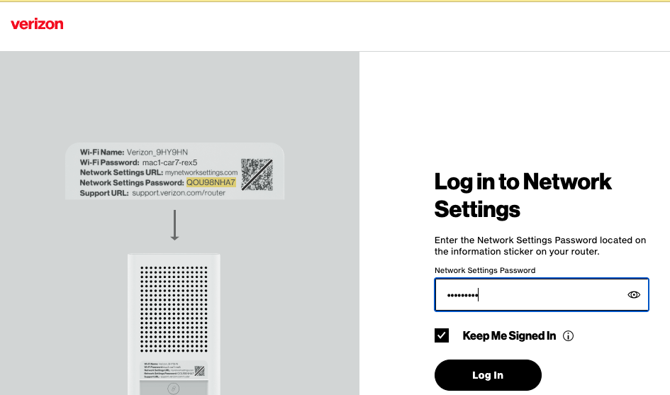
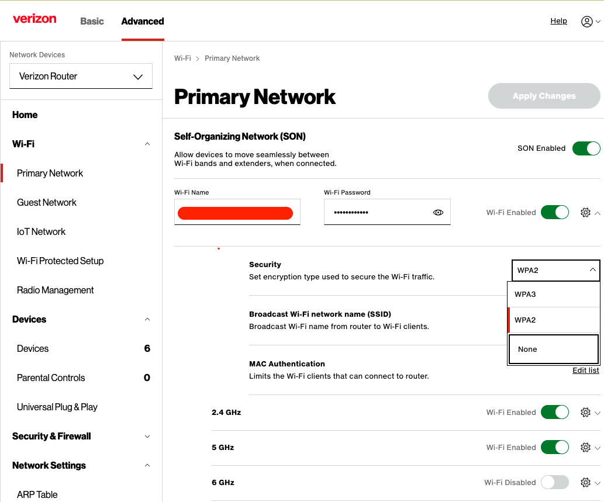
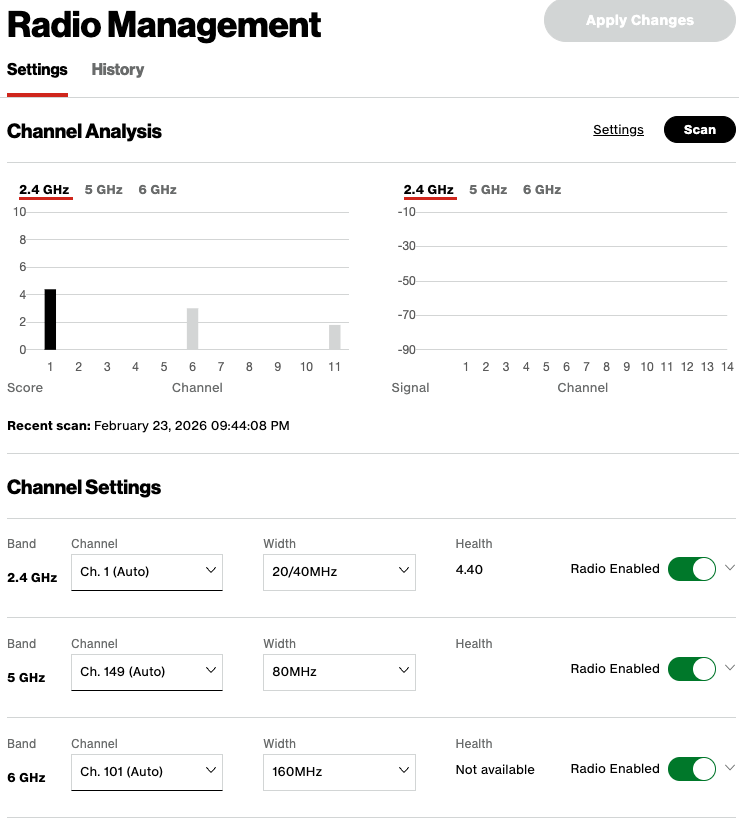
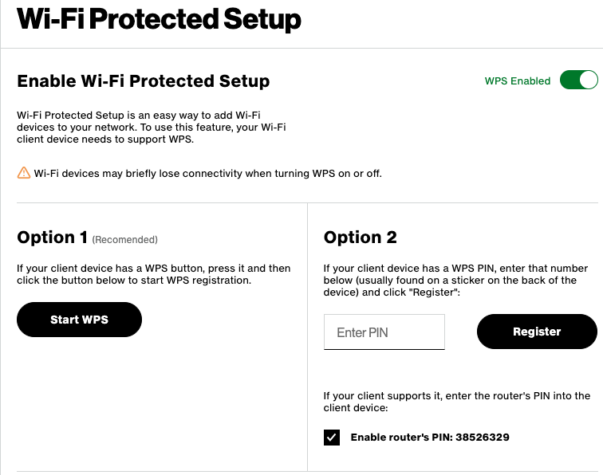
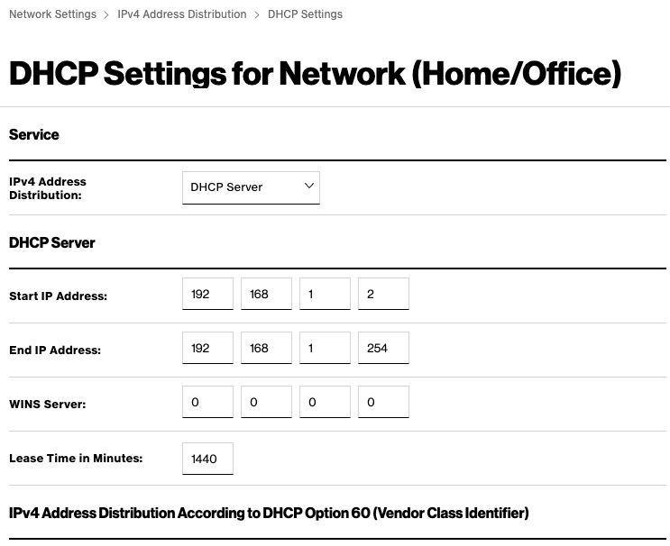
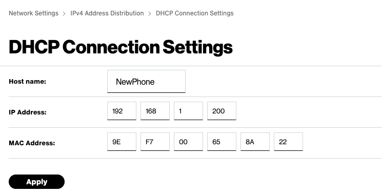
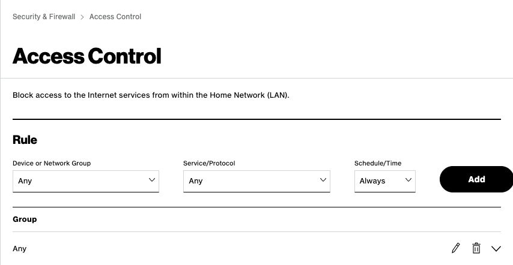
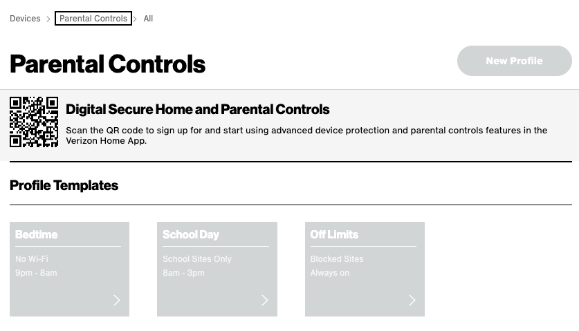

# Lab 28 - WiFi Connectivity, Authentication, and Access Control

This exercise provides basic understanding of WiFi Connectivity in
home/office network, configuring DHCP Service, 
and security control on Wi-Fi Router.

## Learning Objectives

- Understand WiFi AP/Router configuration
- Understand SSId management
- Configure WiFi Authentication.
- Understand DHCP server configuration
- Implement MAC filtering
- Implement Access Control List

## Environment 

This exercise requires working with a Wifi Router/Access Point and your laptop (or device) (Something to try at home). 
- It would be greatly helpful if WiFi Router is connected to Wired LAN port for internet connectivity and access. 
- At times, without this connectivity, the configuration may not be completed successfully.

***This lab can be done via any router at work or home. Before you make any changes make sure you have copy of the original settings.***

## Description

In this exercise, Verizon Wi-Fi Router is used to describe the exercise for illustrative purposes. 
- For any other Wi-Fi Access Point/Router, screen layout or menu/options may be somewhat different in GUI interface, but similar concepts would be applicable. 
- The exercise will describe setting up both Access Point functionality as well as Wi-Fi Router functionality. 
- It is assumed that you will be working with factory reset Wi-Fi Router. 
- Thus, it is recommended that the Wi-Fi Router be reset to factory default before starting the setup.

### Initial Setup

#### Powering up Wi-Fi Router/AP

If your AP is not already connected and powered on:
- Power on the AP/Router, and connect its internet port to office LAN wall jack using RJ45 cable.

Make a note of the `factory/ISP default setting` i.e., its SSID and Password, which can be typically found at the backside label of the device. 
- After power on of the Wi-Fi Router, wait till its status light indicators show that it is connected correctly.

#### Connecting to AP/Router for Configuration

On your laptop, select the Wi-Fi Network (e.g., VERIZON_EB3D_5G) as broadcast by AP/Router and connect to it. 
- Once Wifi is connected, open a browser on your laptop, and enter the IP address of WiFi Router (as given in quick start guide) which would typically be 192.168.x.1, where x would 0,1, 2 or 3. 
- This will open a set up page for Wi-Fi Router. 
- If this device is starting from factory default setting, it may ask to reset the password to a new value. 
  - Create a password of your choice and then access the setup GUI for setting up the AP/Router.
- Otherwise, enter the password that you get from the back of the device and login.

#### Band Selection

Most Access Points work in dual band i.e., 2.4GHz and 5GHz (New models can have triple band with 6GHz). 
- Find the menu item for radio/dual band and enable both. 
- Configure extra options if available for these bands as follows

**2.4GHz Frequency Band**

- This band supports 802.11b, 802.11g and 802.11n mode .
  - Most modern devices are configured to use 802.11n mode, it is recommended to enable all three of these modes.
- This frequency band supports 11 channels and rather than fixing any particular channel, configure it in Auto Mode 
  - i. e., let AP determine the best channel available in the location where it is installed.
- Further, set the channel width to Auto mode instead of 20MHz or 40MHz. 
  - The latter gives more bandwidth, but may also cause more interference with neighboring devices when more number of devices are connected to it.
- Enable broadcast of SSID. If this is not enabled, then this AP will not be discoved by user device (e.g., laptop, phone etc.)

**5GHz Frequency band**

- This frequency band supports 802.11a, 802.11n and 802.11ac mode.
  - Most current devices today supports 802.11ac, but it is recommended to configure it with mixed mode using all 3 options.
- Choose the channel in Auto mode for best operations.
- Choose Channel width in Auto mode for best operations.

### Configuring Authentication

The access point typically provides following 3 types of wireless authentication, `see the second image`.

**No authentication (disable authentication)**
- This implies that no authentication i.e., any user who can see the
- SSID from the AP/Router, can connect to it. 
  - It is strongly recommended this authentication method is not used in office/home. 
- This option may however be useful in a public place e.g., library, park, etc. 

**WPA/WPA2/WPA3 Personal**

- This is the preferred authentication method to be used for home/office setup where all users connecting to WiFi AP/Router know and trust each other. 
  - In this exercise, you may select this option.
- From the given Encryption option, use AES if available, else TKIP. 
  - AES provides better encryption security.
- Specify the password and remember the same. This will be used by all users connecting to AP/Router. 
  - If all users don't know each other, this can be a security risk.
- The drawback of this option is that if any one user leaves the group, this password needs to be changed and informed to all other users.

**WPA/WPA2 Enterprise**

- This option is to be selected in a larger office environment, where the organization maintains a separate authentication server, e.g., Active Directory (AD) server or Radius Server. 
  - If so, enter the IP Address of that server and related information. We will not use this option.

**Guest Network Access**

- If Wi-Fi AP/Router provides guest network access separately, then enable it and configure it. 
  - Define a separate SSID and password for the guest, and isolate it from accessing local network. 
  - This will provide security to local users and provide access to visiting guests to your home/office.
- If AP/Router provides bandwidth control, enable the same and define the limit for incoming and outgoing traffic. 
  - This ensures that guest does not consume the entire internet bandwidth.

#### WPS Access
Most current routers provide Wi-Fi Protected Setup (WPS) for connecting a device quickly using a PIN. 
- The device must support WPS Connectivity. 
- To enable this support, configure the WPS option, and enter 8-digit pin value. 
- The WPS standard defines the PIN to be 8 digits.

To connect a new device using PIN, press the WPS button on Wi-Fi router, and connect the device within 2 minutes. 
- On the device, user need to enter the specified PIN and device will be connected using WPN in a quicker way.

### Configuring DHCP

When a device (laptop/phone etc.) connects to Wi-Fi Router, it needs to get the IP address, subnet mask, default router, DNS server etc. so as access internet successfully. 
- The RFC 1918 provides the private address ranges for public use, i.e., any one can use these IP addresses in their local setup with requiring any permissions/approvals. 

This RFC provides the three reserved ranges as below:

- 10.0.0.0 - 10.255.255.255, with a subnet prefix of /8. 
- 172.16.0.0 - 172.31.255.255 with a subnet prefix of /16. That is, there are 16 ranges that can be used. These 16 ranges are 172.16.0.0/16, 172.17.0.0/16, ..., 172.31.0.0/16.
- (192.168.0.0 - 192.168.255.255, with a subnet prefix of /24. That is, there 256 ranges that can be used. These 256 ranges correspond to 192.168.0.0/24, 192.168.1.0/24, ..., 192.168.255.0.0/24.

Normally, for a home/office network where number of connecting devices are less in numbers (e.g., less than 200), most setup use the the `192...` range

#### Configuration of IP Range

To configure your selected range in the Wi-Fi router, login to the AP/router, select DHCP option, and enter the values in the DHCP server settings. 

The figure above shows the network `192.168.1.0/24` being used for DHCP, with the default gateway set to `192.168.1.254`.

- A common convention is to use either the first assignable IP address or the last assignable IP address in the subnet for the default gateway.
- In this subnet, `192.168.1.0` is the network address and `192.168.1.255` is the broadcast address, so neither can be assigned to hosts.
- In the figure above, the DHCP pool starts at `192.168.1.2` and ends at `192.168.1.254`.

In this DHCP server configuration, the address `192.168.1.1` is not included in the DHCP pool and is therefore reserved.

- As a general practice, the full assignable host range is not always used for DHCP, and some addresses are reserved for routers, servers, or static configuration.
- You should choose appropriate start and end addresses for the DHCP pool based on the network design.

Another parameter that needs to be configured is lease time. 
- The DHCP server assigns the IP Address for a limited period determined by lease time. 
- After expiry of lease time, the device needs to renew the IP Address. 
- Typically, in home or small office setup, this value is kept at 1 to 2 days, whereas in public places e.g., library, airports etc., the lease time is defined to be 1 to 2 hrs. 
- This is because in the public places, a user is expected to use the internet connectivity for shorter duration.

Another parameter that must be configured is DNS server. 
- These are typically provided by your internet service provider (ISP) and may not be shown. 
  - If provided enter those values in these fields, in DNS settings. 
- If not known, then you can specify open DNS servers such as 8.8.8.8 (by Google) and 1.1.1.1 (by Cloudfare).

If you are working on spare AP, save the settings and this will be effective immediately. 
- In case you have changed the range, it is likely that you will be disconnected and need to be connected again as you will get a new IP address from DHCP Server.

#### Configuring Reserved Addresses

For some of the fixed/static device in home/office setup, it is preferred that these devices be assigned a fixed IP address. 
- Either these can be manually assigned to the device or configured in the DHCP Server to always assign the same address. 
- Use the **Address Reservation** option in AP/Router setting and enter the MAC address of the device and associated reserved IP address. 
- An example of such a setup is shown below. 
- This reserved IP address is also used when you would like to put security control for different devices in the Wi-Fi Router.

### Configuring Security Controls

A Wi-Fi router provides different choices for security control access. 
- At the base level, most AP/Router provides MAC filtering, Access Control Lists etc.

#### MAC Filtering

This option, if provided, requires you to enter the MAC addresses of devices which should be always given (or denied) full access to network users or internet. 
- For example, if a internet enable TV is to be given full access, its MAC address should be entered in such a list and it should be given full access. 
- Similarly, if few devices or hosts (e g., a server in the local network) needs to be provided unrestricted access, their MAC addresses should be entered here.
- Further, if some devices should not be given access from internet (e g., printer, thermostat, security access devices), there MAC address should be configured and access should be denied.
- Thus, primarily which needs to be given (or denied) Internet access, enter their MAC addresses accordingly.

#### Access Control Lists

Often, you would like to define rules limiting the access of some
devices to certain internet sites and these devices should not be given full internet access. 
- For example, printer should be able to access its manufacturer website for driver/software update. 
- Then, these devices should be first added into Reserved IP Addresses and then added to Access control List specifying which targets are allowed for access and during what time. 
- You need to be careful when adding rules to ACL. 
- ACL also has a default policy of deny or allow. Choose it as per your need. 
- Use default deny if you are pessimistic and want to explicitly identify and permit known users for internet access. 
- Choose default Allow, if you are optimistic and generally want to allow everyone except selected few who should be denied internet access. 
- These ACL rules can become complicated especially if a large number of such rules are defined and thus defined them judiciously.

#### Other Security Controls

Some WiFi routes provides explicit parental control. 
- This option is generally used for children, K-12 schools, where you would like to provided internet access during specified hours. 
- If such a situation applies, then define these rules accordingly.

#### Bandwidth Control

At times, especially in a small office setup with limited internet bandwidth, you would like to put bandwidth control for users so that some unscrupulous users do not consume the entire bandwidth. 
- One example, is guest network access. 

Define the bandwidth control policies as per your requirements and implement the same by configuring the values accordingly. 
- However, it should be noted that such configuration often results in disgruntled users and may lead to political issues. So, use such controls in a judicious manner.

## Summary

In this exercise, we have studied and learnt the following

-  Configuring Wi-Fi Bands (2.4GHz and/or 5GHz) and channel parameters
-  Configuring Authentication methods (WPA-PSK vs WPA Enterprise)
-  Configuring SSID and enabling its broadcast.
-  Enabling WPS for authentication.
-  DHCP Server configuration
-  MAC filtering
-  Access Control Lists for security control

## Learning Resources

- Computer Networks - A Top Down Approach, v8, Kurose, Ross; Pearson publishing
