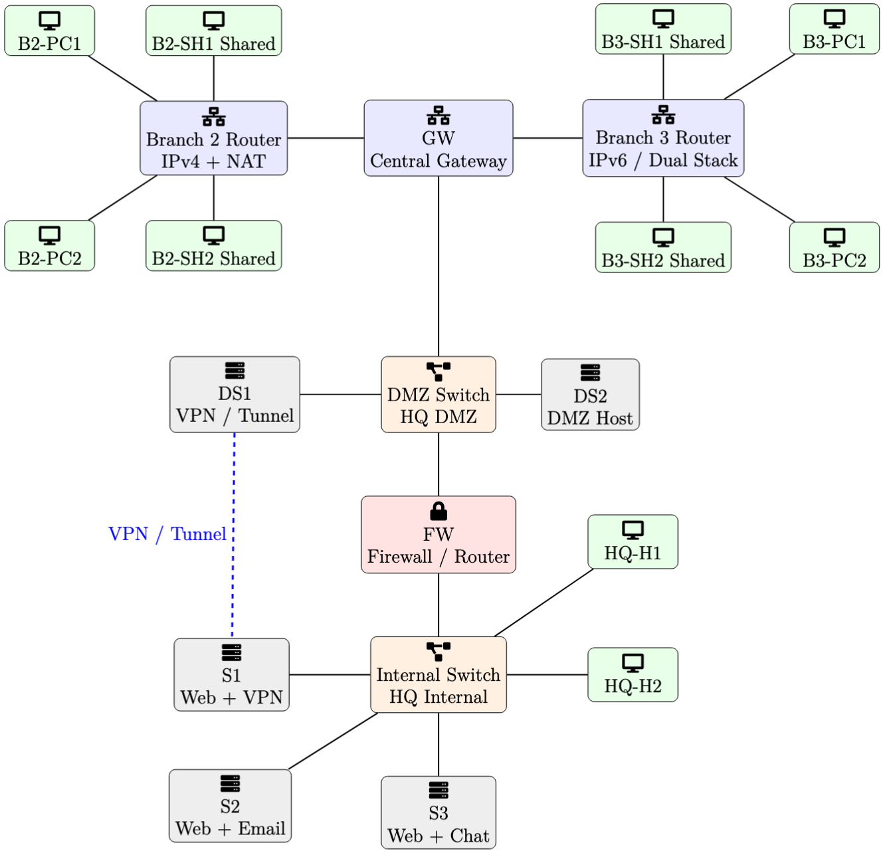

# Capstone Project - Enterprise Network Design and Service Deployment

This capstone project brings together the major concepts covered in the course into one practical network build. 
- Implement, configure, test, and document a small enterprise-style environment consisting of one headquarters and two branches based on an instructor-provided topology diagram. 
- The final network must support secure communication, multiple application services, controlled access between network zones, and evidence-based verification using packet captures.

The project is intended to resemble a realistic deployment task rather than an isolated protocol exercise. 
- Configure the network, demonstrate that the required services work, verify that restricted traffic is blocked where appropriate, and explain the observed packet flow at key points in the network.
- Create the Docker Compose YAML file or files required to instantiate the topology from the provided diagram.

The purpose of the capstone is to bring together the practical skills developed across the course and reflect on how the different networking concepts work together in one integrated environment.
- The topology provided below and should be used as the reference for building the network.

## Learning Objectives

- Apply IP addressing, routing, and subnetting in a multi-network environment
- Configure Linux hosts, services, and user/group settings
- Deploy and verify web, HTTPS, email, and chat services
- Implement firewall rules and NAT behavior
- Use SSH tunneling or VPN-style connectivity for controlled access
- Demonstrate load balancing across multiple backend web servers
- Capture and interpret traffic using `tcpdump`

## High-Level Topology

The capstone uses a hub-and-spoke style enterprise topology.
- Headquarters contains:
  - a central gateway `GW`
  - a DMZ network
  - a firewall `FW`
  - internal servers `S1`, `S2`, and `S3`
  - two internal client hosts `H1` and `H2`
- Branch 2 is a traditional IPv4 branch:
  - one branch router
  - four hosts
  - two of the hosts are shared multi-user systems
  - the branch router performs NAT
- Branch 3 is an IPv6 branch:
  - one branch router with dual-stack connectivity
  - four hosts
  - two of the hosts are shared multi-user systems
  - all branch hosts use IPv6
- `DS1` and `S1` play the tunnel / VPN role between the external and internal sides

***For clarity, the topology diagram may show LAN segments as if they are connected through switches. In the Docker implementation, realize these LAN segments using Docker bridge networks rather than separate switch containers, unless you choose to extend the design further.***
## Required Network Zones

At minimum, the design must include the following logical zones:
- Headquarters DMZ
- Headquarters internal network
- Branch 2 IPv4 network
- Branch 3 IPv6-capable network

## Required Services

Deploy and demonstrate the following services:
- Web service over HTTP
- Web service over HTTPS
- Email service
- Chat service
- Load-balanced web access across three internal servers

For demonstration purposes, browser-accessible services should be made reachable from the local machine through the DMZ-facing host `DS1`. 
- This allows selected services to be demonstrated using a local browser such as Chrome or Mozilla while still preserving the intended network design in which internal services are not directly exposed. 
- A typical approach is to use `DS1` as the external entry point on HTTP and/or HTTPS and then forward or proxy traffic to the appropriate internal service.

### Hint for Local Browser Access

Consider carefully how browser-based access from the local machine will reach the protected services.

Useful hints include:
- expose selected `DS1` service ports to the local machine through Docker
- consider making `DS1` listen on:
  - `80` for HTTP
  - `443` for HTTPS
- forward or proxy requests from `DS1` to the intended internal service
- ensure that the required firewall rules allow the chosen path

If SSH reverse port forwarding is used on `DS1`, the SSH server configuration on `DS1` may need to be updated. 
- One previously used method was:
  - edit `/etc/ssh/sshd_config`
  - set `GatewayPorts clientspecified`
  - restart the SSH service

Use a reverse proxy, port forwarding, or another technically sound design, as long as the path from the local browser to the correct internal service can be explained clearly.

Recommended service roles:
- `S1`: web service and tunnel/VPN endpoint
- `S2`: web service and email service
- `S3`: web service and chat service

## User and Host Requirements

Branch 2 and Branch 3 must each contain four hosts.
- Two hosts in each branch should act as regular client machines
- Two hosts in each branch should act as shared systems
- Shared systems must support multiple users
- Users on shared systems must belong to one of two groups

This requirement is intended to incorporate Linux user, group, and permission management into the project.

## Functional Requirements

Design and configure the network so that:
- Required services are reachable from the appropriate hosts
- Traffic between security zones is controlled through policy
- Branch 2 communicates through an IPv4/NAT design
- Branch 3 communicates using IPv6-capable connectivity
- Tunnel/VPN behavior is demonstrated through `DS1` and `S1`
- Internal web traffic can be distributed across `S1`, `S2`, and `S3`

Clearly document which flows are:
- allowed
- denied
- tunneled
- translated through NAT

## Verification Requirements

Demonstrate the design using both application-level tests and packet-level evidence.

Examples of application tests include:
- `ping`
- `curl`
- `nc`
- HTTPS access
- email interaction
- chat/message exchange

Examples of useful packet capture points include:

- branch routers
- `GW`
- `FW`
- `DS1`
- `S1`

Do not only collect packet captures; explain what the captures show. For example:

- normal forwarding behavior
- NAT translation
- firewall blocking
- tunnel encapsulation
- load-balanced web requests

## Expected Work

Use the topology diagram to build the network, configure the required services, test the design, and reflect on the observed behavior.

As part of the capstone activity, prepare to show:

- the Docker Compose YAML file or files used to create the topology
- the addressing and subnet plan
- the main configuration commands or scripts used to build the network
- the required services working in the intended way
- selected `tcpdump` captures with short explanations
- major troubleshooting steps, if any were needed

## Presentation Requirement

A short presentation of approximately 10 minutes may also be required.
- Because everyone is working from the same provided topology, the presentation should not focus on redrawing or restating the full network diagram. Instead, emphasize implementation, verification, and lessons learned.

The presentation should include:

- a brief summary of how the network was implemented
- key configuration decisions such as routing, firewall policy, NAT, tunneling, or service placement
- evidence that the required services worked as expected
- one or more meaningful packet captures and a short explanation of what they show
- one or two important troubleshooting problems and how they were resolved
- a short reflection on what security or design improvements could be made in a real deployment

## Recommended Work Structure

A useful way to approach the capstone is to break the work into the following areas. 
- This structure works whether you are working individually or as a team.

If you choose to collaborate, begin by sitting together to understand the topology and create a shared working document. 
- Use this document to record the addressing plan, major configuration steps, important commands, and references to earlier labs.
-  Team members may then divide the work into separate areas, test their parts individually, and finally integrate and validate the full network together.

### Topology and Planning

- agree on addressing, interfaces, routes, zones, and service placement
- maintain a working document with commands, notes, and references to earlier labs

### YAML / Container Topology Setup

- create and validate the Docker Compose file
- ensure all containers, links, and networks match the provided diagram

### Router and Gateway Configuration

- routing
- forwarding
- NAT where required
- IPv4 / IPv6 setup

### Firewall and Access Policy Configuration

- implement filtering rules
- verify allowed and blocked flows
- configure secure paths where required

### Host Configuration

- user accounts
- IP configuration
- SSH setup
- shared-host user/group setup

### Service Configuration

- web / HTTPS
- email
- chat
- any tunnel or reverse-proxy configuration

### Load Balancing Configuration

- configure backend distribution
- verify which backend handled requests

### Reachability and Connectivity Testing

- `ping`
- `curl`
- `nc`
- service access verification
- expected failure cases

### Packet Capture and Traffic Analysis

- collect `tcpdump` evidence
- explain routing, NAT, firewall, tunnel, or load-balancing behavior

### Presentation Preparation

- implementation summary
- key decisions
- troubleshooting story
- capture analysis
- lessons learned

## Notes

- Reuse ideas and techniques from earlier labs, but make the final design work as one integrated environment.
- The emphasis of the capstone is practical deployment, validation, and explanation.
